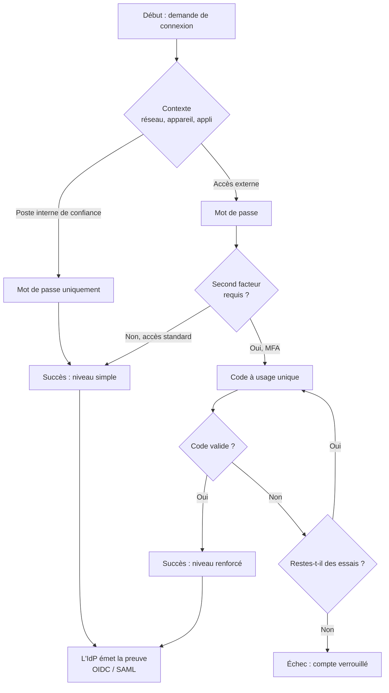

# Workflows d'authentification

> [!abstract] Ancre
> Un workflow d'authentification est la **logique** qui décide, à chaque connexion, **quelles étapes** l'utilisateur doit franchir et **dans quel ordre** : simple mot de passe, ou élévation par un second facteur, ou échec.

---

## 🧒 Avant de commencer : de quoi on parle

> [!tip] En clair
> Jusqu'ici, on a surtout parlé de **comment transmettre** une preuve d'identité (OIDC, SAML). Mais il y a une question **avant** ça :
>
> **Qu'est-ce qu'on demande à l'utilisateur, et dans quel ordre ?**
>
> - On lui demande juste un mot de passe ?
> - Un mot de passe **puis** un code sur son téléphone ?
> - Une clé matérielle **si** la connexion vient de l'extérieur ?
> - Rien du tout, s'il vient d'un poste interne de confiance ?
> - Un second facteur **seulement** pour accéder aux actions sensibles ?
>
> 🗺️ **L'analogie :** c'est un **parcours fléché**, comme un organigramme. À chaque étape, une question : *« ça a réussi ? »* → oui → on avance ; non → on réessaie, ou on essaie une autre méthode, ou on refuse.

**Les mots à connaître pour cette note :**

| Mot technique | En clair |
|---|---|
| **workflow d'authentification** | le **parcours** : quelles étapes, dans quel ordre |
| **facteur** | une **preuve** : mot de passe, code, clé, biométrie |
| **MFA** | plusieurs facteurs **de natures différentes** |
| **arbre** | la structure **en branches** : une condition → deux chemins |
| **étape** | une **brique** du parcours (un écran, une vérification) |
| **step-up** | **monter** le niveau pour une action sensible |
| **fallback** | le **plan B** quand une méthode échoue |

Voir aussi : [[step_up_auth]] (le niveau) et [[sso_session_and_consent]] (ce qui en résulte).

---

## Définition

> [!tip] En clair
> Un workflow d'authentification, c'est **la recette** du guichet d'identité. Il décrit :
> - les **étapes** possibles,
> - les **conditions** pour passer de l'une à l'autre,
> - et **quoi faire** en cas d'échec.
>
> 🔧 **Le mot technique :** on parle de *workflow*, de **flow**, d'**arbre** ou de **chaîne** d'authentification. Selon les produits, ça s'appelle un *journey*, un *authentication flow*, une *policy*… mais **le concept est le même**.

Un **workflow d'authentification** est la **logique d'orchestration** qui détermine, pour une demande donnée, la séquence des vérifications à effectuer avant d'authentifier un utilisateur — et le niveau d'authentification résultant.

Il **assemble** des briques qui, prises séparément, sont toutes simples :

| Brique | En clair |
|---|---|
| **Collecte d'un facteur** | demander un mot de passe, un code, une clé |
| **Vérification** | le facteur est-il valide ? |
| **Condition** | est-ce que je continue ? (branchement) |
| **Adaptation au risque** | le contexte change-t-il la décision ? |
| **Succès / échec** | on délivre l'authentification, ou on refuse |

**Le workflow ne « connaît » pas le protocole.** Il décide **ce qui est vérifié** ; le protocole ([[openid_connect]] ou [[saml2]]) décide **comment le résultat est transmis** à l'application. Ce sont **deux couches distinctes** — et les confondre est une source classique de confusion.

---

## Enjeux

> [!tip] En clair
> **Pourquoi passer par un workflow plutôt qu'un simple formulaire ?**
>
> Parce que « demander un mot de passe à tout le monde, tout le temps » est à la fois **trop** et **pas assez** :
> - **Trop** : inutile de demander un second facteur à quelqu'un qui consulte sa page d'accueil depuis son bureau.
> - **Pas assez** : insuffisant de demander un simple mot de passe pour un virement bancaire.
>
> Le workflow permet de **dos**er l'effort demandé selon **ce qui est en jeu**.

- **Adaptation au contexte** : la décision peut dépendre du lieu, de l'appareil, de l'heure, du réseau, de l'historique.
- **Progressivité** : on ne demande pas **tout** dès la première connexion — on **élève** quand c'est nécessaire (*step-up*).
- **Plusieurs moyens pour un même but** : proposer plusieurs facteurs, avec des **plans B**.
- **Conformité** : imposer un niveau minimum pour certaines classes d'accès (données sensibles, actions financières).
- **Cohérence** : centraliser la politique, au lieu de la dupliquer dans chaque application.
- **Le piège** : un workflow **trop complexe** devient impossible à auditer, et crée des **chemins de contournement** non voulus.

---

## Fonctionnement détaillé

### La structure : des étapes, des branches, des issues

> [!tip] En clair
> Un workflow se lit **comme un organigramme**. Trois ingrédients :
>
> 1. **Des étapes** : « demander le mot de passe », « demander un code », « vérifier la clé ».
> 2. **Des branches** : « si l'utilisateur est admin → chemin A ; sinon → chemin B ».
> 3. **Des issues** : « authentifié au niveau X », « échec », « réessayer ».



**Ce qui se lit dans ce diagramme :**
- Le **contexte** (réseau, appareil) oriente dès le début.
- Le **second facteur** n'est demandé que dans certaines branches — c'est l'**adaptation**.
- Il y a une **politique d'échec** explicite (essais, verrouillage).
- **Toutes les branches de succès convergent** vers l'émission de la preuve.

### Les facteurs : les briques qu'on assemble

> [!tip] En clair
> Un **facteur** est une façon de prouver son identité. Il en existe **trois familles**, et le MFA consiste à combiner des familles **différentes** — pas trois fois la même.

| Famille | En clair | Exemples |
|---|---|---|
| **Ce que tu sais** | quelque chose **en tête** | mot de passe, code PIN, réponse à une question |
| **Ce que tu as** | quelque chose **en poche** | téléphone (code, notification), clé matérielle, carte |
| **Ce que tu es** | quelque chose **de toi** | empreinte, visage, iris |

**Le MFA, ce n'est pas « plusieurs étapes »** — c'est **plusieurs familles différentes**. Deux mots de passe ne sont **pas** du MFA ; un mot de passe + un code sur téléphone, oui.

**Résistance au phishing :** tous les facteurs ne se valent pas. Un code par SMS se **phishé** facilement (ou s'intercepte). Une **clé matérielle** liée au domaine du site ne fonctionne **pas** sur un faux site — c'est ce qu'on appelle un facteur **résistant au phishing**.

| Facteur | Famille | Résistance au phishing |
|---|---|---|
| Mot de passe | sait | faible |
| Code par SMS / email | a | **faible** (interception, SIM swap) |
| Code TOTP (application) | a | moyenne |
| Notification push à valider | a | moyenne (vulnérable au « fatigue bombing ») |
| **Clé matérielle (FIDO2)** | a | **élevée** |
| Biométrie + clé (passkey) | a + es | **élevée** |

### L'adaptation au contexte : la décision risque

> [!tip] En clair
> Le workflow peut **changer d'avis selon le contexte**. On ne demande pas la même chose à quelqu'un qui se connecte depuis son bureau sécurisé, et à quelqu'un qui se connecte depuis un hôtel à l'étranger à 3 h du matin.
>
> C'est ce qu'on appelle l'**authentification adaptative** (ou *risk-based*).

| Signal de contexte | Exemple d'effet |
|---|---|
| **Réseau** | interne → plus permissif ; externe → MFA exigé |
| **Appareil** | appareil connu → confiance ; inconnu → vérification renforcée |
| **Géolocalisation** | pays inhabituel → contrôle supplémentaire |
| **Heure** | hors horaires → vigilance |
| **Comportement** | rythme de frappe, navigation inhabituelle → suspicion |
| **Criticité de l'appli** | accès à une appli sensible → niveau minimum |

**Le principe** (proche du **Zero Trust**) : ne pas faire confiance *a priori*, mais **évaluer** en continu et **exiger plus** quand le risque augmente.

### Le chaînage : plusieurs facteurs dans un ordre choisi

> [!tip] En clair
> Un workflow bien conçu ne se contente pas de « demander le MFA ». Il décide **quel facteur**, **dans quel ordre**, et **comment retomber sur ses pieds**.

**L'ordre se réfléchit** :

| Ordre | Avantage |
|---|---|
| Mot de passe **puis** second facteur | classique, mais demande deux gestes |
| **Clé matérielle d'abord** | un seul geste, plus sûr — et le mot de passe peut même être supprimé |
| Facteur **à la demande** (step-up) | rien à la connexion, second facteur au moment sensible |

**Le *fallback*** (plan B) est essentiel :

> [!tip] En clair
> Que se passe-t-il si l'utilisateur a **perdu** son téléphone ? Un workflow sans plan B **enferme les gens dehors** — et génère un appel au support, qui est lui-même un **vecteur d'attaque** (un attaquant appelle le support et se fait passer pour l'utilisateur).
>
> Un bon workflow prévoit : codes de secours, plusieurs facteurs enregistrés, procédure de récupération **avec vérification forte**.

### Le step-up : élever le niveau au bon moment

> [!tip] En clair
> **Le principe le plus utile dans la pratique.** On n'impose pas le MFA à la connexion (ça énerve tout le monde) : on l'exige **au moment de l'action sensible**.
>
> C'est exactement ce que la section « le niveau est monotone » de [[sso_session_and_consent]] décrit : une fois l'élévation obtenue, elle **profite à toute la session**.

```
1. Alice se connecte avec son mot de passe       → niveau simple
2. Elle consulte son solde                        → rien à faire
3. Elle clique « Virement »                       → le workflow exige un niveau renforcé
4. → le parcours la renvoie demander son second facteur
5. → elle fournit son code
6. → la session est ÉLEVÉE                          → le virement est autorisé
7. Elle revient à son solde                       → toujours élevée (monotone)
```

**Le lien avec les protocoles :** côté OIDC, cette exigence s'exprime par `acr_values` ; côté SAML, par `AuthnContextClassRef`. Le workflow, c'est **ce qui se passe à l'intérieur** de l'IdP quand il reçoit cette demande ([[step_up_auth]]).

### Workflow ≠ protocole : la distinction à ne pas rater

> [!tip] En clair
> **C'est le point que beaucoup confondent.** Deux couches **séparées** :

| | Le **workflow** | Le **protocole** |
|---|---|---|
| Décide de… | **ce qui est vérifié**, et comment | **comment transmettre** le résultat |
| Exemples | mot de passe → OTP → risque | [[openid_connect]], [[saml2]] |
| Vit… | dans l'IdP | entre l'appli et l'IdP |
| Sa sortie | un **niveau d'authentification** | une **assertion** / un **jeton** |

**Conséquence pratique :** on peut changer de protocole **sans changer** le workflow (un IdP moderne expose souvent OIDC **et** SAML avec le **même** arbre d'authentification derrière). Et on peut ajouter un facteur **sans toucher** aux applications — c'est précisément la stratégie de « graviter autour » du système existant.

---

## Exemple concret

> [!tip] En clair
> **Trois parcours réalistes**, du plus simple au plus élaboré. Regarde bien : c'est de la **logique**, pas du protocole.

### Parcours 1 — Simple (accès standard)

```
[1] Mot de passe demandé
[2] Vérification → OK
[3] Niveau atteint : SIMPLE
[4] Émission de la preuve (id_token / assertion SAML)
```

### Parcours 2 — MFA (accès depuis l'extérieur)

```
[1] Contexte évalué : réseau = externe
[2] Mot de passe demandé
[3] Vérification → OK
[4] Second facteur exigé (car externe)
    → proposition : application TOTP (choix préféré) ou SMS (repli)
[5] Code fourni
[6] Vérification → OK
[7] Niveau atteint : RENFORCÉ
[8] Émission de la preuve
```

### Parcours 3 — Adaptation au risque + fallback

```
[1] Contexte évalué :       réseau = externe
                            appareil = INCONNU
                            géolocalisation = pays inhabituel
[2] Mot de passe demandé
[3] Vérification → OK
[4] Niveau de risque jugé ÉLEVÉ
    → facteur résistant au phishing exigé (clé matérielle)
[5] L'utilisateur a PERDU sa clé
    → branche fallback : code de secours à usage unique
[6] Code de secours correct
[7] Niveau atteint : RENFORCÉ, avec un ÉVÉNEMENT DE SÉCURITÉ journalisé
[8] Émission de la preuve
```

**Ce que le parcours 3 enseigne :** un bon workflow **prévoit l'échec des facteurs** (perte, panne, oubli) **sans** ouvrir un trou de sécurité — et **trace** l'événement (une utilisation de code de secours mérite une alerte).

### Ce qui doit être vérifié dans un workflow (checklist)

```
□ Quelle est la POLITIQUE pour cette application / ce niveau de risque ?
□ Quels FACTEURS sont disponibles pour cet utilisateur (enregistrés) ?
□ Quel est l'ORDRE retenu, et pourquoi ?
□ Que se passe-t-il en cas d'ÉCHEC (essais, verrouillage, temporisation) ?
□ Quel FALLBACK si un facteur est indisponible ?
□ Le niveau atteint est-il bien celui ATTENDU par l'application ?
□ L'événement est-il JOURNALISÉ (succès, échec, fallback) ?
□ Le parcours est-il ENREGISTRÉ côté serveur (anti-contournement) ?
```

---

## Pièges fréquents

> [!tip] En clair
> **Les 6 erreurs à retenir :**
> 1. **Confondre workflow et protocole** → ce sont deux couches distinctes.
> 2. **Croire que « deux étapes » = MFA** → il faut deux **familles** différentes.
> 3. **Aucun fallback** → les utilisateurs qui perdent leur facteur sont enfermés dehors.
> 4. **Faire confiance au navigateur pour la logique** → un attaquant peut sauter des étapes.
> 5. **Workflow illisible** → impossible à auditer, chemins de contournement cachés.
> 6. **Niveau demandé mais non vérifié** → l'application ne contrôle pas ce qu'elle reçoit.

- **Confondre workflow et protocole** — croire qu'ajouter un facteur impose de changer d'OIDC, ou que le protocole « gère » la politique d'authentification. Réflexe : le workflow décide **quoi**, le protocole transmet **comment** ; les deux évoluent indépendamment.
- **MFA mal compris** — deux mots de passe, ou mot de passe + question secrète, ne sont **pas** du MFA. Réflexe : combiner des **familles différentes** (savoir / avoir / être).
- **Facteur faible pris pour un facteur fort** — le SMS est souvent considéré comme équivalent à une clé matérielle. Il ne l'est pas (SIM swap, interception, phishing en temps réel). Réflexe : classer les facteurs par **résistance au phishing**, et réserver les meilleurs aux accès critiques.
- **Absence de fallback** — la perte d'un facteur bloque l'utilisateur. Réflexe : prévoir des **codes de secours**, plusieurs facteurs enregistrés, et une procédure de récupération **vérifiée**.
- **Procédure de récupération faible** — le contournement « oubli de facteur » par le support devient **le maillon faible** du système (technique classique des attaquants : appeler le support). Réflexe : la récupération doit exiger un **niveau de preuve au moins égal** à l'original.
- **Logique côté client (navigateur)** — le workflow est exécuté en JavaScript, donc **modifiable** : l'utilisateur peut sauter l'étape du second facteur. Réflexe : **toute** décision d'authentification doit être **serveur**.
- **Étapes non liées à la session** — un attaquant peut soumettre directement la « deuxième étape » sans avoir franchi la première. Réflexe : enregistrer la progression **côté serveur**, liée à la session.
- **Niveau atteint non vérifié par l'application** — l'IdP déclare un niveau, l'application ne contrôle rien ([[step_up_auth]]). Réflexe : vérifier `acr` / `AuthnContextClassRef`.
- **Workflow trop complexe** — trop de branches, personne ne sait ce qui se passe réellement : impossibilité d'auditer, chemins oubliés. Réflexe : garder le parcours **lisible**, documenté, avec un chemin par défaut sûr.
- **Politique dupliquée dans chaque application** — chaque appli réimplémente sa logique, avec des divergences. Réflexe : **centraliser** la politique dans l'IdP, les applications ne consomment que le résultat.
- **Absence de journalisation** — impossible de savoir ce qui s'est passé, ni de détecter les attaques. Réflexe : tracer chaque étape (succès, échec, fallback, verrouillage) et alerter sur les schémas anormaux.
- **Verrouillage absent ou excessif** — pas de protection contre le bourrage d'identifiants (*credential stuffing*), ou verrouillage si agressif qu'il crée un déni de service. Réflexe : temporisation progressive, limitation de débit, détection d'anomalies.
- **« Fatigue bombing »** — inonder l'utilisateur de notifications push jusqu'à ce qu'il accepte. Réflexe : limiter le nombre de sollicitations, afficher le **contexte** de la demande (d'où, quoi), permettre de refuser.

---

## Rappel

> [!question] Question de rappel
> Une application exige un accès « de niveau renforcé ». Où se décide **comment** satisfaire cette exigence, et comment cette décision parvient-elle à l'application ? Pourquoi ne faut-il pas confondre les deux niveaux ?

> [!success]- Réponse
> La décision se prend dans le **workflow d'authentification**, qui vit **dans l'IdP** : c'est lui qui sait quels facteurs l'utilisateur possède, quel est le contexte (réseau, appareil, risque), quel ordre appliquer et quel **fallback** prévoir. Le résultat de cette décision est un **niveau d'authentification**, transmis à l'application par le **protocole** — `acr` dans l'[[id_token]] en OIDC, `AuthnContextClassRef` dans l'assertion en [[saml2]]. Il ne faut pas confondre les deux couches parce qu'elles **évoluent indépendamment** : on peut ajouter un facteur, changer l'ordre, durcir la politique — **sans toucher aux applications** (elles ne voient que le niveau) ; et on peut changer de protocole (SAML → OIDC) **sans** réécrire le workflow. Confondre les deux conduit à dupliquer la politique dans chaque application (divergences, trous) et à croire qu'un protocole « sécurise » alors qu'il ne fait que **transporter** le résultat. Enfin, la vérification reste **des deux côtés** : l'IdP doit réellement atteindre le niveau, et l'application doit **contrôler** que le niveau reçu correspond à son exigence.

### 🎯 Le résumé à retenir

> [!tip] Si tu ne retiens qu'une chose
> **Le workflow = le parcours fléché ; le protocole = le transport du résultat.**
>
> - **Des étapes** (facteurs) → **des branches** (conditions) → **un niveau**.
> - **MFA** = familles **différentes** (savoir / avoir / être).
> - **Step-up** = on élève le niveau **au moment utile**, pas à l'entrée.
> - **Fallback** = toujours un plan B, sinon on enferme les gens dehors.
>
> **Le réflexe de sécurité :** la logique doit vivre **côté serveur**, être **journalisée**, et le niveau atteint doit être **vérifié** par l'application.
>
> **Et l'intérêt pratique :** ajouter un facteur ou durcir une politique **sans toucher aux applications** — c'est ainsi qu'on fait évoluer un système existant.

---

## Voir aussi

- [[step_up_auth]] — comment l'exigence de niveau est véhiculée par OIDC.
- [[sso_session_and_consent]] — ce que devient le niveau (monotone) dans la session.
- [[prompts_and_interaction]] — `prompt`, `max_age` : quand redemander une authentification.
- [[openid_connect]] — un des protocoles qui transporte le résultat du workflow.
- [[saml2]] — l'autre protocole, avec `AuthnContextClassRef`.
- [[rbac_abac_rebac]] — une fois authentifié, à quoi a-t-on droit ?
- [[iam/index]] — carte d'entrée du domaine.
- [[oidc/index]] — carte d'entrée du domaine protocole.

## Références

- NIST SP 800-63B — *Digital Identity Guidelines: Authentication and Lifecycle Management* (facteurs, niveaux d'assurance, AAL).
- NIST SP 800-207 — *Zero Trust Architecture* (vérification continue, adaptation au risque).
- OpenID Connect Core 1.0 — §2 (`acr`, `amr`, `auth_time`), §3.1.2.1 (`acr_values`, `max_age`, `prompt`).
- OASIS SAML 2.0 — *Authentication Context* (`ac:classes`).
- OASIS SAML 2.0 — *Profiles* (Web Browser SSO).
- FIDO2 / WebAuthn — facteurs résistants au phishing.
