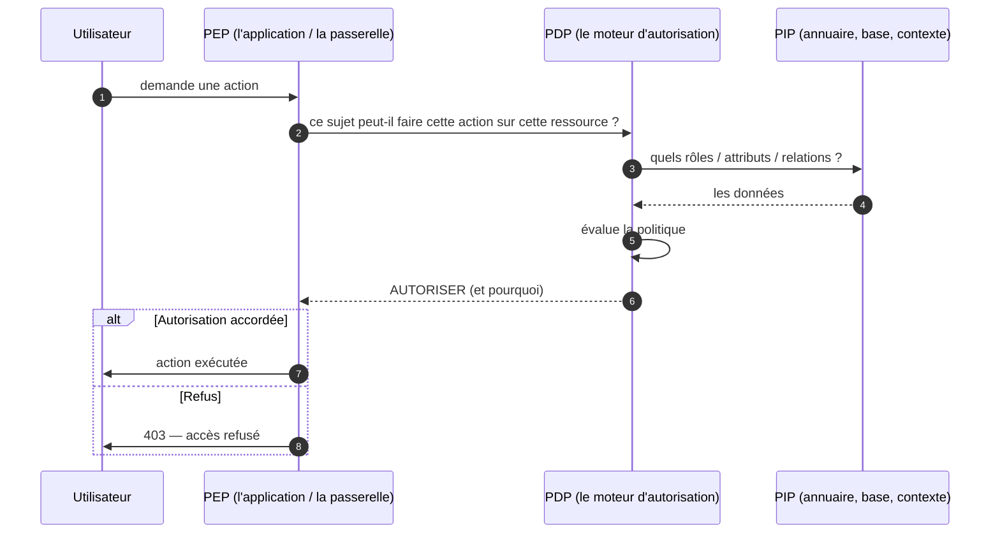

# RBAC, ABAC et ReBAC

> [!abstract] Ancre
> Ces trois sigles désignent trois **modèles d'autorisation** — trois façons de répondre à la question « cet utilisateur a-t-il le droit de faire cette action ? ». RBAC raisonne par **rôles**, ABAC par **attributs**, ReBAC par **relations**.

---

## 🧒 Avant de commencer : de quoi on parle

> [!tip] En clair
> On a beaucoup parlé d'**authentification** : *« qui es-tu ? »*. Mais ça ne suffit pas !
>
> Il reste la question suivante : **« et maintenant, à quoi as-tu le droit ? »**
>
> 🏢 **L'analogie de l'immeuble de bureaux :**
> - **RBAC** : tu reçois un **badge « Comptabilité »**. Ce badge ouvre toutes les portes de l'étage comptabilité. *Simple, mais grossier : tous les comptables ont exactement les mêmes droits.*
> - **ABAC** : le portier décide **au cas par cas** : « il est 10 h, il est dans le service comptabilité, l'étage est en zone France, donc j'ouvre ». *Fin, mais complexe à maîtriser.*
> - **ReBAC** : « cette porte s'ouvre aux **personnes à qui le responsable a donné la clé** ». Ce n'est plus un rôle, c'est une **relation**. *Idéal pour le partage.*

**Les mots à connaître pour cette note :**

| Mot technique | En clair |
|---|---|
| **autorisation** | décider **à quoi** on a droit |
| **RBAC** | par **rôles** (« comptable », « admin ») |
| **ABAC** | par **attributs** (heure, lieu, service, classification…) |
| **ReBAC** | par **relations** (« propriétaire de », « membre de ») |
| **PDP** | **qui décide** (*Policy Decision Point*) |
| **PEP** | **qui applique** la décision (*Policy Enforcement Point*) |
| **PIP** | **qui fournit les données** de la décision (*Policy Information Point*) |

Voir aussi : [[scopes_and_claims]] (la permission côté OAuth) et [[iam/index]].

---

## Définition

> [!tip] En clair
> Les trois modèles répondent à **la même question** — *« ce sujet peut-il faire cette action sur cette ressource ? »* — mais ils la résolvent avec **des informations différentes**.

| Modèle | Base de la décision | Question posée |
|---|---|---|
| **RBAC** | le **rôle** de l'utilisateur | « quel rôle a-t-il ? » |
| **ABAC** | les **attributs** de tout le monde | « quelles sont les propriétés du sujet, de la ressource, du contexte ? » |
| **ReBAC** | les **relations** entre entités | « quelle relation le lie à cette ressource ? » |

---

## Enjeux

> [!tip] En clair
> **Pourquoi trois modèles ?** Parce que la bonne question n'est pas « lequel est le meilleur » mais **« quel niveau de finesse j'ai besoin ? »**.
>
> - Une petite application avec 3 types d'utilisateurs → **RBAC** suffit.
> - Une banque avec des règles contextuelles (montant, heure, zone) → **ABAC**.
> - Un outil collaboratif (documents partagés) → **ReBAC**.
>
> Et le piège classique : **ce qui marche pour 10 utilisateurs explose à 100 000**. Le modèle doit être choisi **avant** que ça devienne ingérable.

- **Granularité croissante** : RBAC est simple mais grossier ; ABAC et ReBAC sont plus fins mais plus complexes à administrer.
- **Explosion combinatoire** : RBAC dérive vite en **centaines de rôles** (« comptable-junior-filiale-nord »…). C'est le symptôme classique de « RBAC qui craque ».
- **Administrabilité** : le meilleur modèle est **inutilisable** s'il est impossible d'expliquer une décision à un auditeur.
- **Contexte** : ABAC permet d'intégrer le **contexte** (heure, lieu, niveau de risque) — indispensable en Zero Trust.
- **Séparation des pouvoirs** : dans tous les modèles, un utilisateur ne doit pas pouvoir **à la fois** accorder et exercer un droit (contrôle des accès privilégiés).
- **Le lien avec OAuth** : les **scopes** d'un [[access_token]] sont une forme **grossière** de permission ([[scopes_and_claims]]) ; les modèles décrits ici répondent à la décision **fine**.

---

## Fonctionnement détaillé

### RBAC : le rôle comme clé

> [!tip] En clair
> **L'idée :** on ne donne pas de droits aux **personnes**, on donne des droits aux **rôles**, et on attribue des rôles aux personnes.
>
> **Pourquoi c'est malin :** quand quelqu'un change de poste, on change **son rôle** — pas ses 47 permissions une par une.

```
Utilisateur → Rôle → Permission → Ressource
     Alice  → Comptable → écrire → Factures
     Bob    → Admin     → tout   → tout
```

**Les trois relations de base** (NIST RBAC) :

| Relation | En clair |
|---|---|
| **Attribution** (user → role) | qui a quel rôle |
| **Permission** (role → permission) | quel rôle donne quel droit |
| **Hiérarchie** (role → role) | « admin » **hérite** de « comptable » |

**Le principe du moindre privilège** : RBAC ne doit donner que les rôles **nécessaires**. Mais en pratique, les organisations **cumulent les rôles** par confort — et c'est ainsi qu'on obtient des utilisateurs avec des droits qu'ils n'utilisent jamais (« *privilege creep* »).

**Le symptôme de saturation :**

> [!tip] En clair
> Quand on commence à créer des rôles du genre **« comptable-junior-filiale-nord-temps-partiel »**, c'est le signe que RBAC ne suffit plus : on essaie de coder des **attributs** dans des **noms de rôles**. C'est le moment de passer à ABAC — ou de combiner.

### ABAC : décider sur les attributs

> [!tip] En clair
> **L'idée :** au lieu d'un rôle figé, on **évalue des propriétés** — celles du sujet, de la ressource, de l'action, et du contexte.
>
> 🔧 **La règle s'écrit comme une condition :** « **SI** le service de l'utilisateur **égale** le service propriétaire du document **ET** l'heure est ouvrable **ALORS** autoriser ».

Les quatre familles d'attributs :

| Famille | En clair | Exemples |
|---|---|---|
| **Sujet** | qui agit | service, niveau hiérarchique, habilitations, ancienneté |
| **Ressource** | ce qui est visé | sensibilité, propriétaire, service, localisation |
| **Action** | ce qui est demandé | lire, écrire, supprimer, exporter |
| **Contexte** | où / quand / comment | heure, adresse IP, appareil, niveau de risque |

**Ce que ça permet :** des règles **fines** et **contextuelles** — par exemple : *« un médecin peut consulter un dossier d'un patient de son service, pendant ses heures de garde, depuis le réseau de l'hôpital »*.

**Le prix à payer :**

| Avantage | Coût |
|---|---|
| Très fin, contextuel | **complexité** des règles |
| Pas d'explosion de rôles | **difficile à auditer** (« pourquoi cette décision ? ») |
| Adapté au Zero Trust | **dépendance aux données d'attributs** (si elles sont fausses, la décision est fausse) |

> [!warning] Le point le plus souvent mal compris
> ABAC déplace la complexité : au lieu de gérer des rôles, on gère des **règles** et des **sources d'attributs**. Une règle ABAC est **très difficile à expliquer** à un auditeur : « cette personne a été refusée parce que la combinaison de son service, de l'heure et de son niveau d'habilitation… ». La **traçabilité** doit être conçue dès le départ.

### ReBAC : décider sur les relations

> [!tip] En clair
> **L'idée :** la permission ne vient pas d'un **rôle** ni d'un **attribut**, mais d'une **relation** entre l'utilisateur et l'objet.
>
> 🗂️ **L'exemple qui parle :** un document partagé. Qui peut le voir ? **Ceux à qui on l'a partagé.** Ni un rôle, ni une heure : une **relation**.

```
Alice  → propriétaire → Document A
Bob    → lecteur      → Document A
Carol  → membre de    → Équipe X
Équipe X → éditeur    → Projet Y
Bob    → membre de    → Équipe X   ⇒  Bob a un chemin vers Projet Y
```

**La force de ReBAC : les relations se *propagent*.** Bob n'a jamais été nommé sur le Projet Y — mais il hérite du droit **par son appartenance** à l'équipe. C'est ce qu'on appelle la **résolution de chemin** (*graph traversal*).

**Le modèle de référence : Google Zanzibar** — le système qui a popularisé ReBAC, en modélisant les permissions comme un **graphe de relations**, avec une résolution efficace même à très grande échelle.

**Où ça brille :** applications collaboratives (documents, tableaux, dépôts de code), partages fins entre utilisateurs, workflows d'approbation.

**Le coût :** un **moteur de résolution** (parcours de graphe) à maintenir, et une complexité de raisonnement (les héritages sont puissants, mais peuvent devenir difficiles à prévoir).

### Les trois modèles, côte à côte

> [!tip] En clair
> **Le tableau à retenir.** Chacun a sa force, et en pratique on les **combine** souvent.

| | **RBAC** | **ABAC** | **ReBAC** |
|---|---|---|---|
| Base de décision | rôle | attributs + contexte | relations |
| Complexité | **faible** | élevée | moyenne |
| Granularité | grossière | **très fine** | fine, orientée partage |
| Contextuel | non | **oui** | non (par nature) |
| Explosion du modèle | **oui** (rôles) | non (règles) | non (graphe) |
| Explication / audit | **facile** | difficile | moyenne |
| Cas d'usage type | applications d'entreprise | banque, santé, Zero Trust | collaboration, partage |
| Risque principal | *privilege creep* | règles inauditables | graphe imprévisible |

**En pratique, on combine :** un socle **RBAC** (les rôles structurants), affiné par des **conditions ABAC** (contexte, sensibilité), avec des **relations ReBAC** pour le partage entre utilisateurs. C'est le modèle des grandes plateformes.

### L'architecture : qui décide, qui applique

> [!tip] En clair
> Peu importe le modèle : la décision doit être **centralisée**, sinon chaque application réinvente (et se trompe). Trois briques à connaître :

| Composant | En clair | Rôle |
|---|---|---|
| **PEP** — *Policy Enforcement Point* | **le portier** | intercepte la demande, exige une décision, l'applique |
| **PDP** — *Policy Decision Point* | **le juge** | évalue la politique et rend la décision (autoriser/refuser) |
| **PIP** — *Policy Information Point* | **le dossier** | fournit les données nécessaires (rôles, attributs, relations) |



**La règle d'or :** le **PEP** n'a pas de logique métier. Il **demande** et **applique**. Toute la logique vit dans le **PDP** — c'est ce qui rend la politique **centralisée, testable et auditable**.

**Et l'astuce moderne :** le PDP peut **aussi** vérifier les permissions liées à un **jeton** OAuth (le `scope` du [[access_token]]), ce qui permet de combiner autorisation *d'API* et autorisation *métier*.

---

## Exemple concret

> [!tip] En clair
> **Le même besoin, résolu par les trois modèles.** Tu vois immédiatement les différences.

**Le besoin :** *« Qui peut consulter le dossier du patient n° 4512 ? »*

### RBAC

```
Rôle « medecin-dossier » → droit : lire → dossiers

Dr Martin    a le rôle medecin-dossier   → AUTORISÉ
Dr Dupont    a le rôle medecin-dossier   → AUTORISÉ
Secrétaire   n'a pas le rôle             → REFUSÉ

⚠️ Problème : le Dr Dupont n'est PAS le médecin de ce patient.
   RBAC autorise quand même : le rôle est trop grossier.
```

### ABAC

```
Règle : AUTORISER SI
   sujet.rôle = medecin
   ET sujet.service = ressource.service        ← le patient appartient à son service
   ET action = lire
   ET contexte.heure ∈ heures_ouvrables
   ET contexte.reseau = interieur

Dr Martin    service=Cardio, patient service=Cardio, 10h, intérieur  → AUTORISÉ
Dr Dupont    service=Neuro, patient service=Cardio                    → REFUSÉ   ✅
Secrétaire   rôle=secrétaire                                          → REFUSÉ
Nuit (2h)                                                                        → REFUSÉ
```

**ABAC corrige la faiblesse de RBAC** — au prix d'une règle à maintenir et à expliquer.

### ReBAC

```
Relations :
   Dr Martin  → medecin_referent → Patient 4512
   Patient 4512 → appartient_à   → Service Cardio
   Dr Dupont  → membre_de        → Service Neuro

Question : Dr Martin peut-il lire le dossier 4512 ?
   chemin : Dr Martin → medecin_referent → Patient 4512   ✅ AUTORISÉ

Question : Dr Dupont ?
   chemin : Dr Dupont → membre_de → Service Neuro
             … mais aucun chemin vers Patient 4512          ❌ REFUSÉ
```

**ReBAC répond naturellement** à *« qui a une relation avec cette ressource ? »* — c'est le modèle des systèmes où **le partage est la norme** (un dossier médical est partagé entre plusieurs intervenants, changeant au fil du temps).

### Exemple de règle ABAC écrite formellement

```
PERMIT (sujet, action, ressource)
  OÙ sujet.role = "medecin"
  ET action.nom ∈ ("lire", "annoter")
  ET ressource.service = sujet.service
  ET ressource.classification ≤ sujet.habilitation
  ET contexte.heure ∈ sujet.horaires
  ET contexte.reseau ∈ ("interne", "vpn")
  ET contexte.mfa = vrai
```

**Chaque ligne est un attribut.** Multiplie les lignes par le nombre de cas métier, et tu comprends pourquoi **l'auditabilité** est le vrai défi d'ABAC.

---

## Pièges fréquents

> [!tip] En clair
> **Les 6 erreurs à retenir :**
> 1. **Coder des attributs dans les noms de rôles** → RBAC explose en centaines de rôles.
> 2. **Accumuler les rôles** (*privilege creep*) → les gens ont des droits qu'ils n'utilisent jamais.
> 3. **Règles ABAC que personne ne peut expliquer** → audit impossible.
> 4. **Décider dans l'application** au lieu d'un PDP central → chaque appli diverge.
> 5. **PDP qui tombe** → si le portier ne peut pas joindre le juge, que fait-on ?
> 6. **Attributs non fiables** → une mauvaise donnée d'entrée produit une mauvaise décision.

- **Explosion des rôles** — créer un rôle par combinaison (service × niveau × site) produit des milliers de rôles ingérables. Réflexe : quand les noms de rôles contiennent des attributs, **passer à ABAC** pour ces dimensions.
- **Accumulation de droits** (*privilege creep*) — les droits s'ajoutent lors des mobilités et ne sont jamais retirés. Réflexe : **revue périodique** des habilitations, et retrait automatique lors des changements de poste (voir le cycle de vie, famille *provisioning*).
- **Règles ABAC inauditables** — impossible d'expliquer un refus à un utilisateur ou à un auditeur. Réflexe : concevoir la **traçabilité dès le départ** (quelle règle a décidé, avec quelles valeurs d'attributs).
- **Décision côté application** — chaque application réimplémente sa logique : divergences, oublis, trous. Réflexe : **PDP central**, applications = simples PEP.
- **Confondre authentification et autorisation** — croire qu'être authentifié donne des droits, ou qu'un rôle suffit sans contrôle au moment de l'action. Réflexe : séparer les deux ; vérifier **à chaque action**.
- **Décision prise une fois pour toutes (au login)** — les droits changent, les contextes changent. Réflexe : décider **au moment de l'action**, avec le contexte courant (logique **Zero Trust**).
- **Oubli du mode dégradé** — si le PDP est injoignable : autorise-t-on (faille) ou refuse-t-on tout (panne) ? Réflexe : décider **explicitement** de la politique de repli (*fail-closed* par défaut), et prévoir un cache de décisions.
- **Attributs non fiables ou périmés** — un attribut « service » obsolète donne des accès erronés. Réflexe : **source unique de vérité**, synchronisation, et traçabilité de l'origine.
- **Dépendance circulaire des permissions** — les permissions héritées par relations (ReBAC) créent des chemins imprévus. Réflexe : borner la profondeur d'héritage, tester les cas limites, visualiser le graphe.
- **Absence de séparation des pouvoirs** — un administrateur peut s'attribuer tous les droits. Réflexe : séparer **administration des droits** et **exercice des droits**, avec approbation à deux.
- **Jeton OAuth pris pour une autorisation métier** — un `scope` dit « l'application peut accéder à cette API », **pas** « cet utilisateur a le droit de voir ce dossier ». Réflexe : combiner le contrôle du jeton ([[access_token]]) et la décision métier (PDP).

---

## Rappel

> [!question] Question de rappel
> Une organisation a créé plus de 400 rôles, dont certains nommés « comptable-junior-site-nord-temporaire ». Quel problème révèle cette situation, et comment y remédier ? Quel est le risque principal du remède envisagé ?

> [!success]- Réponse
> Ces noms révèlent une **explosion de rôles** : l'organisation encode des **attributs** (niveau, site, statut) dans des **noms de rôles**, signe que **RBAC a atteint ses limites** pour ces dimensions. La remédiation consiste à passer à **ABAC** pour ces critères : on garde un socle **RBAC** pour les rôles réellement structurants (métier), et on traite le **contexte** (site, horaires, sensibilité, niveau, type de contrat) par des **règles d'attributs**. Le risque principal du remède est le **transfert de complexité** : ABAC rend les décisions **difficiles à expliquer et à auditer** — il faut pouvoir répondre à « pourquoi cet accès a-t-il été refusé ? », avec la règle déclenchée et les valeurs d'attributs utilisées. Il faut donc concevoir la **traçabilité dès le départ**, garantir la **fiabilité des sources d'attributs**, et prévoir un **mode dégradé** si le PDP devient injoignable. Dans le cas cité, une correction intermédiaire est souvent utile : **dédupliquer** les rôles par élimination des attributs excédentaires, puis n'introduire ABAC que là où la finesse est réellement nécessaire.

### 🎯 Le résumé à retenir

> [!tip] Si tu ne retiens qu'une chose
> **Trois réponses à « à quoi ai-je droit ? »**
>
> - **RBAC** → par **rôles**. Simple, auditable — mais explose en multiplicité.
> - **ABAC** → par **attributs + contexte**. Très fin, adapté au Zero Trust — mais dur à auditer.
> - **ReBAC** → par **relations**. Idéal pour le partage — mais complexe à raisonner.
>
> **En pratique : on combine.** RBAC pour la structure, ABAC pour le contexte, ReBAC pour le partage.
>
> **Et l'architecture à garder en tête :** la décision vit dans un **PDP central** ; l'application est un **PEP** qui demande et applique — jamais qui décide.
>
> **Le symptôme d'alerte :** quand un **nom de rôle** contient un attribut, il est temps de passer à ABAC.

---

## Voir aussi

- [[auth_workflows]] — l'étape d'avant : qui es-tu ?
- [[scopes_and_claims]] — la permission grossière portée par un jeton OAuth.
- [[access_token]] — ce que le jeton autorise côté API, et ses limites.
- [[sso_session_and_consent]] — ce que porte la session, distinct des permissions.
- [[iam/index]] — carte d'entrée du domaine.
- [[openid_connect]] — comment les attributs (rôles) arrivent dans les *claims*.
- [[saml2]] — les attributs dans l'assertion (`AttributeStatement`).

## Références

- NIST RBAC — *Role Based Access Control* (Sandhu et al.) : attribution, hiérarchie, séparation des pouvoirs.
- NIST SP 800-162 — *Guide to Attribute Based Access Control (ABAC) Definition and Considerations*.
- NIST SP 800-207 — *Zero Trust Architecture* (décision au moment de l'action, contexte).
- Google — *Zanzibar: Google's Consistent, Global Authorization System* (ReBAC, graphe de relations).
- OASIS XACML — *eXtensible Access Control Markup Language* (PDP / PEP / PIP, politiques).
- NIST SP 800-53 — *Security and Privacy Controls*, AC (Access Control) : moindre privilège, revue des habilitations.
