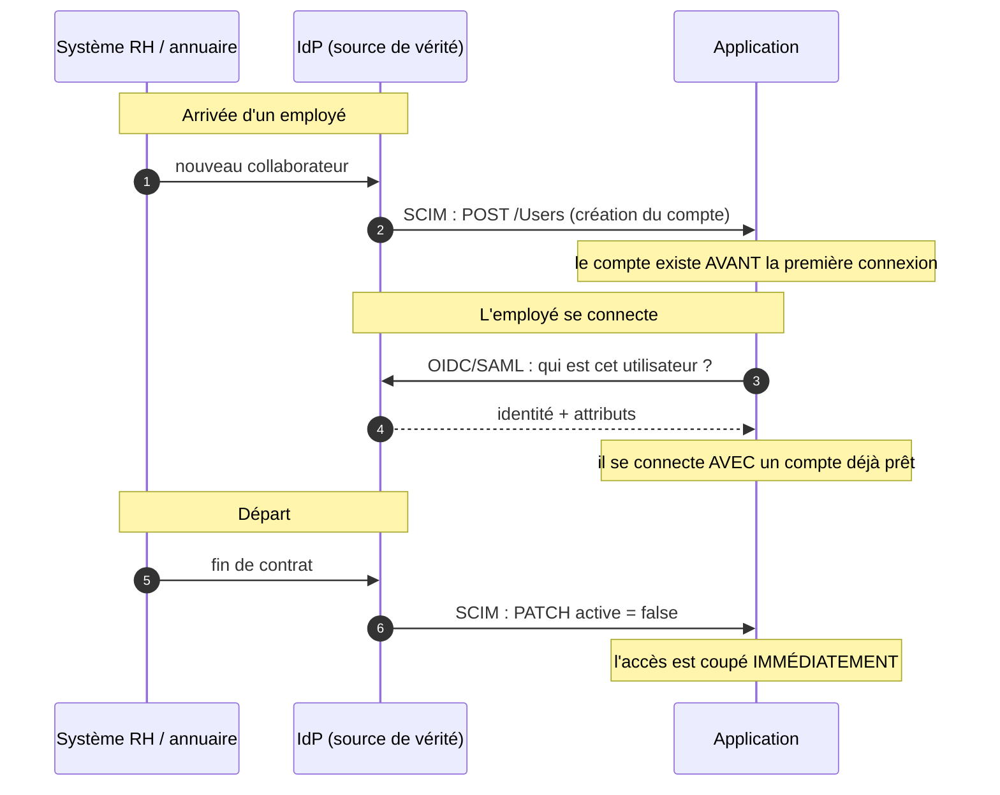

# SCIM

> [!abstract] Ancre
> SCIM (*System for Cross-domain Identity Management*) est le standard qui permet à un système d'identité de **créer, modifier et supprimer automatiquement** les comptes dans les applications : c'est le langage du **provisionnement**.

---

## 🧒 Avant de commencer : de quoi on parle

> [!tip] En clair
> On a parlé d'**authentification** (prouver qui on est) et d'**autorisation** (ce à quoi on a droit). Mais il y a une question **avant** les deux :
>
> **Comment le compte de l'utilisateur arrive-t-il dans l'application ?**
>
> 🏢 **L'analogie :** quand un nouvel employé arrive, il faut :
> - **Créer son badge** dans chaque bâtiment où il travaille.
> - Le **mettre à jour** quand il change de service.
> - Le **désactiver** le jour de son départ.
>
> Si on fait ça **à la main** dans 40 applications, on oublie toujours quelque chose. **Et ce qu'on oublie le plus souvent, c'est le départ** — ce qui laisse des comptes actifs pour des gens partis. C'est un **risque de sécurité majeur**.
>
> **SCIM, c'est le standard qui automatise tout ça.**

**Les mots à connaître pour cette note :**

| Mot technique | En clair |
|---|---|
| **SCIM** | le **langage** pour gérer les comptes automatiquement |
| **provisioning** | **créer** et **configurer** un compte automatiquement |
| **déprovisioning** | **désactiver/supprimer** un compte automatiquement |
| **IdP / source de vérité** | le système qui **décide** (l'annuaire d'entreprise) |
| **application cible** | le système qui **reçoit** (Slack, Jira, Salesforce…) |
| **JML** | *Joiner / Mover / Leaver* : arrivée, changement, départ |
| **mapping d'attributs** | la **traduction** entre les champs du modèle et ceux de l'appli |

Voir aussi : [[auth_workflows]] (ce qui se passe à la connexion) et [[index]].

---

## Définition

> [!tip] En clair
> SCIM est un **protocole REST standardisé** : un système d'identité envoie des **requêtes HTTP** à une application pour **créer, lire, mettre à jour ou supprimer** des comptes.
>
> 🔧 **Le mot technique :** défini par la **RFC 7643** (le modèle de données : *utilisateur*, *groupe*) et la **RFC 7644** (le protocole : les opérations HTTP).

**SCIM 2.0** (*System for Cross-domain Identity Management*) est un standard (RFC 7643 / RFC 7644) définissant :

- un **modèle de données** JSON pour représenter les **utilisateurs** (`User`) et les **groupes** (`Group`) ;
- un **protocole REST** (`GET`, `POST`, `PUT`, `PATCH`, `DELETE`) pour les gérer automatiquement entre un **fournisseur d'identité** (l'IdP) et une **application** (le *service provider*).

**SCIM ne fait pas d'authentification.** Il ne dit pas qui est l'utilisateur — il **gère son compte**. C'est le **complément** des protocoles comme [[openid_connect]] ou [[saml2]].

| | **SCIM** | **[[openid_connect]] / [[saml2]]** |
|---|---|---|
| Question | « **créer/gérer** le compte » | « **qui** est connecté ? » |
| Direction | IdP → application (poussé) | application → IdP (à la connexion) |
| Moment | en continu (création, changement, départ) | à chaque connexion |

---

## Enjeux

> [!tip] En clair
> **Le vrai enjeu : supprimer les comptes oubliés.**
>
> Un employé qui part laisse, en moyenne, des comptes **actifs** dans des dizaines d'applications. Ces comptes deviennent des **portes d'entrée** pour un attaquant (identifiants réutilisés, mots de passe faibles, absence de MFA). C'est l'une des causes les plus fréquentes de compromission en entreprise.

- **Sécurité du départ (le plus critique)** : un compte non désactivé est un accès résiduel, souvent oublié des mois.
- **Fin de la manipulation manuelle** : plus de création de comptes à la main dans 40 applications — source d'erreurs et de délais.
- **Cohérence des attributs** : un changement de nom ou de service se propage **partout** automatiquement.
- **Rapidité d'arrivée** : l'employé a tout **le premier jour**, au lieu d'attendre trois semaines.
- **Traçabilité** : chaque création/modification/suppression est **journalisée** — indispensable en audit.
- **Coût caché** : un compte orphelin ne coûte pas seulement une licence — il coûte une **surface d'attaque**.

---

## Fonctionnement détaillé

### Le sens du flux

> [!tip] En clair
> **L'IdP est la source de vérité**, et il **pousse** vers les applications. C'est le sens à retenir :

```
   Annuaire / IdP                       Applications
   (source de vérité)                   (cibles)
        │                                    │
        │  ── POST /Users (création) ──────> │  Slack
        │  ── PATCH /Users (modification) ─> │  Jira
        │  ── DELETE /Users (départ) ──────> │  Salesforce
        │  ── POST /Groups (ajout au groupe) >│
        │                                    │
```

**Deux modes possibles :**

| Mode | Qui décide quoi | En clair |
|---|---|---|
| **Poussé par l'IdP** | l'IdP **décide** et **envoie** | le mode courant (« *outbound provisioning* ») |
| **Tiré par l'application** | l'appli **interroge** l'IdP | plus rare, pour des imports |

### Le modèle de données : `User`

> [!tip] En clair
> SCIM définit une **représentation standard** d'un utilisateur. Chaque application doit ensuite **traduire** ces champs vers les siens — c'est le *mapping*.

```json
{
  "schemas": ["urn:ietf:params:scim:schemas:core:2.0:User"],
  "id": "2819c223-7f76-453a-919d-413861904646",
  "externalId": "alice.martin",
  "userName": "alice.martin@exemple.com",
  "name": {
    "givenName": "Alice",
    "familyName": "Martin",
    "formatted": "Alice Martin"
  },
  "emails": [
    { "value": "alice.martin@exemple.com", "primary": true, "type": "work" }
  ],
  "active": true,
  "groups": [
    { "value": "groupe-comptabilite", "display": "Comptabilité" }
  ],
  "meta": {
    "resourceType": "User",
    "created": "2026-10-01T08:00:00Z",
    "lastModified": "2026-10-01T08:00:00Z",
    "version": "W/\"a330bc54f0671c9\""
  }
}
```

**Les champs les plus importants :**

| Champ | En clair |
|---|---|
| **`id`** | l'identifiant **du compte dans l'application** |
| **`externalId`** | l'identifiant **côté IdP** — le lien entre les deux mondes |
| **`userName`** | l'identifiant de connexion (souvent l'email) |
| **`active`** | ⭐ **le champ critique** : `false` = compte désactivé |
| **`groups`** | les groupes d'appartenance (base d'un RBAC — voir [[rbac_abac_rebac]]) |
| **`meta.version`** | la version (concurrence optimiste : deux systèmes mettent-ils à jour en même temps ?) |

> [!warning] Le champ `active` mérite toute l'attention
> C'est **le** champ qui porte le déprovisionnement. Un `active: false` bien appliqué **coupe** l'accès immédiatement. Un IdP qui n'applique pas ce champ — ou une application qui l'ignore — laisse le compte ouvert : l'employé parti garde son accès.

### Le protocole : les cinq opérations

> [!tip] En clair
> SCIM est du **REST classique**. Cinq opérations suffisent à tout décrire.

| Opération | HTTP | En clair | Cas JML |
|---|---|---|---|
| **Créer** | `POST /Users` | nouveau compte | **Joiner** (arrivée) |
| **Lire** | `GET /Users/{id}` | consulter un compte | audit, debug |
| **Lister / chercher** | `GET /Users?filter=...` | trouver des comptes | réconciliation |
| **Mettre à jour** | `PATCH /Users/{id}` | modifier un compte | **Mover** (changement) |
| **Supprimer / désactiver** | `DELETE` ou `PATCH active:false` | fermer un compte | **Leaver** (départ) |

**Exemple — création (Joiner) :**

```http
POST /Users HTTP/1.1
Host: app.exemple.com
Authorization: Bearer <token de provisionnement>
Content-Type: application/scim+json

{
  "schemas": ["urn:ietf:params:scim:schemas:core:2.0:User"],
  "externalId": "alice.martin",
  "userName": "alice.martin@exemple.com",
  "name": { "givenName": "Alice", "familyName": "Martin" },
  "emails": [{ "value": "alice.martin@exemple.com", "primary": true }],
  "active": true
}
```

**Exemple — modification (Mover) :**

```http
PATCH /Users/2819c223-7f76-453a-919d-413861904646 HTTP/1.1
Host: app.exemple.com
Content-Type: application/scim+json

{
  "schemas": ["urn:ietf:params:scim:api:messages:2.0:PatchOp"],
  "Operations": [
    { "op": "replace", "path": "userName",
      "value": "alice.dupont@exemple.com" }
  ]
}
```

**Exemple — départ (Leaver) :**

```http
PATCH /Users/2819c223-7f76-453a-919d-413861904646 HTTP/1.1
Host: app.exemple.com
Content-Type: application/scim+json

{
  "schemas": ["urn:ietf:params:scim:api:messages:2.0:PatchOp"],
  "Operations": [
    { "op": "replace", "path": "active", "value": false }
  ]
}
```

**Le choix `DELETE` vs `active: false` :**

| Approche | Effet | Recommandation |
|---|---|---|
| `DELETE` | suppression **définitive** | risqué : on perd l'historique et l'attribution des ressources |
| `PATCH active:false` | **désactivation** réversible | ⭐ **préféré** — on garde la trace, l'accès est coupé |

En pratique, la **désactivation** est préférée : elle coupe l'accès **immédiatement**, tout en préservant les données (documents, tickets, historique) et en permettant un retour si le départ est annulé.

### Les groupes et l'autorisation

> [!tip] En clair
> SCIM gère aussi les **groupes**. C'est le pont vers l'**autorisation** : quand l'IdP ajoute un utilisateur à un groupe, l'application peut en déduire des **droits** (RBAC).
>
> ➡️ C'est ainsi que **le rôle suit le poste** : l'employé change de service → son groupe change → ses droits changent, **sans intervention manuelle**.

```
Annuaire (source de vérité)
   Alice → groupe « Comptabilité »  ──SCIM──>  Application
                                              → rôle local « Comptable »
                                              → droits associés
```

**Le lien direct avec [[rbac_abac_rebac]] :** SCIM synchronise **le rôle** ; le modèle RBAC décide **ce que le rôle autorise**. Deux briques distinctes, mais qui se répondent.

### Le cycle de vie : Joiner, Mover, Leaver

> [!tip] En clair
> **Le cadre JML** structure tout le provisionnement. Trois moments, trois besoins.

| Moment | Ce qui change | Action SCIM | Criticité |
|---|---|---|---|
| **Joiner** (arrivée) | nouveau compte | `POST /Users` + groupes | moyenne (délai, expérience) |
| **Mover** (mobilité) | service, poste, nom | `PATCH` attributs + groupes | **élevée** (droits cumulés) |
| **Leaver** (départ) | fin de contrat | `PATCH active:false` | ⭐ **critique** (sécurité) |

**Le « Mover » est le plus souvent négligé :** quand Alice passe de la Comptabilité aux Ressources Humaines, on lui **ajoute** les droits RH… mais on oublie souvent de lui **retirer** ceux de la Comptabilité. C'est le mécanisme du *privilege creep* décrit dans [[rbac_abac_rebac]]. **SCIM résout ça** — à condition de synchroniser **les deux** (ajouts **et** retraits).

### Le lien avec les protocoles d'authentification

> [!tip] En clair
> **SCIM et OIDC/SAML sont complémentaires, pas concurrents.** Ensemble, ils font l'identité complète :



**La distinction à retenir :**

| | SCIM | OIDC / SAML |
|---|---|---|
| Quand | **en continu** (avant, pendant, après) | **à la connexion** |
| Objet | **le compte** | **la preuve d'identité** |
| Effet d'un départ | compte **désactivé** | plus de nouvelle connexion |

**Le point important :** couper l'authentification ne suffit **pas** — les **sessions déjà ouvertes** et les **jetons déjà émis** restent valides. C'est pourquoi le deprovisioning doit aussi **révoquer** les sessions et les jetons (voir [[logout]] et [[refresh_token]]).

---

## Exemple concret

> [!tip] En clair
> **Le cycle de vie d'Alice**, de son arrivée à son départ, avec les appels réels.

### Jour 1 — Joiner

```
Le système RH enregistre l'arrivée d'Alice
  → l'IdP crée son identité
  → SCIM pousse vers les applications :

POST /Users  →  Slack        { userName: alice.martin@exemple.com, active: true }
POST /Users  →  Jira         { userName: alice.martin@exemple.com, active: true }
POST /Users  →  Salesforce   { userName: alice.martin@exemple.com, active: true }
POST /Groups →  Jira         { ajout au groupe « Comptabilité » }

Résultat : le jour de son arrivée, Alice a tout. Aucun compte créé à la main.
```

### Jour 1 — Première connexion

```
Alice se connecte à Slack avec SSO (OIDC ou SAML)
  → son compte EXISTE DÉJÀ (créé par SCIM)
  → elle n'a rien à demander à personne
```

### Mois 6 — Mover

```
Alice passe de la Comptabilité aux Ressources Humaines
  → l'annuaire change son groupe
  → SCIM pousse :

PATCH /Groups  →  retrait du groupe « Comptabilité »      ⭐ LE RETRAIT, essentiel
PATCH /Groups  →  ajout au groupe « Ressources Humaines »
PATCH /Users   →  mise à jour de son titre / service

Résultat : ses droits suivent son poste, sans accumulation.
```

### Mois 24 — Leaver (le moment critique)

```
Alice quitte l'entreprise
  → l'annuaire enregistre la fin de contrat
  → SCIM pousse IMMÉDIATEMENT :

PATCH /Users/{id}  →  { "op": "replace", "path": "active", "value": false }
  →  Slack, Jira, Salesforce : compte DÉSACTIVÉ

Et EN PLUS (hors SCIM, mais indispensable) :
  → l'IdP révoque ses SESSIONS actives        (sinon elle reste connectée)
  → l'IdP révoque ses JETONS (refresh token)  (sinon elle se refait des accès)
```

**Si le dernier bloc est oublié :** Alice ne peut plus se **reconnecter**, mais sa **session ouverte** sur l'application continue de fonctionner — parfois pendant des heures, ou jusqu'à l'expiration du refresh token. **Le déprovisionnement n'est complet que si l'on coupe aussi les sessions et les jetons.**

### Ce qui doit être mis en place (checklist)

```
□ L'IdP est bien la SOURCE DE VÉRITÉ (un seul endroit décide)
□ Les applications cibles supportent SCIM, ou une PASSERELLE fait la traduction
□ Le MAPPING d'attributs est défini (et testé) pour chaque application
□ Le RETRAIT de groupe est synchronisé autant que l'AJOUT
□ Le champ `active` est réellement APPLIQUÉ par les applications
□ Les SESSIONS et JETONS sont RÉVOQUÉS au départ (au-delà de SCIM)
□ Chaque opération est JOURNALISÉE (audit)
□ Une RÉCONCILIATION périodique détecte les comptes orphelins
```

---

## Pièges fréquents

> [!tip] En clair
> **Les 6 erreurs à retenir :**
> 1. **Oublier le départ** → le compte reste actif, l'accès survit des mois.
> 2. **Ne synchroniser que les ajouts** → les droits s'accumulent (*privilege creep*).
> 3. **Couper la connexion sans révoquer les sessions** → la session ouverte continue.
> 4. **IdP qui n'est pas la source de vérité** → deux sources, deux vérités, incohérence.
> 5. **Mapping d'attributs bâclé** → noms mal orthographiés, groupes non reconnus.
> 6. **Aucune réconciliation** → les dérives s'accumulent sans jamais être détectées.

- **Déprovisionnement oublié** — c'est **la** faille classique : un compte actif pour quelqu'un parti. Souvent découvert lors d'un audit… des mois plus tard. Réflexe : SCIM **et** contrôle périodique des comptes orphelins.
- **Suppression au lieu de désactivation** — `DELETE` détruit le compte et ses données (documents, tickets, historique) ; on perd la traçabilité et l'attribution. Réflexe : préférer `active: false`.
- **`active: false` non appliqué par l'application** — le champ est reçu mais ignoré : le compte reste utilisable. Réflexe : **tester** le déprovisionnement de bout en bout, pas seulement la création.
- **Sessions et jetons non révoqués** — couper l'authentification ne ferme **pas** les sessions ouvertes ni les [[refresh_token|refresh tokens]] déjà émis. Réflexe : au départ, révoquer sessions **et** jetons (voir [[logout]]).
- **Asymétrie ajout/retrait** — les groupes sont ajoutés mais jamais retirés lors des mobilités. Réflexe : synchroniser **l'état complet**, pas seulement les ajouts ; faire des revues régulières.
- **Mapping d'attributs négligé** — le nom d'attribut ne correspond pas à celui attendu par l'application ; l'email part dans le mauvais champ ; les groupes ne se créent pas. Réflexe : **documenter et tester** le mapping par application.
- **Deux sources de vérité** — l'IdP et un outil RH/SIRH se contredisent, ou une administration manuelle réintroduit des comptes. Réflexe : **une seule** source, tout le reste est en lecture seule.
- **Pas de gestion des erreurs** — une requête SCIM échoue silencieusement (application indisponible) : le compte n'est jamais désactivé. Réflexe : **file d'attente avec reprise**, alertes sur échec, et supervision des jobs de provisionnement.
- **`externalId` non conservé** — sans le lien vers l'identité source, la réconciliation devient impossible. Réflexe : conserver systématiquement `externalId` et l'`id` local.
- **Conflits de mise à jour** — deux systèmes modifient le même compte ; le dernier écrase l'autre. Réflexe : utiliser `meta.version` (concurrence optimiste).
- **Jeton de provisionnement trop permissif** — le jeton qui appelle SCIM peut lire/modifier **tous** les comptes. Réflexe : jeton dédié, **portée minimale**, rotation, et masquage dans les logs.
- **Données personnelles exportées sans contrôle** — SCIM transporte des données personnelles (email, nom, parfois adresse). Réflexe : ne synchroniser que le **nécessaire** (moindre privilège appliqué aux **données**, pas seulement aux droits).
- **Absence de journalisation** — impossible de savoir qui a créé ou désactivé quoi, ni de prouver la conformité. Réflexe : journaliser chaque opération, avec source et résultat.
- **Croire que SCIM authentifie** — SCIM ne gère **pas** la connexion : il prépare le compte. Réflexe : SCIM **et** [[openid_connect]]/[[saml2]] — les deux sont nécessaires.

---

## Rappel

> [!question] Question de rappel
> Un employé quitte l'entreprise. L'IdP envoie `PATCH /Users/{id}` avec `active: false` à toutes les applications. Cet employé peut-il encore accéder à quelque chose ? Que faut-il faire de plus ?

> [!success]- Réponse
> **Oui, il peut encore accéder à deux choses.** D'abord, **il ne peut plus s'authentifier** : le compte étant désactivé, une nouvelle connexion SSO échouera — c'est le rôle du champ `active`. Mais ① les **sessions déjà ouvertes** auprès des applications restent valides jusqu'à leur expiration ou leur fermeture : l'utilisateur déjà connecté à une application continue de travailler, même si son compte est désactivé — toutes les applications ne revérifient pas l'état du compte à chaque requête. Et ② les **jetons déjà émis** ([[access_token]], [[refresh_token]]) restent utilisables jusqu'à leur expiration, et le refresh token permet même d'en **obtenir de nouveaux** : l'accès peut se prolonger bien au-delà du départ. Il faut donc, **en plus** du `active: false` : **révoquer les sessions actives** (propagation de la déconnexion — voir [[logout]]) et **révoquer les refresh tokens** (RFC 7009). En complément, on s'appuie sur des durées de vie **courtes** des access tokens, sur la **rotation** des refresh tokens, et sur une **réconciliation périodique** pour détecter les comptes qui auraient échappé au déprovisionnement.

### 🎯 Le résumé à retenir

> [!tip] Si tu ne retiens qu'une chose
> **SCIM = l'automatisation du cycle de vie des comptes.**
>
> - **IdP = source de vérité**, il **pousse** vers les applications.
> - **`active: false`** est le champ du **départ** — le plus critique.
> - **JML** : *Joiner* (créer), *Mover* (mettre à jour — **ajouter ET retirer**), *Leaver* (désactiver).
> - **SCIM ≠ authentification** : SCIM **prépare** le compte, OIDC/SAML **ouvre la session**.
>
> **Le réflexe vital :** désactiver le compte **ne suffit pas**. Il faut aussi **révoquer sessions et jetons**, sinon l'accès survit au départ.
>
> **Et le bénéfice concret :** le compte orphelin d'un ancien employé est l'une des **causes les plus fréquentes** de compromission en entreprise — SCIM est la réponse.

---

## Voir aussi

- [[auth_workflows]] — ce qui se passe à la connexion, une fois le compte créé.
- [[rbac_abac_rebac]] — les groupes synchronisés par SCIM alimentent les rôles.
- [[logout]] — la révocation des sessions, complément indispensable au déprovisionnement.
- [[refresh_token]] — à révoquer explicitement au départ d'un utilisateur.
- [[saml2]] — le protocole souvent couplé à SCIM dans le monde de l'entreprise.
- [[openid_connect]] — le protocole moderne qui consomme les comptes créés par SCIM.
- [[index]] — carte d'entrée du domaine.
- [[access_token]] — le jeton dont l'expiration limite (imparfaitement) la fenêtre résiduelle.

## Références

- RFC 7643 — *System for Cross-domain Identity Management: Core Schema* (modèle `User`, `Group`).
- RFC 7644 — *System for Cross-domain Identity Management: Protocol* (opérations REST, filtre, PATCH).
- RFC 7009 — *OAuth 2.0 Token Revocation*.
- NIST SP 800-53 — *Security and Privacy Controls*, AC-2 (Account Management) : création, revue, désactivation, suppression des comptes.
- NIST SP 800-63A — *Digital Identity Guidelines: Enrollment and Identity Proofing* (cycle de vie).
