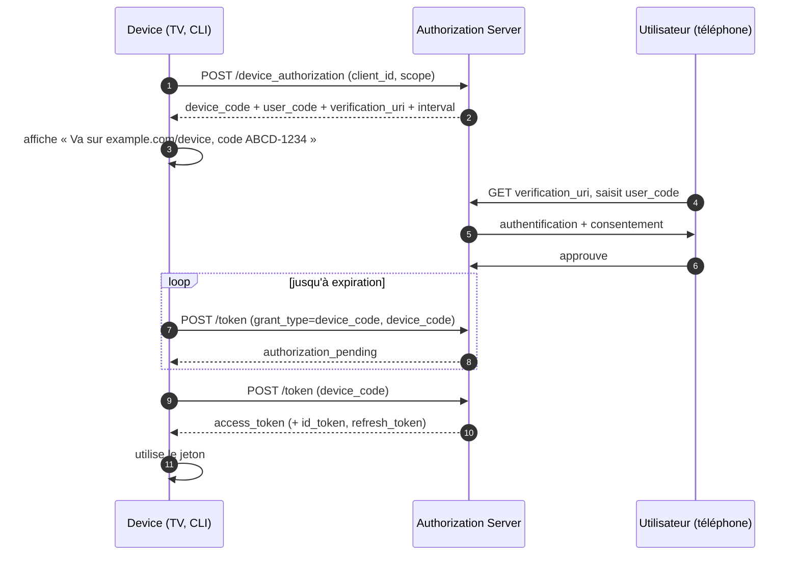

# Device Authorization Flow

> [!abstract] Ancre
> Le Device Authorization Flow permet à un appareil dépourvu de navigateur utilisable d'obtenir un jeton : l'utilisateur s'authentifie sur un autre appareil, avec un code court.

---

## 🧒 Avant de commencer : de quoi on parle

> [!tip] En clair
> Imagine une **Smart TV**, une console de jeu, une imprimante ou un terminal. Comment te connecter dessus ? Tu ne vas pas taper ton mot de passe sur une télécommande !
>
> La solution est astucieuse :
> 1. L'appareil affiche un **code court** (du genre `ABCD-1234`) et une adresse.
> 2. **Toi**, tu prends **ton téléphone**, tu vas sur cette adresse, tu tapes le code.
> 3. Tu te connectes **sur ton téléphone** (clavier confortable, vrai navigateur).
> 4. L'appareil, qui **attendait patiemment**, reçoit son badge.
>
> **Le principe :** faire la partie sensible (saisir son mot de passe) sur l'appareil **confortable**, et laisser l'appareil limité juste **attendre**.

**Les mots à connaître pour cette note :**

| Mot technique | En clair |
|---|---|
| **Device Authorization** | le flow des appareils sans navigateur |
| **`device_code`** | le ticket secret que l'appareil garde et présente en boucle |
| **`user_code`** | le code court montré à l'écran (`ABCD-1234`) |
| **`verification_uri`** | l'adresse où l'utilisateur saisit ce code |
| **polling** | l'appareil qui redemande régulièrement « c'est bon ? » |
| **`interval`** | le temps d'attente imposé entre deux demandes |

Voir aussi : [[authorization_code_flow]] (le flow classique) et [[pkce]] (recommandé ici aussi).

---

## Définition

> [!tip] En clair
> Ce flow (RFC 8628) sert quand un appareil **existe** mais n'a **pas de navigateur utilisable** : TV, console, CLI, objet connecté.
>
> L'appareil ne peut pas afficher une page de connexion correctement — alors c'est **l'utilisateur qui se connecte ailleurs**, et l'appareil récupère le badge par un mécanisme d'attente.

Le **Device Authorization Flow** (RFC 8628) permet à un appareil à capacités d'entrée limitées d'obtenir un [[access_token]] : l'appareil demande un `device_code` et affiche un `user_code`, l'utilisateur s'authentifie sur un **second appareil** via la `verification_uri`, et l'appareil obtient le jeton par *polling* du `/token`.

Il peut délivrer un [[id_token]] — c'est donc un flux [[openid_connect]] légitime ([[openid_connect]]), recommandé pour les appareils sans navigateur.

---

## Enjeux

> [!tip] En clair
> **Le problème :** un appareil sans clavier confortable ne peut pas t'offrir une connexion sûre. Si tu tapes ton mot de passe sur une télécommande, tu risques de le taper devant tout le monde — et l'appareil devient un point de fuite.
>
> **Ce que ce flow apporte :** la partie sensible se fait **ailleurs**, sur un appareil que tu contrôles. L'appareil limité ne voit jamais ton mot de passe.

- **Découplage** : le secret (le mot de passe) ne circule **jamais** sur l'appareil limité.
- **Ergonomie** : la saisie se fait sur un clavier confortable et un vrai navigateur.
- **Coût** : l'appareil doit **attendre** — d'où le *polling*, qui impose une charge et un rythme à respecter.
- **Risque propre** : le `device_code` est un secret — s'il fuite et que l'utilisateur autorise, l'attaquant récupère le jeton.

---

## Fonctionnement détaillé

### Les deux jetons du flow

> [!tip] En clair
> Deux codes très différents circulent ici :
> - Le **code court** (`user_code`) : montré **à l'écran**, il sert à **toi**. Court, lisible, à taper à la main.
> - Le **code long** (`device_code`) : gardé **par l'appareil**, secret, jamais affiché. C'est lui qui sert à réclamer le badge.
>
> Ne pas les confondre : l'un est public (l'écran), l'autre est secret (l'appareil).

| Élément | Rôle | Visibilité |
|---|---|---|
| `device_code` | Identifie la demande de l'appareil au `/token` | **Secret** — reste sur l'appareil |
| `user_code` | Saisi par l'utilisateur sur la `verification_uri` | Public — affiché à l'écran |
| `verification_uri` | Adresse où saisir le `user_code` | Public |
| `verification_uri_complete` | URL pré-remplie (QR code, lien direct) | Public |
| `expires_in` | Durée de validité de la demande | Public |
| `interval` | Délai minimal entre deux *polls* | Public |

### Le déroulement

> [!tip] En clair
> Cinq étapes, dont une qui se répète :
> 1. L'appareil **demande** le droit de se connecter.
> 2. Il **affiche** le code court.
> 3. Toi, tu **saisis** ce code sur ton téléphone et tu t'authentifies.
> 4. L'appareil **redemande en boucle** « c'est bon ? » → « pas encore »… « pas encore »…
> 5. « Oui ! » → l'appareil reçoit le badge.



### Le polling et ses règles

> [!tip] En clair
> L'appareil ne peut pas **recevoir** d'appel du guichet (il est derrière une box, sans adresse publique). Alors c'est lui qui **redemande** régulièrement.
>
> Deux règles, sinon le guichet se protège :
> - **Respecter le rythme** (`interval`) : redemander trop vite → erreur `slow_down`.
> - **S'arrêter à l'heure** : après `expires_in`, la demande est morte.

| Réponse du `/token` | Signification | Action de l'appareil |
|---|---|---|
| `authorization_pending` | l'utilisateur n'a pas encore approuvé | attendre `interval` puis redemander |
| `slow_down` | trop de requêtes | augmenter l'intervalle de 5 s |
| `access_denied` | l'utilisateur a refusé | arrêter |
| `expired_token` | délai dépassé | recommencer le flow |
| `200` + jetons | approuvé | utiliser le jeton |

L'erreur `slow_down` est une protection anti-surcharge : elle **impose** au client de ralentir. L'ignorer et continuer à haute fréquence est une faute — au mieux rejetée, au pire un abus.

### PKCE : recommandé ici aussi

> [!tip] En clair
> L'échange du `device_code` **est un échange de code déguisé**. Donc la même protection s'applique : [[pkce]], surtout pour les appareils qui ne peuvent pas garder de secret.
>
> La RFC 8628 le recommande explicitement pour les clients non confidentiels.

Bien que le `device_code` ne traverse pas de navigateur, RFC 8628 §5.6 recommande [[pkce]] pour les clients publics : le `code_verifier` lie l'échange à l'appareil. Le `device_code` reste un secret à protéger — ne pas le journaliser, ne pas l'afficher.

---

## Exemple concret

> [!tip] En clair
> Le parcours complet d'une CLI ou d'une TV. Observe les deux vies parallèles : l'appareil qui **attend en boucle**, et toi qui **agis sur ton téléphone**.

**1. L'appareil demande l'autorisation :**

```http
POST /device_authorization HTTP/1.1
Host: auth.example.com
Content-Type: application/x-www-form-urlencoded

client_id=cli-tool-42
&scope=openid%20profile%20read:data
```

**Réponse :**

```json
{
  "device_code": "GmRhmhcxhwAzkoEqiMEg_DnyEysNkuNhszIySk9eS",
  "user_code": "WDJB-MJHT",
  "verification_uri": "https://auth.example.com/device",
  "verification_uri_complete": "https://auth.example.com/device?user_code=WDJB-MJHT",
  "expires_in": 1800,
  "interval": 5
}
```

**2. L'appareil affiche :**

```
Pour vous connecter, ouvrez https://auth.example.com/device
et saisissez le code : WDJB-MJHT
```

**3. L'utilisateur s'authentifie sur son téléphone** (login + consentement).

**4. L'appareil interroge le `/token` toutes les 5 secondes :**

```http
POST /token HTTP/1.1
Host: auth.example.com
Content-Type: application/x-www-form-urlencoded

grant_type=urn:ietf:params:oauth:grant-type:device_code
&device_code=GmRhmhcxhwAzkoEqiMEg_DnyEysNkuNhszIySk9eS
&client_id=cli-tool-42
```

```json
{ "error": "authorization_pending" }
```

**5. Après approbation :**

```json
{
  "access_token": "eyJhbGci...",
  "token_type": "Bearer",
  "expires_in": 3600,
  "refresh_token": "8xLOxBtZp8",
  "id_token": "eyJhbG...AwfQ.SIG",
  "scope": "openid profile read:data"
}
```

C'est le flow utilisé par `gh auth login`, les applications de streaming sur TV et la plupart des consoles.

---

## Pièges fréquents

> [!tip] En clair
> **Les 5 erreurs à retenir :**
> 1. **Poll trop vite** → erreur `slow_down`. Il faut respecter l'`interval`.
> 2. **Journaliser le `device_code`** → c'est un secret, il ouvre l'accès.
> 3. **Confondre `user_code` et `device_code`** → l'un est affiché, l'autre est secret.
> 4. **Ne pas gérer l'expiration** → l'appareil attend indéfiniment une demande morte.
> 5. **Oublier PKCE** sur un appareil sans secret → protection perdue.

- **Polling trop rapide** — l'AS répond `slow_down` ; l'ignorer mène au rejet ou à l'abus. Réflexe : respecter `interval`, l'augmenter de 5 s sur `slow_down`.
- **`device_code` journalisé ou affiché** — c'est le secret du flow. Réflexe : ne jamais l'écrire dans les logs, ne jamais le montrer à l'écran.
- **Confusion `user_code` / `device_code`** — le premier est public (écran), le second est privé (appareil). Réflexe : les traiter comme deux objets de nature différente.
- **Expiration non gérée** — `expired_token` laissé sans traitement, l'appareil poll à vide. Réflexe : arrêter le polling et relancer le flow.
- **`user_code` trop long ou ambigu** — un code difficile à recopier crée des échecs et des réessais (surface d'abus). Réflexe : alphabet restreint, sans caractères ambigus (RFC 8628 §6.1).
- **Utilisateur trompé sur le device** — un attaquant obtient un `user_code` et le fait saisir par une victime, qui autorise l'accès de l'attaquant (*phishing par code*). Réflexe : afficher assez d'informations (nom du client, portée demandée) sur la page de vérification, et alerter l'utilisateur.
- **PKCE omis sur un client public** — l'échange du `device_code` est un échange de code déguisé. Réflexe : PKCE (`S256`) pour tout client non confidentiel.
- **Aucune limite de tentatives** — un `user_code` trop court est attaquable par force brute. Réflexe : codes à entropie suffisante, limitation des essais, courte durée de vie.

---

## Rappel

> [!question] Question de rappel
> Pourquoi l'appareil doit-il *poller* le `/token` au lieu de simplement recevoir le jeton une fois l'utilisateur authentifié ?

> [!success]- Réponse
> Parce que l'appareil est typiquement **sans serveur joignable et sans navigateur** : il ne peut pas exposer de `redirect_uri` utilisable, et le serveur d'autorisation n'a aucun moyen de l'appeler. La seule direction possible est donc **appareil → serveur** : l'appareil redemande périodiquement l'état de sa demande, jusqu'à ce qu'elle soit approuvée (`200` avec les jetons) ou rejetée (`access_denied`, `expired_token`). C'est aussi ce qui rend le flow robuste : aucune ouverture de port, aucune redirection, l'appareil reste purement sortant. D'où les règles `interval` et `slow_down`, qui protègent le serveur de la charge induite.

### 🎯 Le résumé à retenir

> [!tip] Si tu ne retiens qu'une chose
> **L'appareil affiche un code court, tu te connectes sur ton téléphone, l'appareil attend son badge.**
>
> Le mot de passe ne circule **jamais** sur l'appareil limité — c'est tout l'intérêt. Et l'appareil doit **respecter le rythme** de ses demandes (`interval`), sinon `slow_down`.

---

## Voir aussi

- [[oauth2]] — le cadre et la liste des grants.
- [[authorization_code_flow]] — le flow dont celui-ci est une variante pour appareils sans navigateur.
- [[pkce]] — recommandé à l'échange du `device_code` (RFC 8628 §5.6).
- [[access_token]] — le jeton finalement délivré à l'appareil.
- [[refresh_token]] — souvent émis, pour éviter de refaire le flow.
- [[flows_comparison]] — choisir entre code, device et client credentials.
- [[security_oauth21]] — usages abusifs et durcissements.
- [[oidc/index]] — carte d'entrée du dossier.

## Références

- RFC 8628 — *OAuth 2.0 Device Authorization Grant* (§3 device authorization request, §3.4 response, §3.5 polling, §5.6 PKCE, §6.1 user code).
- RFC 6749 — *The OAuth 2.0 Authorization Framework*.
- RFC 7636 — *Proof Key for Code Exchange* (PKCE).
- RFC 9700 — *Best Current Practice for OAuth 2.0 Security*.
- draft-ietf-oauth-v2-1 — *The OAuth 2.1 Authorization Framework*.
