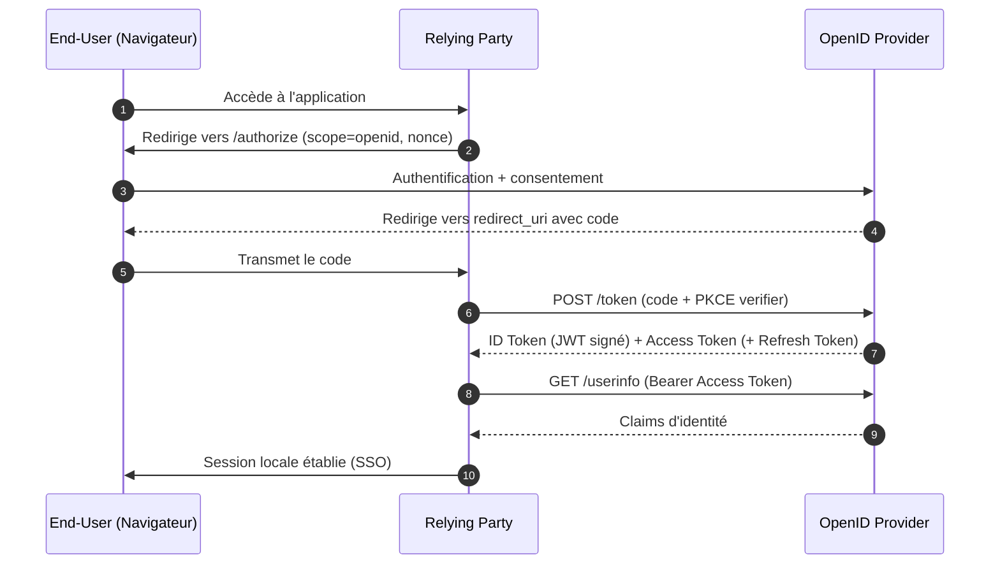

# OpenID Connect

> [!abstract] Ancre
> OAuth 2.0 autorise l'accès ; OIDC ajoute l'identité en standardisant un ID Token signé qui prouve *qui* s'est authentifié.

---

## 🧒 Avant de commencer : de quoi on parle

> [!tip] En clair
> Rappelle-toi OAuth : il donne un **badge** pour faire des choses (lire tes fichiers, par exemple). Mais le badge **ne dit pas qui tu es** — il dit seulement ce que l'application a le droit de faire.
>
> Résultat : quand tu te connectes à une appli avec Google, l'appli a bien l'autorisation… mais elle ne sait pas ton nom.
>
> **OIDC, c'est la pièce qu'on ajoute par-dessus.** En plus du badge, Google remet une **carte d'identité signée** qui dit : « cet utilisateur, c'est Alice, et voilà son identifiant ».
>
> OIDC n'invente **rien de nouveau** : c'est exactement le même mécanisme qu'OAuth, avec **un objet en plus**.

**Les mots à connaître pour cette note :**

| Mot technique | En clair |
|---|---|
| **OpenID Connect (OIDC)** | la couche « identité » posée sur OAuth |
| **OpenID Provider (OP)** | le guichet d'identité qui sait **qui** tu es (Google, Keycloak…) |
| **Relying Party (RP)** | l'application qui veut savoir **qui** tu es |
| **End-User** | toi |
| **ID Token** | la carte d'identité signée (voir [[id_token]]) |
| **scope `openid`** | le mot magique qui dit « je veux l'identité, pas juste un accès » |

---

## Définition

> [!tip] En clair
> OAuth répond à : « **est-ce que cette appli a le droit d'agir pour moi ?** »
> OIDC répond à : « **qui suis-je, et comment le prouver de façon fiable ?** »
>
> Ce sont **deux questions différentes**, donc **deux briques différentes** — mais OIDC se pose **par-dessus** OAuth, il ne le remplace pas.
>
> 🔧 **Le mot technique :** cette couche s'appelle **OpenID Connect**, et la « preuve » qu'elle apporte s'appelle l'**ID Token**.

OpenID Connect (OIDC) 1.0 est une couche d'**authentification** (identité) construite **au-dessus** de [[oauth2]], qui reste un protocole d'**autorisation** (délégation d'accès). OIDC normalise un [[id_token]] au format [[jwt]], des scopes identitaires et un endpoint `/userinfo` pour transformer un « j'ai le droit d'accéder » en « voici qui est l'utilisateur ».

---

## Enjeux

> [!tip] En clair
> **Le problème sans OIDC :** chaque fournisseur (Google, Facebook, Microsoft…) bricolait sa propre façon de dire « voici l'utilisateur ». Du coup, aucune application ne pouvait traiter tout le monde pareil — et surtout, rien n'était **vérifiable** : comment être sûr que le nom annoncé n'a pas été inventé ?
>
> **Ce qu'OIDC apporte :** un **contrat unique** que tout le monde respecte, et une identité **signée cryptographiquement** — donc infalsifiable.

Là où [[oauth2]] répond à « ce client peut-il agir au nom de l'utilisateur sur cette ressource ? », OIDC répond à « quelle est l'identité de cet utilisateur, et comment le prouver de façon vérifiable ? ». Sans cette couche standardisée, chaque fournisseur bricolait sa propre API « me » et l'authentification tierce devenait non interopérable et non vérifiable cryptographiquement.

- **Interopérabilité** : un seul contrat ([[discovery_and_jwks]]) permet à n'importe quel Relying Party de fédérer n'importe quel OP.
- **Vérifiabilité** : l'identité est portée par une signature asymétrique, pas par un appel d'API implicite.
- **Fédération & SSO** : un fournisseur d'identité (OP) sert de source de vérité pour des dizaines d'applications (RP), d'où le Single Sign-On et le provisionnement d'identité.
- **Confidentialité** : OIDC laisse l'OP choisir entre un `sub` global stable et un `sub` *pairwise* (par RP), limitant le pistage inter-sites.
- **Conformité** : eIDAS, FAPI, PSD2 ou Open Banking s'appuient sur OIDC comme socle d'identité.

---

## Fonctionnement détaillé

### Les trois rôles

> [!tip] En clair
> Trois personnages, et ils sont faciles à retenir :
> - **Toi** (End-User)
> - **L'application** qui veut savoir qui tu es (Relying Party)
> - **Le guichet d'identité** qui sait qui tu es (OpenID Provider)
>
> Note bien : le guichet s'appelle **OP** ici, alors qu'en OAuth on disait **AS**. C'est souvent le même serveur — OIDC lui donne juste un deuxième nom quand il fait de l'identité.

- **End-User** : la personne physique dont l'identité est établie (souvent titulaire du navigateur).
- **Relying Party (RP)** : l'application qui veut authentifier l'utilisateur ; elle enregistre un `client_id`, un `redirect_uri` et un secret ou une clé auprès de l'OP.
- **OpenID Provider (OP)** : le serveur d'identité qui authentifie l'utilisateur et émet l'[[id_token]] et l'[[access_token]].

### Ce qu'OIDC ajoute à OAuth 2.0

> [!tip] En clair
> **OIDC n'est qu'un ajout — six petites choses :**
> 1. Le mot magique **`openid`** dans les droits demandés.
> 2. La **carte d'identité** (l'ID Token).
> 3. Un **guichet pour les infos de profil** (`/userinfo`).
> 4. Une **fiche technique publique** du serveur (Discovery).
> 5. Le **`nonce`** — le cousin du `state`, mais pour la carte d'identité.
> 6. Des règles de **déconnexion** propre.

1. **Le scope `openid`** obligatoire : sa présence distingue une requête OIDC d'une requête purement OAuth. S'ajoutent `profile`, `email`, `address`, `phone` (claims standardisés) et `offline_access` (droit d'obtenir un [[refresh_token]]). Catalogue complet des scopes et des claims : [[scopes_and_claims]].
2. **L'[[id_token]]** : un [[jwt]] signé porteur des *claims* d'identité (`iss`, `sub`, `aud`, `exp`, `iat`, `nonce`, `auth_time`, `acr`, `amr`).
3. **L'endpoint `/userinfo`** : API protégée par l'[[access_token]] qui renvoie les claims additionnels (prénom, e-mail vérifié, photo…).
4. **[[discovery_and_jwks]]** : le document `/.well-known/openid-configuration` publie les endpoints, les algorithmes et l'URI JWKS, supprimant tout paramétrage manuel.
5. **Le `nonce`** : valeur imprévisible liée à la requête, embarquée dans l'ID Token pour bloquer le rejeu.
6. **Session Management** : spécifications de logout front-channel (iframe) et back-channel (appel direct RP↔OP) pour propager la déconnexion. Détail : [[sso_session_and_consent]] et [[logout]].

### Les flux OIDC

> [!tip] En clair
> Comme en OAuth, il y a plusieurs chemins — mais un seul est recommandé. Retiens juste celui-là.

| Flux | Émission des tokens | Statut |
|---|---|---|
| Authorization Code | via le back-channel | **Recommandé** |
| Implicit | via le front-channel | Déprécié (RFC 9700) |
| Hybrid | ID Token front + code back | Cas avancés |

Le flux dominant est [[authorization_code_flow]] combiné à [[pkce]] ; les environnements sans navigateur utilisent [[device_authorization_flow]] ou [[client_credentials_flow]] (machine-to-machine, sans identité utilisateur). Voir [[flows_comparison]] et [[security_oauth21]].

> [!tip] En clair
> **Le déroulé, en une phrase :** on démarre comme OAuth (redirection, code, échange), et **en plus** on reçoit la carte d'identité dans la réponse. L'application peut ensuite demander des détails de profil via `/userinfo`.



### Claims, délégation et fédération

> [!tip] En clair
> - **Claims** = les « lignes » de la carte d'identité (nom, identifiant…). Le plus important est `sub` : **ton identifiant stable** chez le guichet. Stable veut dire que ton email peut changer, ton `sub` non.
> - **Délégation** = tu autorises quelqu'un à agir pour toi, sans lui donner tes identifiants.
> - **Fédération** = plusieurs organisations acceptent la même carte, ce qui donne le **SSO** (une seule connexion pour toutes les applis).

L'ID Token porte l'identité sous forme de **claims** : `sub` est l'identifiant **stable** et **local à l'OP** de l'utilisateur. En mode `pairwise`, `sub` est dérivé par RP (avec le `sector_identifier_uri`), ce qui empêche deux RP de corréler le même utilisateur. La **délégation** signifie que l'utilisateur autorise un client tiers sans lui confier ses identifiants ; la **fédération** étend ce modèle à plusieurs domaines d'administration, réalisant le SSO. Le profil **FAPI** (Financial-grade API) durcit OIDC pour la finance ([[fapi]]), et l'OpenID Foundation délivre les **certifications** : *Basic*, *Implicit*, *Hybrid*, *Config*, *FAPI*.

---

## Exemple concret

> [!tip] En clair
> Alice se connecte à un CRM avec « Se connecter avec MonIdentité ». Le début est **identique** à OAuth. Ce qui change : dans la réponse, il y a un `id_token` **en plus** de l'access token. C'est lui qui dit « je suis Alice ».

Alice ouvre `crm.example.fr` (RP) et clique « Se connecter avec MonIdentité ».

```
GET https://op.example.com/authorize
  ?response_type=code
  &client_id=crm-example-fr
  &redirect_uri=https://crm.example.fr/callback
  &scope=openid%20profile%20email
  &state=a1b2c3
  &nonce=n-0S6_WzA2Mj
  &code_challenge=E9Melhoa2OwvFrEMTJguCHaoeK1t8URWbuGJSstw-cM
  &code_challenge_method=S256
```

Après authentification, le RP échange le code contre :

```json
{
  "access_token": "eyJhbGci...",
  "token_type": "Bearer",
  "expires_in": 3600,
  "id_token": "eyJhbGciOiJSUzI1NiIsImtpZCI6IjIwMjYtMDEifQ.eyJpc3MiOiJodHRwczovL29wLmV4YW1wbGUuY29tIiwiYXVkIjoiY3JtLWV4YW1wbGUtZnIiLCJzdWIiOiJhbGljZSIsIm5vbmNlIjoibi0wUzZfV3pBMk1qIiwiZXhwIjoxNzk4MDAwMDAwfQ.SIG"
}
```

Le RP vérifie la signature via la JWKS, contrôle `iss`, `aud`, `exp` et le `nonce`, puis crée sa session locale. L'[[access_token]] n'est utilisé que pour appeler `/userinfo` ou une API métier — jamais comme preuve d'identité.

## Pièges fréquents

> [!tip] En clair
> **Les 4 erreurs à retenir avant tout :**
> 1. Prendre le badge (access token) pour une carte d'identité → ce n'est pas son rôle.
> 2. Ne pas vérifier **à qui** la carte est destinée (`aud`) → un jeton émis pour une autre appli est accepté.
> 3. Oublier le `nonce` → une carte interceptée peut être rejouée ailleurs.
> 4. Accepter la carte sans vérifier la **signature** → n'importe qui peut en fabriquer une.

- **Confondre [[access_token]] et [[id_token]]** → le RP lit l'identité dans le mauvais jeton ; réflexe : l'ID Token s'adresse au client (`aud` = `client_id`), l'access token s'adresse à une ressource.
- **Utiliser l'access token comme preuve d'identité** → un jeton opaque ou de format libre ne garantit ni la signature ni les claims ; réflexe : exiger un ID Token signé et validé.
- **Ignorer le `nonce`** → rejeu d'un ID Token intercepté sur une autre session ; réflexe : générer un nonce imprévisible, le stocker en session et le comparer à la réception.
- **Oublier de valider l'audience (`aud`)** → un ID Token émis pour une *autre* application est accepté (confused deputy) ; réflexe : vérifier `aud == client_id` **et** `iss == OP attendu`.
- **Accepter `alg: none` ou un algorithme symétrique** → forge de jeton ; réflexe : n'autoriser que RS256/ES256 et épingler le `kid` de la JWKS.
- **Ne pas valider `exp` / `iat` / `azp`** → jetons périmés ou multi-audience mal interprétés ; réflexe : horloge synchronisée et `azp` contrôlé.
- **Négliger le logout back-channel** → la session RP survit à la déconnexion OP (faille de sécurité sur poste partagé) ; réflexe : implémenter les deux canaux — voir [[logout]].
- **Faire transiter un code par le front sans [[pkce]]** → interception du code ; réflexe : S256 systématique, même pour un client confidentiel.

## Rappel

> [!question] Question de rappel
> Pourquoi ne peut-on pas utiliser l'[[access_token]] comme preuve d'identité auprès d'un Relying Party ?

> [!success]- Réponse
> Parce que l'access token est destiné à une **ressource** (API), n'a pas forcément d'audience liée à l'utilisateur, peut être opaque et ne contient aucun contrat sur l'identité. Seul l'[[id_token]], signé par l'OP, avec un `aud` égal au `client_id` et un `nonce` validé, atteste de l'authentification de l'utilisateur.

### 🎯 Le résumé à retenir

> [!tip] Si tu ne retiens qu'une chose
> **OAuth = le badge. OIDC = la carte d'identité, posée par-dessus.**
> OIDC ne remplace rien : il **ajoute** un jeton (`id_token`) au mécanisme OAuth que tu connais déjà.
>
> **Pourquoi on en a besoin :** parce qu'un badge dit *ce que tu peux faire* — jamais *qui tu es*.

## Voir aussi

- [[oauth2]] — le socle d'autorisation sur lequel OIDC est construit.
- [[authorization_code_flow]] — le flux recommandé pour obtenir un ID Token.
- [[pkce]] — protection obligatoire du code côté client public.
- [[scopes_and_claims]] — les scopes identitaires (`profile`, `email`…) et le catalogue des claims.
- [[sso_session_and_consent]] — la session OP stateful et la mémoire des consentements.
- [[logout]] — la propagation du logout aux applications.
- [[discovery_and_jwks]] — résolution automatique des métadonnées et des clés.
- [[security_oauth21]] — durcissement et bonnes pratiques actuelles.
- [[fapi]] — le profil sectoriel qui durcit OIDC pour la finance.
- [[flows_comparison]] — choisir entre code, implicit et hybrid.
- [[jwt]] — format et validation de l'ID Token.
- [[index]] — carte de navigation du domaine.

## Références

- OpenID Connect Core 1.0 — <https://openid.net/specs/openid-connect-core-1_0.html>
- OpenID Connect Discovery 1.0 — <https://openid.net/specs/openid-connect-discovery-1_0.html>
- RFC 6749 — The OAuth 2.0 Authorization Framework
- RFC 7636 — Proof Key for Code Exchange (PKCE)
- RFC 8414 — OAuth 2.0 Authorization Server Metadata
- RFC 9068 — JWT Profile for OAuth 2.0 Access Tokens
- RFC 9700 — Best Current Practice for OAuth 2.0 Security (2025)
