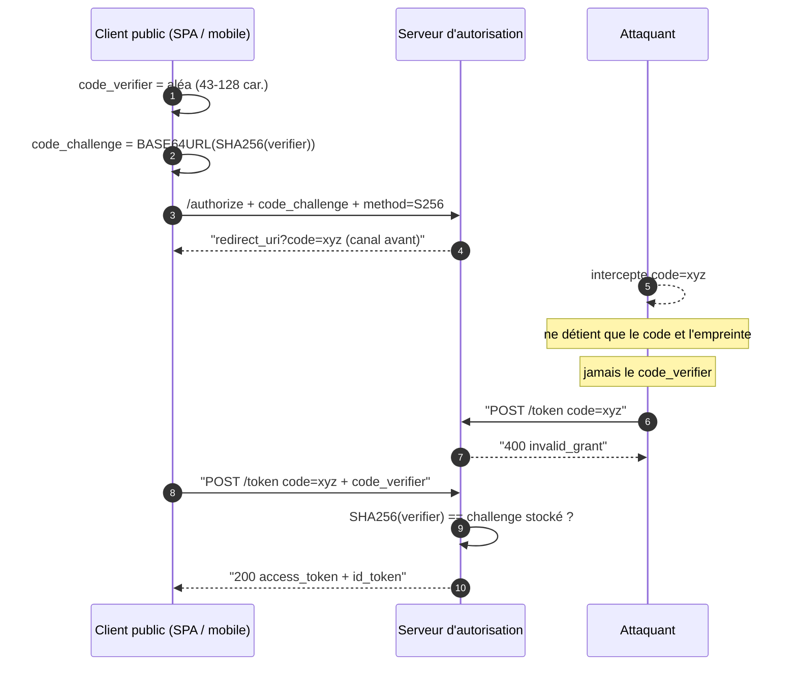

# PKCE (Proof Key for Code Exchange)

> [!abstract] Ancre
> PKCE lie chaque code d'autorisation à un secret qui ne quitte jamais le canal arrière : intercepter le code ne suffit plus.

---

## 🧒 Avant de commencer : de quoi on parle

> [!tip] En clair
> Imagine qu'on te remette un **colis** que tu dois aller chercher au guichet. N'importe qui peut intercepter ce colis en route… sauf que le colis est **fermé par un cadenas** dont toi seul as la clé.
>
> PKCE, c'est ce cadenas. Ton application fabrique une clé, en garde une partie secrète, et n'envoie qu'une **empreinte** dans le colis. Le voleur qui intercepte le colis ne peut pas l'ouvrir : il n'a pas la clé.

**Les 4 mots à connaître pour cette note :**

| Mot technique | En clair |
|---|---|
| `code` | le colis (un bon de retrait temporaire) |
| `code_verifier` | ta clé secrète, que tu gardes dans ta poche |
| `code_challenge` | l'empreinte de ta clé, que tu mets sur le colis |
| **client public** | une application qui ne peut **rien** garder de secret (mobile, site web dans le navigateur) |

Voir aussi : [[state_login_csrf]] — son cousin, qui protège contre une autre attaque.

---

## Définition

> [!tip] En clair
> À la connexion, ton application invente un **mot de passe temporaire**. Elle le garde pour elle. Elle n'envoie à Google qu'une **empreinte** de ce mot (une version transformée, impossible à inverser). Google range l'empreinte avec le colis.
>
> Plus tard, ton application envoie le **vrai mot de passe**. Google recalcule l'empreinte et compare : ça correspond → les jetons sont donnés. Ça ne correspond pas → refus.
>
> 🔧 **Les mots techniques :** le mot de passe temporaire s'appelle le **`code_verifier`**, son empreinte s'appelle le **`code_challenge`**. L'ensemble de ce mécanisme s'appelle **PKCE**.

PKCE (Proof Key for Code Exchange, **RFC 7636**), prononcé « pixy », est une extension de sécurité du [[authorization_code_flow]] : elle lie cryptographiquement la requête qui *demande* un code à celle qui *échange* ce code, via un secret éphémère connu du seul client.

---

## Enjeux

> [!tip] En clair
> Le problème : le **colis (le code) passe dans ton navigateur**, c'est-à-dire dans un endroit que ton application ne contrôle pas. Sur un téléphone ou un site web, il n'y a **aucun endroit sûr** où cacher un mot de passe permanent : tout est lisible.
>
> Sans PKCE, le colis est « ouvert » : celui qui l'intercepte peut le dépenser comme s'il était toi.
>
> Avec PKCE : même intercepté, il ne peut rien en faire.

Le code circule par le **canal avant** (redirection vers `redirect_uri`), que le client ne contrôle pas. Sur un **client public** (mobile, SPA), aucun secret client n'est possible : le code devient un **jeton porteur**, échangeable par qui l'intercepte contre un [[access_token]] et un [[id_token]]. PKCE ferme cette faille sans rien stocker de permanent.

- **Clients publics** : secret client impossible à garder, le code reste nu.
- **Canal avant hostile** : schémas d'URI squattables, extensions, historique, `Referer`, XSS.
- **Injection de code** : l'attaquant peut aussi faire consommer *son* code à la victime.
- **Coût nul** : un aléa et un hachage par connexion — d'où son imposition par la RFC 9700.

## Fonctionnement détaillé

### Le principe

> [!tip] En clair
> **L'idée en une image : coudre les deux jambes du flow.**
>
> Le flow a deux temps : *demander* le colis, puis *échanger* le colis. Normalement, ces deux temps ne sont pas reliés. PKCE les **coud** : pour échanger, il faut prouver qu'on est bien celui qui a demandé.
>
> Comment ? En envoyant au début une **empreinte** (que tout le monde peut voir sans risque), et à la fin le **secret** (qui ne circule que dans le tuyau sécurisé entre ton serveur et Google).

Le client invente un secret, n'envoie sur le canal avant qu'une **empreinte** (le *challenge*), et ne révèle le secret qu'à l'échange, sur le canal arrière. L'attaquant qui lit le canal avant n'obtient qu'une empreinte, inutilisable seule : les deux jambes du flow sont **cousues**.

### Étape 1 — le `code_verifier`

> [!tip] En clair
> Ton application tire un **mot de passe au hasard**, assez long pour être indevinable. Elle le garde dans sa poche : il ne part jamais vers Google à cette étape.

Chaîne aléatoire de **43 à 128 caractères** sur l'alphabet `[A-Za-z0-9-._~]` (RFC 7636 §4.1) : en pratique 32 octets aléatoires encodés en base64url, soit 43 caractères et ≥ 256 bits d'entropie.

### Étape 2 — le `code_challenge`

> [!tip] En clair
> Ton application **transforme** le mot de passe en empreinte (comme un hachage). Elle envoie cette empreinte à Google. L'empreinte part dans l'URL, donc en clair — mais **sans risque** : à partir de l'empreinte, impossible de remonter au mot de passe.
>
> Google garde l'empreinte de côté, collée au colis qu'il va émettre.

`code_challenge = BASE64URL(SHA256(ASCII(code_verifier)))`, envoyé à `/authorize` avec `code_challenge_method=S256` ; le serveur le **stocke avec le code** émis (RFC 7636 §4.2). Les méthodes supportées sont publiées dans le document de découverte ([[discovery_and_jwks]]).

### Étape 3 — l'échange

> [!tip] En clair
> Le colis est revenu. Ton application envoie maintenant le **vrai mot de passe** (le verifier) — mais pas dans le navigateur : dans le tuyau direct et chiffré entre elle et Google.
>
> Google recalcule l'empreinte du mot reçu et la compare à celle qu'il avait gardée. **Même ?** → les jetons sont délivrés. **Différent, ou absent ?** → refus.

À `/token`, le client joint le `code_verifier` en clair dans le corps de la requête (canal arrière, TLS). Le serveur recalcule le hachage et le compare au challenge stocké ; toute divergence donne `invalid_grant` (RFC 7636 §4.6).

### Diagramme : le code volé ne se rejoue pas

> [!tip] En clair
> Lis le schéma en te concentrant sur **la ligne de l'attaquant** : il intercepte le code, il tente l'échange… et il se fait refuser, parce qu'il n'a jamais eu le mot de passe.


La preuve est arithmétique : le challenge est une **fonction à sens unique** du verifier. Intercepter `E9Melhoa2OwvFrEMTJguCHaoeK1t8URWbuGJSstw-cM` ne permet pas de retrouver le verifier en temps utile, donc pas de satisfaire l'étape 3. Voir [[security_oauth21]].

### S256 vs `plain`

> [!tip] En clair
> Il existe une variante **piégée** : `plain`. Dans celle-ci, l'empreinte **est** le mot de passe — donc le secret part en clair dans l'URL, et PKCE ne sert plus à rien.
>
> C'est comme écrire ton mot de passe sur le colis au lieu d'en mettre l'empreinte. À **refuser** systématiquement.

`plain` enverrait `challenge = verifier` : l'attaquant qui lit la requête d'autorisation récupère le secret et contourne tout. La RFC 7636 §4.2 dit déjà « SHOULD NOT be used » ; la **RFC 9700 §2.1** exige une méthode n'exposant pas le verifier et rappelle que **S256 est la seule**. `plain` n'existe que pour compatibilité et doit être **refusé** ([[oauth2]]).

### PKCE ne remplace pas le client secret

> [!tip] En clair
> Deux choses différentes, qu'on confond souvent :
> - Le **mot de passe de l'application** (client secret) prouve : « je suis bien cette application ».
> - **PKCE** prouve : « je suis bien celui qui a demandé ce colis ».
>
> Ce n'est pas la même question. On garde **les deux** — c'est de la défense en profondeur.

Pour un **client confidentiel**, le secret authentifie *le client*, tandis que PKCE lie *le code à la session* qui l'a demandé. Deux propriétés distinctes : le secret ne lie pas le code, le verifier ne prouve pas l'identité du client. La RFC 9700 rend donc PKCE **obligatoire** pour les clients publics et **recommandé** pour les confidentiels : on **cumule** les deux (défense en profondeur), on ne substitue pas.

### Au-delà du [[authorization_code_flow]]

> [!tip] En clair
> PKCE s'applique partout où il y a un **code à récupérer**. Donc : aussi dans le flow des appareils sans navigateur (TV, console), qui fait passer un code déguisé.
>
> En revanche, il ne s'applique **pas** au flow machine-à-machine (`client_credentials`) : là, il n'y a ni utilisateur, ni colis, ni navigateur. PKCE n'aurait rien à protéger. (Voir [[client_credentials_flow]].)

PKCE s'applique partout où un code est récupéré : le **[[device_authorization_flow]]** (RFC 8628 §5.6) le recommande pour ses clients non confidentiels, l'échange du `device_code` étant un code flow déguisé. Il ne concerne **pas** le **[[client_credentials_flow]]** : ni utilisateur, ni code, ni client public. Voir [[flows_comparison]].

## Exemple concret

> [!tip] En clair
> Voici un vrai exemple (celui de la RFC). Observe les **deux moments magiques** :
> 1. On transforme le mot de passe en empreinte — et on **retrouve bien la même empreinte** à la fin.
> 2. Le mot de passe lui-même **n'apparaît jamais** dans la requête du début.

Exemple normatif RFC 7636 (Annexe B), verifier de 43 caractères :

```
dBjftJeZ4CVP-mB92K27uhbUJU1p1r_wW1gFWFOEjXk
```

Calcul réel du challenge (vérifié par `openssl` et par `hashlib` + `base64.urlsafe_b64encode`) :

```
SHA-256(verifier), hexadécimal :
13d31e961a1ad8ec2f16b10c4c982e0876a878ad6df144566ee1894acb70f9c3

code_challenge = BASE64URL(ces 32 octets) :
E9Melhoa2OwvFrEMTJguCHaoeK1t8URWbuGJSstw-cM
```

```bash
printf '%s' 'dBjftJeZ4CVP-mB92K27uhbUJU1p1r_wW1gFWFOEjXk' \
  | openssl dgst -binary -sha256 \
  | openssl base64 -A | tr '+/' '-_' | tr -d '='
# => E9Melhoa2OwvFrEMTJguCHaoeK1t8URWbuGJSstw-cM
```

**Requête d'autorisation** (canal avant — le verifier n'y est pas) :
```
GET /authorize?response_type=code
 &client_id=app-mobile-42
 &redirect_uri=https%3A%2F%2Fapp.exemple.com%2Fcallback
 &scope=openid%20profile
 &state=xcoiv98y2kd22vusuye3kch
 &nonce=n-0S6_WzA2Mj
 &code_challenge=E9Melhoa2OwvFrEMTJguCHaoeK1t8URWbuGJSstw-cM
 &code_challenge_method=S256
```

**Échange du code** (canal arrière — le verifier apparaît ici) :
```
POST /token
Content-Type: application/x-www-form-urlencoded

grant_type=authorization_code
 &code=SplxlOBeZQQYbYS6WxSbIA
 &redirect_uri=https%3A%2F%2Fapp.exemple.com%2Fcallback
 &client_id=app-mobile-42
 &code_verifier=dBjftJeZ4CVP-mB92K27uhbUJU1p1r_wW1gFWFOEjXk
```

Le serveur recalcule `E9Melhoa2OwvFrEMTJguCHaoeK1t8URWbuGJSstw-cM` et le retrouve tel quel : `200 OK` avec [[access_token]] et [[id_token]] (des [[jwt]]). Un tel flow peut aussi émettre un [[refresh_token]]. Sans le verifier, ou avec un verifier différent : `400 invalid_grant`.

## Pièges fréquents

> [!tip] En clair
> **Les 4 pièges à retenir, en une ligne :**
> 1. Réutiliser la même clé plusieurs fois → elle devient prévisible.
> 2. Laisser traîner la clé (logs, base de données) → un vol annule tout.
> 3. Utiliser `plain` → le secret part en clair, PKCE devient décoratif.
> 4. Croire que PKCE remplace le `state` → non, ce sont **deux** protections distinctes.

- **`code_verifier` réutilisé** entre connexions — l'empreinte devient prévisible. Réflexe : un verifier **par** requête d'autorisation.
- **Verifier stocké en clair** (base, `localStorage`, log) — un vol de stockage annule la protection. Réflexe : le garder **en mémoire**, ne jamais le journaliser.
- **`code_challenge_method=plain`** — le challenge *est* le secret : PKCE décoratif. Réflexe : imposer `S256`, rejeter `plain`.
- **Verifier omis à `/token`** alors qu'un challenge a été envoyé — le serveur rejette en `invalid_grant`. Réflexe : traiter les deux requêtes comme indivisibles.
- **PKCE absent d'une SPA** — le code transite par un navigateur hostile : exactement le cas d'usage. Réflexe : PKCE dès qu'il n'y a pas de secret client.
- **Serveur qui ne vérifie pas** un challenge envoyé, ou accepte un code sans challenge — attaque de *downgrade*. Réflexe : lier le challenge au code, rejeter tout verifier orphelin (RFC 9700 §4.5.3.1).
- **Confusion avec `state` / `nonce`** — `state` gère le CSRF (voir [[state_login_csrf]]), `nonce` lie l'[[id_token]] à la session ; aucun ne lie le **code** au client. Ce sont des protections complémentaires.
- **Challenge constant ou à faible entropie** — devinable ou recalculable. Réflexe : ≥ 256 bits d'aléa cryptographique, méthode `S256`.

## Rappel
> [!question] Question de rappel
> Un attaquant intercepte le `code` **et** le `code_challenge`. Peut-il obtenir un jeton, et pourquoi ?
>
> [!success]- Réponse
> Non : le challenge est `BASE64URL(SHA256(verifier))`, une fonction à sens unique. Seul le verifier est accepté à `/token` ; sans lui, l'échange échoue en `invalid_grant`. PKCE suppose le canal arrière confidentiel (TLS) et un serveur qui vérifie réellement.

### 🎯 Le résumé à retenir

> [!tip] Si tu ne retiens qu'une chose
> **PKCE est un cadenas sur le colis.**
> Ton application envoie l'**empreinte** de sa clé, jamais la clé.
> Si quelqu'un vole le colis, il ne peut pas l'ouvrir.
>
> **Ce que PKCE ne fait PAS :** il ne t'empêche pas d'être envoyé dans le compte d'un autre. Ça, c'est le travail du [[state_login_csrf]] — les deux vont **ensemble**.

## Voir aussi

- [[authorization_code_flow]] — le flow que PKCE sécurise.
- [[state_login_csrf]] — la protection complémentaire, qui couvre un autre vecteur d'attaque.
- [[oauth2]] — le cadre protocolaire d'origine (RFC 6749).
- [[openid_connect]] — la couche identité ([[id_token]]).
- [[device_authorization_flow]] — PKCE recommandé à son échange.
- [[client_credentials_flow]] — hors périmètre de PKCE.
- [[security_oauth21]] — RFC 9700 et durcissements.
- [[oidc/index]] — carte d'entrée du dossier.

## Références
- **RFC 7636** — Proof Key for Code Exchange, Sakimura et al., 2015 (§4.1 verifier, §4.2 challenge, §4.6 vérification, Annexe B).
- **RFC 9700 / BCP 240** — Best Current Practice for OAuth 2.0 Security, janvier 2025 : « Public clients MUST use PKCE », S256 seule méthode non exposante, anti-downgrade (§4.5.3.1).
- **RFC 6749** — OAuth 2.0 Authorization Framework. · **RFC 6819** — Threat Model (obsolète).
- **RFC 8628** — Device Authorization Grant (§5.6).
- **OAuth 2.1** (draft) — PKCE obligatoire en code flow.
