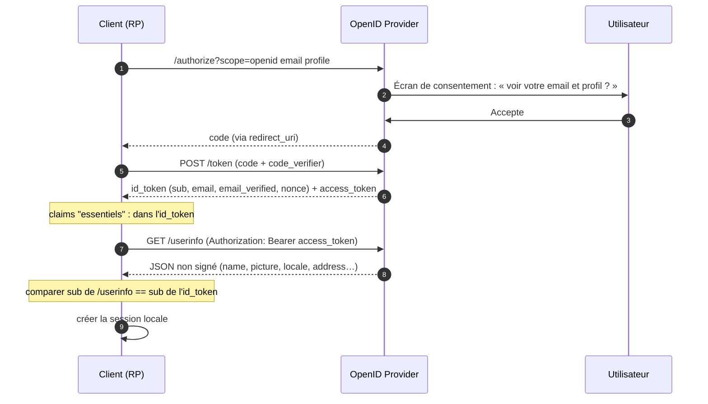

# Scopes et claims

> [!abstract] Ancre
> Les scopes définissent *ce que l'application a le droit de demander*, tandis que les claims sont *les informations concrètes* reçues dans la carte d'identité ou le profil.

---

## 🧒 Avant de commencer : de quoi on parle

> [!tip] En clair
> Imagine que tu t'inscrives à un club de sport :
> - Sur le formulaire, tu coches des cases : *« Je veux recevoir la newsletter »*, *« J'autorise le prélèvement »* → **ce sont les scopes** (les permissions globales que tu accordes).
> - Sur ta carte de membre, il y a ton nom, ton âge, ton email → **ce sont les claims** (les informations précises stockées dans ta fiche).
>
> En OIDC, l'application dit au guichet : *« Je demande le droit de voir ton profil et ton email »* (scope), et le guichet répond avec un paquet de données nominatives : *« prénom : Alice, email : alice@exemple.com »* (claims).

**Les mots à connaître pour cette note :**

| Mot technique | En clair |
|---|---|
| **scope** | la permission globale demandée (« donne-moi accès au profil ») |
| **claim** | une information précise (« le prénom est Alice ») |
| **paramètre `claims`** | l'option de précision (« je veux *absolument* ton email vérifié, sinon annule tout ») |
| **`essential: true`** | l'exigence forte (« obligatoire, pas optionnel ») |
| **`userinfo`** | l'armoire à archives où aller chercher les claims qui ne tiennent pas sur la carte d'identité |

Voir aussi : [[openid_connect]] (le protocole) et [[id_token]] (où ces claims sont rangés).

---

## Définition

> [!tip] En clair
> - Un **scope** est un mot-clé (comme `email` ou `profile`) envoyé dans la requête de connexion pour obtenir le droit d'afficher certaines informations.
> - Un **claim** est une paire « clé-valeur » (`"email": "alice@exemple.com"`) contenue dans l'[[id_token]] ou récupérée sur l'endpoint `/userinfo`.
>
> 🔧 **Le mot technique :** définis par **OpenID Connect Core §5** et **OAuth 2.0 (RFC 6749 §3.3)**. Le paramètre `claims` de la requête d'autorisation est normé par **OIDC Core §5.5**.

Un **scope** est un identifiant de périmètre demandé par le client et validé par l'utilisateur lors du consentement, qui autorise la délivrance de certains jeux de données. 
Un **claim** est un attribut individuel (morceau d'identité ou de contexte) émis par le serveur d'autorisation dans l'[[id_token]] ou via l'endpoint `/userinfo`.

---

## Enjeux

> [!tip] En clair
> **Pourquoi faire attention aux scopes et aux claims ?**
> Parce qu'on a vite fait de demander *trop* de choses (« donne-moi tout, on verra bien »). La règle d'or de la sécurité moderne et du RGPD, c'est le **moindre privilège** : tu ne demandes que ce dont tu as strictement besoin pour faire fonctionner ton application.

- **Moindre privilège** : ne demander que les scopes indispensables (ex. pas besoin d'accéder au carnet d'adresses pour un simple jeu en ligne).
- **Consentement utilisateur** : l'écran de Google montre clairement les scopes demandés (« Cette application veut voir votre adresse email »). Un mauvais scope = un utilisateur qui prend peur et annule.
- **Granularité** : le paramètre `claims` (OIDC Core §5.5) permet d'aller plus loin qu'un simple scope en exigeant qu'un claim soit *absolument vérifié*.
- **Séparation des canaux** : certains claims légers vont dans l'ID Token, les plus lourds ou optionnels restent accessibles uniquement via `/userinfo`.

---

## Fonctionnement détaillé

### Les scopes standard OIDC

> [!tip] En clair
> En OIDC, il y a des mots magiques prédéfinis. Si tu ne mets pas `openid`, ce n'est pas de l'OIDC (c'est juste du vieux OAuth). Les autres ouvrent des tiroirs spécifiques :

| Scope | En clair | Ce qu'il débloque (Claims principaux) |
|---|---|---|
| **`openid`** | **Obligatoire** pour l'identité | Émet l'[[id_token]] et le claim `sub` (identifiant unique). |
| **`profile`** | Informations de base | `name`, `family_name`, `given_name`, `preferred_username`, `picture`, `updated_at`... |
| **`email`** | Adresse mail | `email`, `email_verified` (vrai/faux) |
| **`address`** | Adresse postale | `address` (rue, ville, code postal, pays) |
| **`phone`** | Numéro de téléphone | `phone_number`, `phone_number_verified` |
| **`offline_access`** | Accès hors ligne | Permet d'obtenir un [[refresh_token]] pour agir quand l'utilisateur n'est plus là. |

### Les claims standard (OIDC Core §5.1)

> [!tip] En clair
> Voilà le **catalogue officiel** des informations que le guichet peut te remettre. Tu n'en recevras que celles que tu as **demandées** (par un scope ou par le paramètre `claims`).
>
> ⚠️ **La règle d'or en gras dans le tableau :** `sub` est le seul identifiant sur lequel tu peux construire. `email` change, `name` change, `sub` jamais.

| Claim | Type | Sens | Fiabilité |
|---|---|---|---|
| **`sub`** | string | **Identifiant unique** de l'utilisateur chez l'OP | ⭐ **Stable** — clé de référence |
| `name` | string | Nom complet, formaté pour l'affichage | Peut changer |
| `given_name` | string | Prénom | Peut changer |
| `family_name` | string | Nom de famille | Peut changer |
| `middle_name` | string | Second prénom | Peut changer |
| `nickname` | string | Surnom | Libre |
| `preferred_username` | string | Identifiant court préféré (`alice`, `am`) | **Non unique garantie** |
| `profile` | URL | Page de profil de l'utilisateur | Libre |
| `picture` | URL | Photo de profil | Libre |
| `website` | URL | Site personnel | Libre |
| `email` | string | Adresse électronique | **Peut être réattribuée** |
| **`email_verified`** | boolean | L'email a-t-il été **prouvé** ? | ⭐ **À vérifier** |
| `gender` | string | Genre (`female`, `male`, autre) | Libre |
| `birthdate` | string | Date de naissance (`YYYY-MM-DD`) | Libre |
| `zoneinfo` | string | Fuseau horaire (`Europe/Paris`) | Libre |
| `locale` | string | Langue / région (`fr-FR`) | Libre |
| `phone_number` | string | Numéro de téléphone (format E.164 attendu) | Peut changer |
| **`phone_number_verified`** | boolean | Le numéro a-t-il été **prouvé** ? | ⭐ À vérifier |
| `address` | objet JSON | Adresse postale structurée (`street_address`, `locality`, `postal_code`, `country`) | Libre |
| `updated_at` | number | Dernière mise à jour du profil (timestamp) | Utile pour le cache |

**Deux enseignements de ce tableau :**

- **`sub` est la seule ancre.** Il est stable, local à l'OP, et ne change jamais — c'est lui qu'on stocke en base comme clé utilisateur. L'email, lui, peut être réattribué à quelqu'un d'autre par le fournisseur. Utiliser `email` comme identifiant, c'est préparer une usurpation de compte.
- **Les claims `*_verified` sont des drapeaux de confiance.** `email_verified: true` signifie que l'OP a **prouvé** que l'utilisateur contrôle cette adresse. Sans ce contrôle, un utilisateur peut s'inscrire avec l'email d'un autre.

### Quelle demande ouvre quel claim (OIDC Core §5.4)

> [!tip] En clair
> Il y a **deux façons** de demander des claims : la **grossière** (par scope) et la **chirurgicale** (par le paramètre `claims`).
>
> - **Par scope** : tu demandes un **paquet**. « Donne-moi le profil » → tu reçois le nom, la photo, la locale… tout le lot.
> - **Par paramètre `claims`** : tu demandes **du sur-mesure**. « Donne-moi le prénom, et rien d'autre », ou « j'exige que l'email soit vérifié ».

| Scope demandé | Claims débloqués (le paquet) |
|---|---|
| `profile` | `name`, `family_name`, `given_name`, `middle_name`, `nickname`, `preferred_username`, `profile`, `picture`, `website`, `gender`, `birthdate`, `zoneinfo`, `locale`, `updated_at` |
| `email` | `email`, `email_verified` |
| `address` | `address` |
| `phone` | `phone_number`, `phone_number_verified` |

Attention : un scope **autorise** l'accès à un paquet, il ne le **force** pas. L'OP peut n'en renvoyer qu'une partie, ou demander l'accord de l'utilisateur claim par claim. C'est précisément ce manque de garantie que le paramètre `claims` vient combler.

### Le paramètre `claims` de la requête (OIDC Core §5.5)

> [!tip] En clair
> Parfois, les scopes ne suffisent pas. Tu veux dire au guichet :
> *« Je veux le profil, mais **exige** que l'email soit vérifié (`essential: true`), et je veux la valeur exacte de la ville. »*
>
> C'est là que le paramètre `claims` entre en scène. Il se glisse dans l'URL d'autorisation sous forme de **JSON sérialisé**.

OIDC Core §5.5 permet de formuler des demandes chirurgicales, soit pour l'[[id_token]], soit pour l'endpoint `/userinfo` :

```json
{
  "userinfo": {
    "given_name": { "essential": true },
    "email": null,
    "email_verified": { "essential": true }
  },
  "id_token": {
    "auth_time": { "essential": true },
    "acr": { "values": ["urn:mace:incommon:iap:silver"] }
  }
}
```

- **`essential: true`** : indique au serveur que le client **exige** cette information. Si l'OP ne la possède pas ou que l'utilisateur refuse de la transmettre, l'OP doit renvoyer une erreur (`consent_required` ou refuser le flux), garantissant que le client ne se retrouve pas avec une session incomplète.
- **`value` / `values`** : permet d'exiger une valeur précise ou l'un des niveaux d'authentification (`acr`).

### Où arrivent les claims : `id_token` ou `/userinfo` ?

> [!tip] En clair
> Tous les claims ne voyagent pas par le même chemin :
> - **Les petits** (identifiant, email, nom) tiennent dans l'**ID Token** — ils arrivent directement avec le jeton.
> - **Les gros ou les optionnels** (adresse complète, téléphone, photo…) se récupèrent **à la demande**, sur un guichet dédié : `/userinfo`.
>
> Pourquoi cette séparation ? Parce que l'ID Token est **compact** et qu'il circule beaucoup : on n'y entasse pas tout le profil. Et surtout, on ne veut pas qu'un jeton qu'on met en cache contienne des données sensibles.

| | [[id_token]] | `/userinfo` |
|---|---|---|
| **Nature** | un jeton signé (JWT) | une API protégée |
| **Contenu** | claims essentiels (`sub`, `email`, `nonce`…) | claims additionnels (profil complet) |
| **Authentification** | — | `Authorization: Bearer <access_token>` |
| **Quand** | une fois, à la connexion | à la demande, quand on a besoin du profil |
| **Réponse** | un JWT signé | du JSON **non signé** |

**Le point important :** la réponse de `/userinfo` est du **JSON simple**, non signé. Sa fiabilité vient d'une seule chose : elle a été obtenue en présentant un [[access_token]] valide, sur un canal TLS. C'est pourquoi le claim `sub` de `/userinfo` **doit** être comparé à celui de l'ID Token — sinon, rien ne garantit qu'ils parlent du même utilisateur.

### Le parcours complet : du scope aux claims

> [!tip] En clair
> Voilà **toute la chaîne** en une image : tu demandes des scopes, l'utilisateur consent, tu reçois l'ID Token, puis tu vas chercher le reste sur `/userinfo`.



### Demande (`claims` request) vs Contenu (`claims` response)

> [!tip] En clair
> Attention à ne pas mélanger les deux sens du mot « claims » :
> 1. **Dans la requête** (`claims={...}`) : ce que tu *réclames* au guichet.
> 2. **Dans la réponse** (le payload du [[jwt]]) : ce que le guichet t'a *donné*.

---

## Exemple concret

> [!tip] En clair
> Regarde comment on demande à la fois le scope `openid email` et une exigence forte sur le fait que l'email soit vérifié via le paramètre `claims`.

**1. La requête `/authorize` (avec encodage du JSON dans l'URL) :**

```http
GET /authorize?response_type=code
  &client_id=app-client
  &redirect_uri=https%3A%2F%2Fapp.example.com%2Fcallback
  &scope=openid%20email
  &state=xyz789
  &nonce=n-0S6_WzA2Mj
  &claims=%7B%22id_token%22%3A%7B%22email_verified%22%3A%7B%22essential%22%3Atrue%7D%7D%7D
  &code_challenge=E9Melhoa2OwvFrEMTJguCHaoeK1t8URWbuGJSstw-cM
  &code_challenge_method=S256
HTTP/1.1
Host: auth.example.com
```

*(Le json encodé correspond à `{"id_token":{"email_verified":{"essential":true}}}`)*

**2. La réponse reçue dans l'[[id_token]] :**

```json
{
  "iss": "https://auth.example.com",
  "sub": "user_9921",
  "aud": "app-client",
  "exp": 1759316420,
  "email": "alice@exemple.com",
  "email_verified": true,   // ← Garanti car marqué "essential: true"
  "nonce": "n-0S6_WzA2Mj"
}
```

---

## Pièges fréquents

> [!tip] En clair
> **Les 5 erreurs à retenir :**
> 1. Oublier le scope **`openid`** → tu fais du simple OAuth, pas d'OIDC, et tu n'as aucun ID Token.
> 2. Croire qu'un scope donne un claim sans l'avoir demandé explicitement.
> 3. Utiliser l'email comme identifiant unique (`sub`) → les emails changent ou sont réattribués, `sub` ne change jamais.
> 4. Faire confiance à un email sans vérifier le claim `email_verified: true`.
> 5. Demander des claims en `essential: true` à un fournisseur qui ne les gère pas (plantage garanti du flux).

- **Oublier `openid`** — la requête est traitée comme du pur OAuth 2.0 ; l'AS ne retourne aucun ID Token. Réflexe : `openid` toujours en premier dans le scope.
- **Confondre identité (`sub`) et attribut de contact (`email`)** — l'email peut changer ou être réattribué à une autre personne par le fournisseur d'identité. Réflexe : **toujours** utiliser `sub` comme clé primaire en base de données pour l'utilisateur.
- **Ignorer `email_verified`** — stocker un email sans s'assurer qu'il a été validé par l'OP permet une usurpation de compte par simple saisie d'un email tiers. Réflexe : vérifier `email_verified == true`.
- **Demander trop de scopes par confort** — demander `profile address phone` alors que l'app n'a besoin que du prénom. Réflexe : moindre privilège, ne demander que ce qui est utilisé.
- **Méconnaître le comportement d'un OP face à `claims` complexe** — certains serveurs d'identité ignorent tout ou partie du paramètre `claims` JSON avancé. Réflexe : tester la compatibilité de l'IdP cible.
- **Stocker des données sensibles dans l'ID Token** — l'ID Token transite et peut être stocké en cache client. Réflexe : garder les informations hautement sensibles ou volumineuses derrière l'API `/userinfo`.
- **Ne pas comparer les `sub` d'`id_token` et de `/userinfo`** — la réponse de `/userinfo` est du **JSON non signé** ; sans comparaison des `sub`, rien ne prouve qu'elle concerne le même utilisateur que l'ID Token (*substitution*). Réflexe : vérifier `userinfo.sub == id_token.sub`.
- **Croire qu'un scope garantit un claim** — un scope `email` **autorise** l'accès à l'email, il ne garantit ni sa présence ni sa véracité. Réflexe : exiger l'essentiel via le paramètre `claims` quand le claim est critique, ou dégrader proprement le service.
- **`essential: true` sur un claim que l'OP ne fournit pas** — la session échoue là où une dégradation aurait suffi. Réflexe : n'utiliser `essential` que pour ce qui est **vraiment** indispensable au fonctionnement, accepter une dégradation pour le reste.
- **Scopes personnalisés non versionnés ou ambigus** — un scope maison comme `admin` ou `all` ouvre une porte trop large. Réflexe : nommer finement (`read:contacts`, `write:invoices`) et documenter chaque scope accordé.

---

## Rappel

> [!question] Question de rappel
> Quelle est la différence fondamentale entre demander un scope `email` et utiliser le paramètre `claims` avec `email_verified: { "essential": true }` ?

> [!success]- Réponse
> Le scope `email` est une **demande générale** : il indique à l'OP que le client souhaite recevoir l'adresse de messagerie si l'utilisateur l'autorise (et l'OP peut décider de la fournir ou non, ou de renvoyer `email_verified` à false). Le paramètre `claims` avec `essential: true` est une **exigence contractuelle** : il signifie que le client *exige* que cette information (et ici, qu'elle soit vérifiée) soit fournie ; si l'OP ne peut pas la garantir ou si l'utilisateur refuse, l'OP doit rejeter la demande au lieu de fournir une session incomplète.

### 🎯 Le résumé à retenir

> [!tip] Si tu ne retiens qu'une chose
> **Scopes = les grandes permissions (« profil », « email »).**
> **Claims = les données concrètes reçues (« Alice », « alice@exemple.com »).**
>
> **La règle d'or :** demande toujours le strict minimum (moindre privilège), utilise **`sub`** comme identifiant unique (jamais l'email), et vérifie **`email_verified`** !

---

## Voir aussi

- [[openid_connect]] — la couche qui introduit scopes identitaires et ID Token.
- [[id_token]] — le réceptacle des claims d'identité, et sa validation.
- [[access_token]] — le jeton qui ouvre l'accès à `/userinfo`.
- [[jwt]] — le format de transport sous-jacent.
- [[oauth2]] — la notion de scope d'autorisation.
- [[prompts_and_interaction]] — piloter l'affichage des écrans de consentement.
- [[sso_session_and_consent]] — ce que le consentement enregistre, et pour qui.
- [[oidc/index]] — carte d'entrée du dossier.

## Références

- OpenID Connect Core 1.0 — §5 (Standard Claims), §5.4 (Requesting Claims using Scope Values), §5.5 (Requesting Claims using the `claims` Request Parameter).
- RFC 6749 — *The OAuth 2.0 Authorization Framework*, §3.3 (Access Token Scope).
- RFC 9700 — *Best Current Practice for OAuth 2.0 Security*.
