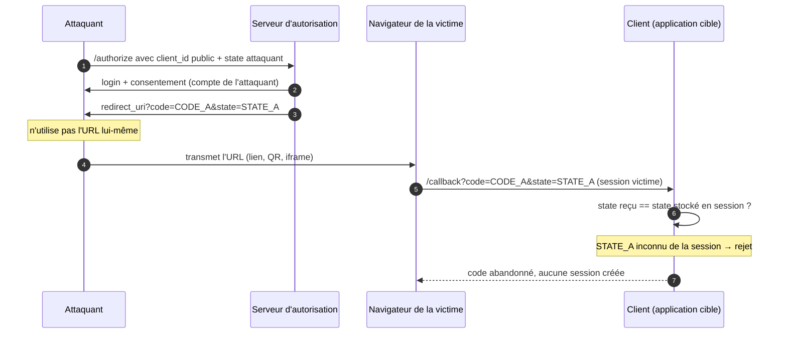

# State (login CSRF)

> [!abstract] Ancre
> Le `state` est une valeur aléatoire que le client pose sur sa requête d'autorisation et exige de retrouver au retour : sans lui, un code d'autorisation émis pour un autre compte peut être consommé par la victime à son insu.

## 🧒 Avant de commencer : de quoi on parle

> [!tip] En clair
> Imagine que tu commandes un colis. Le vendeur te donne un **numéro de suivi** que lui seul connaît, et il te demande de vérifier ce numéro quand le colis arrive. Si le livreur te dépose un colis avec un numéro que tu n'as jamais commandé, tu refuses : ce n'est pas le tien.
>
> Le `state`, c'est exactement ce numéro de suivi. Mais au lieu d'un colis, on parle d'une **connexion**.

**Les 4 mots à connaître pour cette note :**

| Mot technique | En clair |
|---|---|
| `state` | le numéro de suivi de la connexion |
| **client** | ton application (celle sur laquelle tu cliques « Se connecter ») |
| **serveur d'autorisation (AS)** | le guichet d'identité (Google, Keycloak…). Voir [[oauth2]] |
| **attaquant** | la personne malveillante qui essaie de t'embrouiller |

---

## Définition

> [!tip] En clair
> Quand tu cliques sur « Se connecter avec Google », ton application écrit un **mot secret temporaire** sur un bout de papier qu'elle garde dans sa poche. Elle l'envoie à Google. Google le renvoie avec la réponse. Ton application vérifie que c'est bien le même mot. Si ce n'est pas le même → elle refuse.
>
> 🔧 **Le mot technique :** ce mot secret temporaire s'appelle le **`state`**. C'est un paramètre qu'on ajoute à l'URL `/authorize`.

Le `state` est un paramètre opaque de la requête `/authorize` (RFC 6749 §4.1.1) : une chaîne aléatoire générée par le client, renvoyée **telle quelle** par le serveur d'autorisation dans la redirection vers le `redirect_uri`, et comparée strictement par le client à la valeur qu'il avait stockée en session (RFC 6749 §4.1.2.5, §10.12). Sa fonction est la **corrélation** : relier une réponse d'autorisation à la requête que *ce client* a émise pour *cette session*.

C'est la protection contre le **login CSRF** — aussi appelé **injection de code** (*code injection*) — distinct de la protection du code lui-même, qui relève de [[pkce]] (vue d'ensemble : [[authorization_code_flow]]).

---

## Enjeux

> [!tip] En clair
> Il y a deux façons de te faire du mal avec une connexion :
> - **Te voler ton colis** → c'est PKCE qui s'en occupe.
> - **Te faire entrer dans une maison qui n'est pas la tienne** → c'est le `state` qui s'en occupe.
>
> Le `state` ne protège pas le code contre le vol. Il protège **toi**, contre le fait d'utiliser une réponse que tu n'as jamais demandée.

Le state ne protège pas le code contre le vol ; il protège la victime contre le fait de **traiter une réponse qu'elle n'a pas demandée**. C'est une attaque de **CSRF**, c'est-à-dire une action déclenchée depuis le navigateur de la victime sans son intention.

- **Confusion de comptes** : sans verification, une réponse d'autorisation légitime émise pour un autre utilisateur peut être remise à la victime, qui se retrouve connectée dans la session de l'attaquant.
- **Aucun signal côté serveur d'autorisation** : le code injecté est parfaitement valide, émis par l'AS pour un vrai compte. L'AS ne peut rien détecter — seul le client peut.
- **Discrétion de l'attaque** : la victime utilise sa vraie machine, sa vraie IP, sa vraie session ; rien n'est anormal, donc rien n'est détectable par corrélation comportementale.
- **Complémentaire de PKCE** : le state couvre un vecteur que PKCE ne couvre pas, et inversement (voir plus bas).

## Fonctionnement détaillé

### Le principe : un ticket de corrélation vérifié par le client

> [!tip] En clair
> Le `state` fonctionne comme un **ticket de vestiaire**. Tu déposes ton manteau, on te donne un ticket. Pour récupérer ton manteau, tu dois présenter **le même** ticket. Un ticket d'un autre vestiaire ne marchera pas.
>
> - Ton application **crée** le ticket (`state`).
> - Elle le **garde** dans la poche de l'utilisateur (sa session).
> - Elle l'**envoie** à Google.
> - Google le **renvoie** tel quel.
> - Ton application **compare** : « c'est bien mon ticket ? » → oui → on continue. Non → on jette tout.

L'idée est celle d'un **accusé de réception** : le client écrit sur sa demande un identifiant aléatoire dont il garde la trace en session, et refuse toute réponse qui ne porte pas le même identifiant.

1. Le client génère un `state` aléatoire (≥ 128 bits), le stocke dans la session de l'utilisateur.
2. Il l'envoie dans l'URL de `/authorize`, aux côtés de `client_id`, `redirect_uri`, `scope` et du `code_challenge` PKCE.
3. L'AS renvoie l'URL de redirection avec `code` **et** `state` inchangé.
4. Le client compare le `state` reçu à celui qu'il a stocké **avant** d'appeler `/token`. Divergence ou absence : le code est abandonné, la requête rejetée.

Le point de bascule : **le state est vérifié par le client, avant l'échange de token.** PKCE est vérifié par le serveur d'autorisation, pendant l'échange. Deux acteurs, deux moments, deux questions.

> [!important] Le point de bascule
> **Le `state` est vérifié par le client, avant l'échange du jeton.**
> **PKCE est vérifié par le serveur d'autorisation, pendant l'échange.**
> Deux personnes différentes, à deux moments différents, pour répondre à deux questions différentes.

### Le mécanisme, objet par objet

> [!tip] En clair
> Dans tout ce bazar, il y a 4 objets qui circulent. Retiens juste **qui vérifie quoi** :

| Objet | Généré par | Transite par | Vérifié par | Question posée |
|---|---|---|---|---|
| `state` | le client | `/authorize` puis redirection | **le client** | « Cette réponse est-elle bien la mienne ? » |
| `code_challenge` / `code_verifier` | le client | challenge : `/authorize` ; verifier : `/token` | **le serveur d'autorisation** | « Celui qui échange ce code est-il bien celui qui l'a demandé ? » |
| `code` | le serveur d'autorisation | redirection uniquement | le serveur d'autorisation | « Ce code est-il valide, non expiré, non rejoué ? » |
| `nonce` | le client | `/authorize` puis contenu de l'`id_token` | **le client** | « Cet ID Token est-il lié à ma session ? » |

Deux conséquences immédiates :

- Le `state` est la **seule** protection de corrélation visible par le client dans le callback : il voit `code` + `state`, pas le challenge (qui reste stocké chez l'AS).
- Le `state` et le `nonce` sont tous deux vérifiés côté client, mais le premier protège l'**accès** (une connexion), le second l'**identité** (un [[id_token]]).

### L'attaque bloquée : login CSRF / injection de code

> [!tip] L'histoire, en clair
> **Le scénario de l'arnaque, raconté simplement :**
>
> 1. Un voleur a **son** compte à lui chez Google (son mail, son profil).
> 2. Il demande un code de connexion **pour ton application**, avec son compte à lui.
> 3. Google lui donne un code + un numéro de suivi (le sien). **Normal : tout est légitime.**
> 4. Le voleur **ne va pas sur la page lui-même**. Il t'envoie le lien par mail, ou le cache dans une image ou un QR code.
> 5. **Toi**, tu cliques. Ton navigateur va sur « ton » application avec le code du voleur.
> 6. Ton application, si elle ne vérifie rien, échange le code et te connecte… **dans le compte du voleur**.
>
> 🎭 **La partie tordue :** le voleur n'a **pas** pris ton compte. C'est **toi** qui es entré chez **lui**. Tu crois remplir tes documents, tes cartes bancaires… mais tout part chez lui. Et tu ne vois rien d'anormal, parce qu'il n'y a rien d'anormal : c'est ta machine, ta connexion, ton navigateur.

Le scénario, en six étapes :

1. L'attaquant forge un `/authorize` avec **le `client_id` public** de l'application cible, **son propre `state`** et **son propre `code_challenge`**.
2. Il parcourt le tunnel d'authentification **dans son navigateur**, avec **son compte** : login, consentement. Rien n'est anormal — l'AS voit un client légitime et un utilisateur normal.
3. L'AS redirige vers le `redirect_uri` de l'application avec **le code de l'attaquant** et le state qu'il a forgé.
4. L'attaquant **n'utilise pas cette URL lui-même** : il la fait parvenir à la victime (lien, QR code, iframe, e-mail).
5. Le navigateur de la victime charge `/callback?code=<code_attaquant>&state=<state_attaquant>` — avec **sa** session.
6. Le client de l'application reçoit ce code. Sans vérification du state, il l'échange et **connecte la victime dans le compte de l'attaquant**.

La conséquence est contre-intuitive et c'est là tout l'intérêt de l'attaque : l'attaquant **ne vole pas** le compte de la victime, il fait **entrer** la victime dans **son** compte. Tout ce que la victime saisit ensuite (documents, moyens de paiement, notes privées) est déposé dans l'espace de l'attaquant, sans aucun signal d'alarme pour la victime.



### Pourquoi PKCE ne suffit pas ici

> [!tip] En clair
> **PKCE** protège le colis contre le vol : si quelqu'un intercepte ton code, il ne peut pas l'ouvrir (il n'a pas la clé qui va avec).
>
> Mais ici, le voleur a fait **son propre envoi, de bout en bout**. Il a **sa** clé, celle qui correspond à **son** code. Donc PKCE dit « tout est bon » — et c'est vrai, techniquement.
>
> Ce que PKCE ne voit pas, c'est que ce colis-là **n'était pas pour toi**. C'est ça que le `state` vérifie.

PKCE protège le code contre **l'interception** : un attaquant qui capture *le code d'autrui* ne peut pas l'échanger sans le `code_verifier` correspondant. Or dans l'injection de code, l'attaquant a parcouru **son propre flow de bout en bout** : il détient le verifier qui correspond à son code. Le challenge matche parfaitement, l'échange réussit. PKCE couvre « un tiers a volé *mon* code », pas « un code légitime d'un tiers atterrit chez moi ».

Réciproquement, le state ne couvrirait pas l'interception : un code volé au sein du *même* flow est un code valide, porteur du bon state. Seul PKCE le neutralise. Les deux protections sont **indépendantes et cumulatives** — voir [[pkce]] et [[security_oauth21]].

| Attaque | PKCE seul | `state` seul | Les deux |
|---|---|---|---|
| Code intercepté en route | bloquée | non couverte | bloquée |
| Code d'un tiers injecté dans ma session | non couverte | bloquée | bloquée |

> [!example] La métaphore des deux serrures
> - **PKCE** = une serrure sur le colis : seul l'expéditeur peut l'ouvrir.
> - **`state`** = le numéro de suivi sur l'enveloppe : tu vérifies que c'est bien ton colis.
>
> Un seul des deux ne suffit pas. Il faut les deux.

### `state`, `nonce` : la même famille

> [!tip] En clair
> Le `nonce` est le **cousin** du `state`. Même idée : « je t'envoie un mot secret, tu me le renvoies ». Mais il protège autre chose : non pas **la connexion**, mais **la carte d'identité** (l'[[id_token]]).
>
> - `state` protège : « est-ce bien ma connexion ? »
> - `nonce` protège : « est-ce bien ma carte d'identité ? »

Le `nonce` applique le même raisonnement à l'[[id_token]] : le client envoie une valeur aléatoire au leg 1 et exige de la retrouver dans le claim `nonce` du token retourné. Sans lui, un ID Token valide peut être rejoué d'une session à l'autre. La différence tient à la cible : le `state` protège la **réponse d'autorisation** (le code), le `nonce` protège le **jeton d'identité**. Les deux sont posés par le client et vérifiés par le client.

## Exemple concret

> [!tip] En clair
> Voici ce qui se passe **vraiment**, en langage machine. Ne t'inquiète pas des détails — repère juste le `state=af0ifjsldkj` qui part au début et **revient à la fin**. C'est tout.

Application `app.example.com`, retour vers `https://app.example.com/callback`.

**Leg 1 — le client pose le ticket :**

```http
GET /authorize?response_type=code
  &client_id=app-front
  &redirect_uri=https%3A%2F%2Fapp.example.com%2Fcallback
  &scope=openid%20profile%20email
  &state=af0ifjsldkj
  &nonce=n-0S6_WzA2Mj
  &code_challenge=E9Melhoa2OwvFrEMTJguCHaoeK1t8URWbuGJSstw-cM
  &code_challenge_method=S256
HTTP/1.1
Host: auth.example.com
```

Le client a stocké `state=af0ifjsldkj` dans la session associée à ce navigateur.

**Retour du serveur d'autorisation :**

```http
HTTP/1.1 302 Found
Location: https://app.example.com/callback?code=SplxlOBeZQQYbYS6WxSbIA&state=af0ifjsldkj
```

**Contrôle du client, avant tout échange :**

```
state reçu      : af0ifjsldkj
state en session: af0ifjsldkj
→ correspondance stricte : OK, échange du code autorisé

state reçu      : STATE_A (inconnu)
state en session: af0ifjsldkj
→ divergence : code abandonné, aucune requête vers /token
```

Le state est ensuite **invalidé** (usage unique) pour qu'une seconde réponse ne puisse pas être rejouée dans la même session.

## Pièges fréquents

> [!tip] En clair
> Les erreurs classiques, en une ligne chacune :
> 1. Pas de `state` du tout → aucune protection.
> 2. `state` créé mais jamais vérifié → c'est de la décoration.
> 3. `state` trop simple ou toujours le même → l'attaquant peut le deviner.
> 4. `state` réutilisé → on peut rejouer une vieille réponse.
> 5. Croire que PKCE fait le travail du `state` → non, ce sont deux métiers différents.

- **`state` absent** — pas de protection CSRF : la victime peut être connectée au compte de l'attaquant. Réflexe : générer un state aléatoire par requête, l'exiger.
- **`state` généré mais non vérifié** — le paramètre est posé puis ignoré au retour : protection purement décorative. Réflexe : comparer strictement **avant** l'appel à `/token`.
- **`state` à faible entropie ou constant** — devinable, donc injectable par l'attaquant. Réflexe : ≥ 128 bits d'aléa cryptographique, jamais une valeur fixe ou dérivée du `client_id`.
- **`state` réutilisé ou non invalidé** — permet le rejeu d'une réponse ancienne. Réflexe : usage unique, destruction après comparaison.
- **Confondre `state` et PKCE** — croire que le challenge couvre la corrélation. Le challenge n'est pas renvoyé au client : il ne peut pas servir à vérifier une réponse. Voir [[pkce]].
- **Confondre `state` et `nonce`** — le premier protège la réponse d'autorisation, le second l'ID Token. Les deux sont nécessaires en OIDC.
- **`state` transporté hors session** — stocké dans un cookie tiers, un stockage partagé ou une URL : la corrélation n'est plus liée à l'utilisateur. Réflexe : le lier à la session serveur du navigateur concerné.

## Rappel

> [!question] Question de rappel
> Un code d'autorisation légitime, émis par le serveur d'autorisation pour le compte d'un attaquant, arrive dans le navigateur de la victime. Quel mécanisme empêche la connexion à son compte, et pourquoi PKCE ne le ferait pas ?

> [!success]- Réponse
> Le **`state`** : le client compare la valeur retournée à celle qu'il avait stockée dans la session de la victime ; celle de l'attaquant n'y figure pas, donc la réponse est rejetée avant tout échange de token. PKCE ne le ferait pas parce que l'attaquant a parcouru son propre flow de bout en bout et détient le `code_verifier` correspondant : le challenge matche, l'échange réussirait. PKCE neutralise l'interception d'un code, le state neutralise l'injection d'un code étranger.

### 🎯 Le résumé à retenir

> [!tip] Si tu ne retiens qu'une chose
> **Le `state` est un numéro de suivi.**
> Ton application le crée, l'envoie, et exige de le retrouver.
> Si le numéro ne correspond pas → la connexion est refusée.
>
> **Pourquoi c'est vital :** sans lui, on peut te faire entrer dans le compte de quelqu'un d'autre à ton insu, et PKCE ne peut rien y faire.

## Voir aussi

- [[authorization_code_flow]] — le flow où le `state` est émis et vérifié.
- [[pkce]] — la protection complémentaire du code (extension obligatoire pour les clients publics).
- [[id_token]] — validé avec le `nonce`, cousin du `state` côté identité.
- [[oauth2]] — le protocole-cadre (RFC 6749 §4.1.1 et §10.12).
- [[security_oauth21]] — les durcissements recommandés (RFC 9700, RFC 6819).
- [[index]] — carte d'entrée du dossier.

## Références

- RFC 6749 — *The OAuth 2.0 Authorization Framework*, §4.1.1 (`state` dans la requête d'autorisation), §4.1.2.5 (retour du paramètre) et §10.12 (CSRF).
- RFC 6819 — *OAuth 2.0 Threat Model and Security Considerations*, §4.4.1.8 (CSRF — autorisations « caméléon » et confusion de comptes).
- RFC 9700 — *Best Current Practice for OAuth 2.0 Security*, §2.1 et §4.5 (state obligatoire, caractère aléatoire et usage unique).
- OpenID Connect Core 1.0 — §3.1.2.1 (`state` et `nonce` dans la requête d'authentification).
