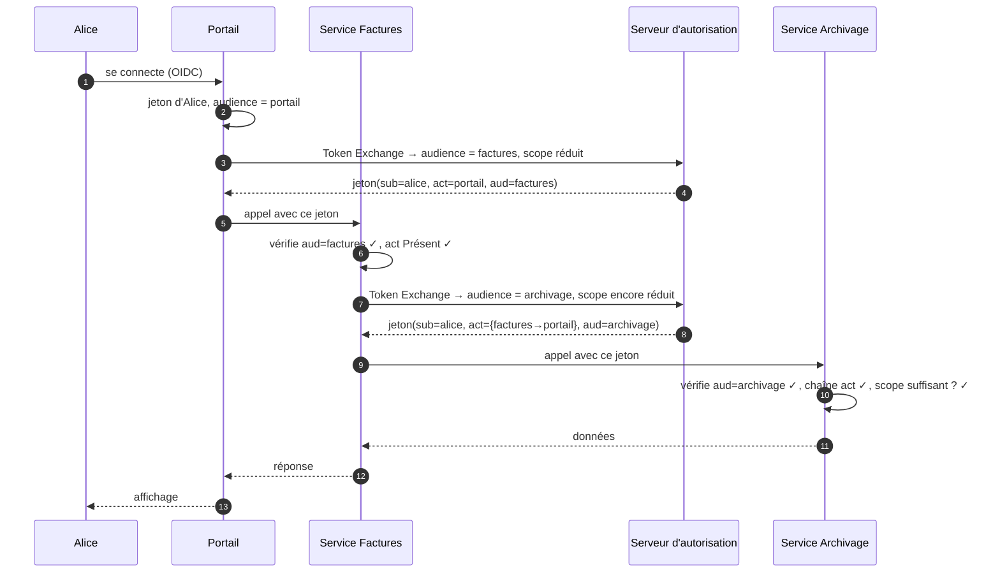

# Token Exchange

> [!abstract] Ancre
> Le Token Exchange (RFC 8693) permet d'**échanger un jeton contre un autre** : changer d'audience, réduire les droits, ou représenter une **délégation**. C'est le mécanisme qui permet à une chaîne de services de propager correctement l'identité.

---

## 🧒 Avant de commencer : de quoi on parle

> [!tip] En clair
> **Le problème, en une histoire.** Tu te connectes à un portail. Le portail appelle un service « factures ». Ce service appelle à son tour un service « archivage ».
>
> À l'archivage, on demande : *« qui demande cette action ? »*
>
> 🤔 **Deux réponses très différentes :**
> - *« C'est le service factures »* → mais alors on a perdu **ton** identité en route !
> - *« C'est Alice, et le service factures agit pour elle »* → là, on sait tout.
>
> **Token Exchange** permet exactement ça : échanger le jeton reçu contre un **nouveau** jeton, adapté au service suivant — en conservant la bonne information sur **qui agit** et **pour qui**.

**Les mots à connaître pour cette note :**

| Mot technique | En clair |
|---|---|
| **Token Exchange** | **échanger** un jeton contre un autre |
| **delegation** | « j'agis **au nom de** quelqu'un » |
| **impersonation** | « je **suis** quelqu'un » (plus risqué) |
| **`act`** | le claim qui dit **qui agit** |
| **`sub`** | le claim qui dit **pour qui** |
| **audience (`aud`)** | **à qui** le jeton est destiné |

Voir aussi : [[access_token]] (le jeton échangé) et [[fapi]] (qui l'utilise).

---

## Définition

> [!tip] En clair
> Le Token Exchange, c'est un **endpoint** sur lequel on envoie :
> - **le jeton d'entrée** (celui qu'on a),
> - **ce qu'on veut** (quelle audience, quels droits),
>
> … et qui renvoie un **nouveau jeton**, adapté.

**Token Exchange** (RFC 8693) définit un *grant type* permettant à un client d'échanger un jeton (l'*subject token*) contre un autre (l'*issued token*), en spécifiant l'audience et éventuellement un périmètre réduit. C'est le mécanisme standard de la **délégation d'identité** entre services.

| Terme RFC 8693 | En clair |
|---|---|
| **subject token** | le jeton **d'entrée** (ce qu'on possède) |
| **actor token** | le jeton de celui qui **agit** (optionnel) |
| **requested token type** | le **type** de jeton demandé en retour |
| **audience** | à qui le nouveau jeton est destiné |
| **resource** | la ressource visée |
| **scope** | les droits demandés (ne peuvent que **réduire**) |

---

## Enjeux

> [!tip] En clair
> **Pourquoi ne pas simplement passer le jeton d'origine au service suivant ?**
>
> Parce que ce serait **une mauvaise pratique de sécurité** :
> - Le jeton d'origine est destiné à **une** API (`aud`). Le passer ailleurs, c'est **élargir** sa portée sans contrôle.
> - Il porte des droits **trop larges** pour le service suivant.
> - On **perd la traçabilité** : qui a fait quoi, à la demande de qui ?
>
> **Le Token Exchange résout les trois :** nouveau jeton, **audience correcte**, droits **réduits**, et **chaîne d'acteurs tracée**.

- **Moindre privilège** : le service suivant reçoit un jeton **aux droits réduits** au strict nécessaire.
- **Audience correcte** : chaque service reçoit un jeton **destiné à lui** — plus de jeton « qui traîne ».
- **Traçabilité de la délégation** : on sait **qui** agit et **pour qui** — essentiel en audit.
- **Fini les jetons fourre-tout** : plus besoin de jetons à larges privilèges qui circulent de service en service.
- **Sécurité de la chaîne** : un jeton compromis dans un maillon ne donne pas accès à toute la chaîne.
- **Coût** : un appel supplémentaire au serveur d'autorisation (latence, disponibilité) — mitigé par le cache.

---

## Fonctionnement détaillé

### Le principe : échanger, pas transmettre

> [!tip] En clair
> **La différence est là :** au lieu de **faire circuler** le même jeton dans toute la chaîne, chaque service **échange** son jeton contre un **nouveau**, taillé pour l'étape suivante.

```
   ❌ SANS échange : le même jeton circule partout
   Alice → [Portail] → [Factures] → [Archivage]
              └────── même jeton, audience « portail », droits larges ──────┘
              → l'archivage reçoit un jeton qui n'était PAS destiné à lui

   ✅ AVEC échange : un jeton par étape
   Alice → [Portail] → (échange) → jeton pour Factures → [Factures]
                    → (échange) → jeton pour Archivage → [Archivage]
              → chaque service reçoit un jeton JUSTE POUR LUI
```

### L'appel d'échange

> [!tip] En clair
> C'est un `POST /token` classique, avec un `grant_type` spécial. On y met **le jeton qu'on a**, et on demande **ce qu'on veut**.

```http
POST /token HTTP/1.1
Host: as.example.com
Content-Type: application/x-www-form-urlencoded
# + authentification du client appelant

grant_type=urn:ietf:params:oauth:grant-type:token-exchange
&subject_token=eyJhbGci...            ← le jeton d'entrée (celui d'Alice)
&subject_token_type=urn:ietf:params:oauth:token-type:access_token
&requested_token_type=urn:ietf:params:oauth:token-type:access_token
&audience=https://api.factures.example.com    ← à qui le nouveau jeton est destiné
&scope=read:invoices                          ← droits RÉDUITS
```

**Réponse :**

```json
{
  "access_token": "eyJhbGci...NOUVEAU",
  "issued_token_type": "urn:ietf:params:oauth:token-type:access_token",
  "token_type": "Bearer",
  "expires_in": 300,
  "scope": "read:invoices"
}
```

| Paramètre | En clair |
|---|---|
| `subject_token` | le jeton que je possède |
| `subject_token_type` | de quel **type** il est |
| `requested_token_type` | ce que je veux en retour |
| `audience` | ⭐ **à qui** le nouveau jeton est destiné |
| `scope` | ⭐ les droits — **réduction** uniquement |
| `actor_token` | *(optionnel)* le jeton de celui qui **agit** |

**Deux garanties importantes :**
1. Le `scope` demandé **ne peut que réduire** les droits — jamais les étendre. C'est du **moindre privilège** appliqué à l'échange.
2. Le serveur peut **refuser** toute demande non autorisée (audience non permise, scope trop large).

### Délégation vs impersonation : la distinction capitale

> [!tip] En clair
> **Deux modes, et une énorme différence de sécurité.**
>
> - **Délégation** : *« je suis le service Factures, et j'agis **au nom d'Alice** »* → **Alice reste l'acteur principal**, le service est un intermédiaire. ✅ **Recommandé.**
> - **Impersonation** : *« je **suis** Alice »* → le service **devient** l'utilisateur. ⚠️ **Dangereux**, à éviter.

**En délégation**, le nouveau jeton contient **deux informations** :

```json
{
  "iss": "https://as.example.com",
  "aud": "https://api.archivage.example.com",
  "sub": "alice",                              // ← POUR QUI : Alice
  "act": { "sub": "service-factures" },        // ← QUI AGIT : le service
  "scope": "read:documents",
  "exp": 1759316420
}
```

Lecture : *« Alice (`sub`), le service Factures agissant pour elle (`act`) »*.

**En impersonation**, il n'y a **pas** de `act` : le jeton porte directement `sub: alice`, et il est **indiscernable** d'un jeton qu'Alice aurait obtenu elle-même. Le service peut alors **tout** faire à sa place, sans trace de son passage.

| | **Délégation** (`act`) | **Impersonation** |
|---|---|---|
| `sub` | l'utilisateur | l'utilisateur |
| `act` | **présent** : le service | absent |
| Traçabilité | ⭐ **oui** — on sait qui a agi | ❌ **non** — invisible |
| Portée | limitée par la politique | potentiellement totale |
| Recommandation | **à privilégier** | à éviter absolument |

> [!warning] Pourquoi l'impersonation est dangereuse
> Le service détient un jeton **indistinguable** de celui de l'utilisateur. Il peut donc agir **sans laisser de trace de son passage** — l'audit ne verra qu'« Alice a fait ceci », jamais « le service a fait ceci pour Alice ». En cas de compromission du service, l'attaquant obtient **tous** les droits des utilisateurs qu'il sert, avec l'apparence de la légitimité. En délégation, à l'inverse, le jeton porte le `act` : les journaux et les contrôles d'accès **savent** qu'un intermédiaire agit, et peuvent appliquer des règles différentes.

### La chaîne de délégation

> [!tip] En clair
> Le claim `act` peut être **imbriqué** : quand il y a plusieurs intermédiaires, on garde **toute la chaîne**.

```json
{
  "sub": "alice",
  "act": {
    "sub": "service-factures",
    "act": { "sub": "portail-web" }
  }
}
```

Lecture : *« Alice, le service Factures agit pour elle, lui-même mandaté par le portail. »*

**L'intérêt :** en cas d'incident, on peut **reconstituer toute la chaîne** d'appels. C'est ce qu'on appelle parfois la **chaîne de responsabilité**.

### Les cas d'usage typiques

> [!tip] En clair
> Voilà où on rencontre vraiment le Token Exchange.

| Cas d'usage | En clair |
|---|---|
| **Chaîne de microservices** | propager l'identité de service en service, avec des droits décroissants |
| **Passerelle d'API** | la passerelle échange un jeton « externe » contre un jeton « interne » |
| **Multi-tenant** | obtenir un jeton pour un tenant donné |
| **Changement de type de jeton** | transformer un jeton d'identité en jeton d'accès API |
| **Assertion → jeton** | échanger une assertion [[saml2]] contre un jeton OAuth |
| **Accès délégué** | un service agit pour un utilisateur sur une ressource précise |

**Le cas de la passerelle mérite une mention :** c'est le plus fréquent. Une passerelle d'API reçoit un jeton émis pour l'**extérieur** et le traduit en jeton pour l'**interne** — avec l'audience et les droits adaptés. C'est aussi ce qui permet de **découpler** les systèmes internes du monde extérieur.

### Token Exchange et les autres mécanismes

> [!tip] En clair
> Ne pas confondre avec les mécanismes voisins.

| Mécanisme | Ce qu'il fait | Différence |
|---|---|---|
| **Token Exchange** | échange **un jeton contre un autre** | change d'audience/type |
| **Refresh Token** | renouvelle un access token **expiré** | même utilisateur, même audience |
| **[[dpop]] / [[mtls]]** | lie un jeton à une **clé** | ne change pas le jeton |
| **Introspection** | **vérifie** un jeton auprès de l'AS | ne délivre rien |

**Et le lien avec [[fapi]] :** Token Exchange est utilisé en finance pour la délégation entre acteurs (banque, agrégateur, commerçant), avec des exigences strictes sur le `act` et les audiences.

---

## Exemple concret

> [!tip] En clair
> **Une chaîne de trois acteurs**, avec la délégation correctement propagée. C'est le scénario qui justifie tout le mécanisme.

**Situation :** Alice accède à un portail, qui appelle un service factures, qui appelle un service archivage. Chaque étape **réduit** les droits.



### Temps 1 — Le portail échange

```http
POST /token HTTP/1.1
Host: as.example.com
Content-Type: application/x-www-form-urlencoded

grant_type=urn:ietf:params:oauth:grant-type:token-exchange
&subject_token=<jeton d'Alice, aud=portail>
&subject_token_type=urn:ietf:params:oauth:token-type:access_token
&audience=https://api.factures.example.com
&scope=read:invoices
```

```json
{
  "access_token": "eyJ...",
  "expires_in": 300,
  "scope": "read:invoices"
}
```

```json
// Décodé
{
  "aud": "https://api.factures.example.com",   // destiné aux Factures
  "sub": "alice",
  "act": { "sub": "portail-web" },             // le portail agit
  "scope": "read:invoices",
  "exp": 1759316420
}
```

**Le service Factures vérifie :** signature, `aud` = **lui**, `act` présent, scope suffisant. ✅

### Temps 2 — Le service Factures échange à son tour

```http
POST /token HTTP/1.1
Host: as.example.com

grant_type=urn:ietf:params:oauth:grant-type:token-exchange
&subject_token=<jeton reçu, aud=factures>
&audience=https://api.archivage.example.com
&scope=read:documents
```

```json
// Le nouveau jeton porte TOUTE la chaîne
{
  "aud": "https://api.archivage.example.com",
  "sub": "alice",
  "act": {
    "sub": "service-factures",
    "act": { "sub": "portail-web" }            // la chaîne est conservée
  },
  "scope": "read:documents",
  "exp": 1759316420
}
```

**L'archivage peut reconstituer :** *« Alice, servie par le service Factures, lui-même mandaté par le portail. »*

### Ce que chaque acteur peut vérifier

| Acteur | Vérifie | Peut refuser si… |
|---|---|---|
| **Factures** | `aud` = lui, `act` présent, scope | le jeton vise quelqu'un d'autre |
| **Archivage** | `aud` = lui, chaîne `act` cohérente, scope | la chaîne est suspecte, scope insuffisant |
| **Auditeur** | toute la chaîne `act` | — (reconstitution a posteriori) |

**Le bénéfice complet :** à aucun moment un jeton n'a circulé **hors de son audience**. Chaque service reçoit **exactement** ce dont il a besoin — et l'audit peut **reconstituer la chaîne entière**.

### Le paramètre `resource` (extension moderne)

> [!tip] En clair
> Une évolution récente introduit un paramètre **`resource`** en plus de l'`audience`, pour désigner la ressource visée de façon plus fine. Certains écosystèmes (dont la finance) l'utilisent pour exprimer précisément *« j'ai besoin d'un jeton pour **cette** ressource »* au lieu de *« pour cette API en général »*.

---

## Pièges fréquents

> [!tip] En clair
> **Les 6 erreurs à retenir :**
> 1. **Utiliser l'impersonation par défaut** → plus de traçabilité, service tout-puissant.
> 2. **Faire circuler le même jeton** entre services → audiences fausses, droits trop larges.
> 3. **Ne pas vérifier `aud`** au service receveur → un jeton destiné ailleurs est accepté.
> 4. **Ne pas limiter le `scope`** → le jeton échangé garde des droits trop larges.
> 5. **Ne pas contrôler le `act`** → impossible de savoir qu'un intermédiaire agit.
> 6. **Boucle d'échange** → deux services s'échangent mutuellement des jetons à l'infini.

- **Impersonation sans besoin réel** — le service devient l'utilisateur, sans trace de son passage. Les journaux ne montrent que « Alice a fait ceci ». Réflexe : **délégation par défaut** (`act` présent), impersonation seulement si c'est inévitable, avec justification et journalisation renforcée.
- **Jeton transmis au lieu d'échangé** — le service passe son jeton d'entrée à l'étape suivante : `aud` ne correspond plus, les droits sont trop larges. Réflexe : **échanger** à chaque changement d'audience.
- **`aud` non vérifiée par le receveur** — le service accepte un jeton destiné à un autre (*confused deputy*). Réflexe : vérifier **strictement** que `aud` = soi-même.
- **`scope` non réduit** — l'échange renvoie un jeton aux mêmes droits larges. Réflexe : demander **le minimum**, et côté serveur, **imposer** la réduction.
- **`act` absent alors qu'il devrait être là** — le jeton semble émis directement pour l'utilisateur ; une chaîne de délégation devient **invisible**. Réflexe : exiger la présence de `act` quand la politique l'impose.
- **Chaîne `act` non vérifiée** — on ne contrôle pas la cohérence de la chaîne (qui a mandaté qui). Réflexe : valider la structure, et **borner la profondeur** acceptée.
- **Permissions de l'appelant non contrôlées** — un service peut demander un jeton pour **n'importe quelle** audience, y compris celles qui ne lui sont pas destinées. Réflexe : le serveur d'autorisation doit vérifier que **ce** service a le droit d'échanger **vers cette** audience.
- **Boucle d'échange** — deux services (ou un service et lui-même) s'échangent des jetons en continu, consommant les ressources. Réflexe : détecter les cycles, limiter la profondeur de la chaîne, mettre en cache.
- **Cache d'échange mal invalidé** — un jeton échangé mis en cache après révocation de l'autorisation d'origine. Réflexe : borner l'usage du cache par l'expiration **la plus courte**, et invalider à la révocation.
- **Durée de vie non ajustée** — le jeton échangé vit plus longtemps que le contexte qui l'a justifié. Réflexe : des durées **courtes** à chaque maillon (quelques minutes) — le contexte est encore valide.
- **Jeton de type non contrôlé** — accepter un `subject_token_type` inapproprié (jeton d'identité pris pour un jeton d'accès). Réflexe : contrôler **le type** des jetons, dans les deux sens.
- **Absence de journalisation** — impossible de reconstituer la chaîne après incident. Réflexe : tracer chaque échange (qui, vers quelle audience, quel scope, quel `act`).
- **Confondre Token Exchange et Refresh Token** — l'un change d'audience/d'acteur, l'autre renouvelle le même. Réflexe : ne pas les substituer ; ils répondent à des besoins différents.
- **Utilisation sans comprendre la RFC 8693** — les champs `actor_token` et la construction du `act` ont des règles précises. Réflexe : implémenter **exactement** la RFC, ou utiliser une bibliothèque validée.

---

## Rappel

> [!question] Question de rappel
> Un portail appelle un service A, qui appelle un service B. Pourquoi est-il préférable que le service A **échange** son jeton plutôt que de le transmettre tel quel, et quelle est la différence de traçabilité entre délégation et impersonation ?

> [!success]- Réponse
> **Pourquoi échanger :** le jeton reçu par le service A est destiné au **portail** (son `aud`), avec des droits calibrés pour lui. Le transmettre tel quel au service B poserait plusieurs problèmes : B recevrait un jeton **qui ne lui est pas destiné** (violation d'audience, contrôle `aud` impossible ou inefficace), et il bénéficierait de droits **plus larges** que nécessaire (violation du moindre privilège). En **échangeant**, A obtient un jeton **destiné à B**, avec des droits **réduits** au strict nécessaire — et le serveur d'autorisation peut refuser l'échange si A n'a pas le droit de viser cette audience. **Quant à la traçabilité :** en **délégation**, le jeton contient le `sub` de l'utilisateur (pour qui) **et** l'`act` (qui agit), éventuellement **imbriqué** sur plusieurs niveaux. Les journaux et les contrôles d'accès **savent** qu'un intermédiaire agit : on peut reconstituer toute la chaîne de responsabilité, et appliquer des règles différentes selon l'acteur. En **impersonation**, le jeton porte le `sub` de l'utilisateur **sans `act`** : il est **indistinguable** d'un jeton obtenu par l'utilisateur lui-même. Le service peut agir en son nom **sans laisser de trace de son passage** — l'audit ne verra qu'« Alice a fait ceci ». En cas de compromission, l'attaquant hérite de tous les droits avec l'apparence de la légitimité. D'où la règle : **délégation par défaut, impersonation seulement si inévitable**.

### 🎯 Le résumé à retenir

> [!tip] Si tu ne retiens qu'une chose
> **Ne fais pas circuler ton jeton — échange-le.**
>
> - **Token Exchange** = un **nouveau jeton** par étape : bonne `aud`, droits **réduits**.
> - **Délégation** (`act` présent) = traçable. ✅ **Recommandé.**
> - **Impersonation** (pas de `act`) = invisible. ⚠️ **À éviter.**
> - Le `scope` ne peut que **réduire** — jamais étendre.
>
> **Le réflexe à garder :** à chaque changement d'audience dans une chaîne de services, il faut **échanger**, pas **transmettre**.
>
> **Et la question à poser :** *« mon jeton est-il bien destiné à ce que j'appelle ? »* Si non → échange.

---

## Voir aussi

- [[access_token]] — le jeton échangé, et la question de son audience.
- [[fapi]] — qui utilise le Token Exchange pour la délégation en finance.
- [[jwt]] — le format qui porte `sub`, `act` et `cnf`.
- [[client_credentials_flow]] — l'authentification du service qui demande l'échange.
- [[refresh_token]] — à ne pas confondre avec l'échange.
- [[scopes_and_claims]] — ce que le `scope` réduit signifie concrètement.
- [[logout]] — la révocation, qui coupe aussi les jetons échangés.
- [[index]] — carte d'entrée du dossier.

## Références

- RFC 8693 — *OAuth 2.0 Token Exchange* (grant type, `subject_token`, `actor_token`, `requested_token_type`, `audience`, `resource`).
- RFC 9068 — *JWT Profile for OAuth 2.0 Access Tokens* (`typ: at+jwt`).
- RFC 7519 — *JSON Web Token (JWT)*.
- RFC 7800 — *Proof-of-Possession Key Semantics for JWT* (claims de contexte).
- RFC 9700 — *Best Current Practice for OAuth 2.0 Security*.
- draft-ietf-oauth-transaction-tokens — *Transaction Tokens* (propagation d'identité dans les chaînes de services).
