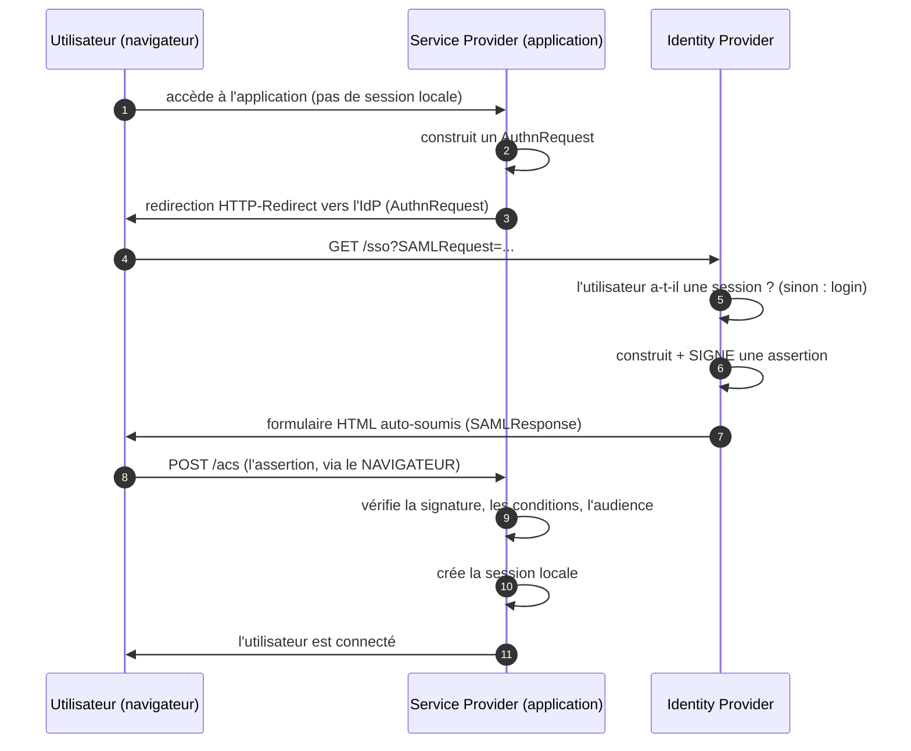

# SAML 2.0

> [!abstract] Ancre
> SAML 2.0 est un protocole de **fédération d'identité** : un fournisseur d'identité signe une **assertion XML** qui affirme « voici l'utilisateur », et la fait parvenir à une application par le **navigateur**.

---

## 🧒 Avant de commencer : de quoi on parle

> [!tip] En clair
> Tu connais déjà le problème, parce qu'on l'a résolu ensemble avec OIDC : **une application veut savoir qui tu es**, mais c'est un **autre** système qui le sait (l'annuaire de ton entreprise).
>
> SAML résout **exactement le même problème** — mais avec une philosophie **très différente** :
>
> 🏢 **L'analogie du badge d'entreprise et du visiteur :**
> - **SAML**, c'est comme un **huissier avec un tampon officiel**. Tu vas le voir avec ta pièce d'identité. Il rédige un **document formel**, le **signe et le tamponne**, et te le donne **à toi**. Tu portes ce document à l'application, qui **vérifie le tampon** et te laisse entrer.
> - Le document est **en papier formel** (du XML verbeux), et **c'est toi qui le transportes**.
>
> Compare avec OIDC : là, c'est un **ticket de vestiaire** (un code court), et l'échange se fait **à l'écart, par une porte de service**. SAML fait tout **devant tout le monde**, dans le navigateur.

**Les mots à connaître pour cette note :**

| Mot technique | En clair |
|---|---|
| **Identity Provider (IdP)** | le guichet qui **sait qui tu es** (l'annuaire d'entreprise) |
| **Service Provider (SP)** | l'application qui **veut savoir qui tu es** |
| **Assertion** | le **document XML signé** : « voici l'utilisateur » |
| **Metadata** | les **fiches techniques** échangées entre IdP et SP |
| **Binding** | le **transport** utilisé (redirection, POST…) |
| **Profile** | un **scénario complet** (bindings + assertion) |
| **Web SSO** | le scénario principal : se connecter via l'IdP |

Voir aussi : [[saml_vs_oidc]] (le comparatif) et [[openid_connect]] (l'équivalent moderne).

---

## Définition

> [!tip] En clair
> SAML est un **vocabulaire en XML** pour dire : « cet utilisateur s'est authentifié, voici ses attributs, et voici la preuve — signée ».
>
> Le nœud du sujet : le document est **signé** par l'IdP. L'application vérifie la signature, et si elle est bonne, elle **croit** le document.
>
> 🔧 **Le mot technique :** ce document s'appelle une **assertion**. Le protocole s'appelle **SAML 2.0** (*Security Assertion Markup Language*).

**SAML 2.0** (OASIS, 2005) est un standard de **fédération d'identité** : il définit un format d'**assertion** XML et un ensemble de **messages de protocole** permettant à un **Identity Provider** d'attester l'identité d'un utilisateur auprès d'un **Service Provider**, afin de réaliser notamment le **Web Browser SSO** (authentification unique via le navigateur).

SAML 2.0 est un **cadre composé de plusieurs spécifications** :

| Spécification | Rôle |
|---|---|
| **Core** (*Assertions and Protocols*) | le format de l'assertion et les messages de protocole |
| **Bindings** | comment les messages sont **transportés** (HTTP Redirect, HTTP POST…) |
| **Profiles** | comment tout ça s'assemble pour un **usage donné** (Web SSO…) |
| **Metadata** | comment IdP et SP **échangent leurs informations techniques** |
| **Authentication Context** | le **niveau** d'authentification (équivalent d'`acr_values` en OIDC) |
| **Security and Privacy Considerations** | les menaces et leurs contre-mesures |

---

## Enjeux

> [!tip] En clair
> **Pourquoi SAML est-il partout en entreprise — et pourquoi n'est-il pas mort ?**
>
> Parce qu'il est **arrivé avant**. Les grandes organisations l'ont déployé massivement (années 2005-2015) pour faire du SSO : un seul compte d'annuaire pour des dizaines d'applications internes et de partenaires.
>
> Ces systèmes **fonctionnent**, ils sont **certifiés**, ils sont **audités**. On ne les remplace pas — on **gravite autour** : on ajoute des facteurs, des workflows, des passerelles.

- **Socle de l'entreprise** : SAML reste très déployé (banque, assurance, administration, universités, grands groupes, fédérations B2B).
- **Legacy assumé** : rarement modernisé, souvent configuré une fois puis figé — d'où l'importance de savoir **le lire** sans le casser.
- **Fédération inter-organisations** : sa raison d'être historique — faire confiance à un annuaire **externe** sans créer de compte local.
- **Le navigateur comme vecteur** : c'est à la fois sa simplicité et sa faiblesse (l'assertion traverse un canal exposé).
- **Concurrence avec OIDC** : pour le neuf, OIDC est choisi presque systématiquement. SAML survit par **inertie du parc installé** et par les **contrats** (fédérations déjà en place).
- **Complexité intrinsèque** : XML, signatures multiples, profils variés — beaucoup de surface d'erreur, d'où une base d'attaques documentée.

---

## Fonctionnement détaillé

### Les deux acteurs

> [!tip] En clair
> Deux personnages, et c'est plus simple qu'OIDC (qui en a quatre) :
>
> - **L'IdP** : celui qui **sait** (l'annuaire d'entreprise, l'IdP interne).
> - **Le SP** : celui qui **veut savoir** (l'application).
>
> ⚠️ **Attention au vocabulaire :** l'IdP de SAML correspond à l'**OpenID Provider** d'OIDC, et le **SP** correspond au **Relying Party**. Ce sont juste des noms différents pour les mêmes rôles.

| SAML | Équivalent OIDC | Rôle |
|---|---|---|
| **Identity Provider (IdP)** | OpenID Provider (OP) | authentifie l'utilisateur, émet l'assertion |
| **Service Provider (SP)** | Relying Party (RP) | reçoit et vérifie l'assertion, crée la session |
| **Utilisateur** (avec son navigateur) | End-User / User-Agent | — |

Il n'y a **pas** d'équivalent aux « Resource Server » et « Authorization Server » séparés d'OAuth : SAML ne fait **que** de l'identité, pas de l'autorisation d'accès à une API.

### L'assertion : le document qui porte l'identité

> [!tip] En clair
> L'assertion est un **document XML** qui dit trois choses :
> 1. **Qui** s'est authentifié (le `Subject`).
> 2. **Comment** il l'a fait (le contexte d'authentification, l'heure).
> 3. **À quoi il a droit** / quels sont ses **attributs** (email, rôle, groupe…).
>
> Et le tout est **signé** par l'IdP.

Structure simplifiée d'une assertion :

```xml
<saml:Assertion ID="_a1b2c3" IssueInstant="2026-10-01T14:02:00Z"
                Version="2.0">
  <saml:Issuer>https://idp.example.com</saml:Issuer>   <!-- QUI a émis -->

  <saml:Subject>
    <saml:NameID Format="urn:oasis:names:tc:SAML:1.1:nameid-format:emailAddress">
      alice@exemple.com                                 <!-- QUI : l'utilisateur -->
    </saml:NameID>
    <saml:SubjectConfirmation>
      <saml:SubjectConfirmationData
          NotOnOrAfter="2026-10-01T14:07:00Z"            <!-- expiration -->
          Recipient="https://app.example.com/saml/acs"
          InResponseTo="_req_987" />                     <!-- corrélation anti-CSRF -->
    </saml:SubjectConfirmation>
  </saml:Subject>

  <saml:Conditions NotBefore="..." NotOnOrAfter="...">
    <saml:AudienceRestriction>
      <saml:Audience>https://app.example.com</saml:Audience>  <!-- POUR QUI -->
    </saml:AudienceRestriction>
  </saml:Conditions>

  <saml:AuthnStatement AuthnInstant="2026-10-01T14:02:00Z">
    <saml:AuthnContext>
      <saml:AuthnContextClassRef>
        urn:oasis:names:tc:SAML:2.0:ac:classes:PasswordProtectedTransport
      </saml:AuthnContextClassRef>                       <!-- COMMENT : le niveau -->
    </saml:AuthnContext>
  </saml:AuthnStatement>

  <saml:AttributeStatement>
    <saml:Attribute Name="mail">                          <!-- LES ATTRIBUTS -->
      <saml:AttributeValue>alice@exemple.com</saml:AttributeValue>
    </saml:Attribute>
    <saml:Attribute Name="role">
      <saml:AttributeValue>admin</saml:AttributeValue>
    </saml:Attribute>
  </saml:AttributeStatement>
</saml:Assertion>
```

**Les quatre informations clés, à repérer** (ce sont les équivalents directs d'OIDC) :

| Élément SAML | En clair | Équivalent OIDC |
|---|---|---|
| `<Issuer>` | qui a émis | `iss` |
| `<NameID>` | qui est l'utilisateur | `sub` |
| `<Audience>` | à qui c'est destiné | `aud` |
| `NotOnOrAfter` | jusqu'à quand c'est valable | `exp` |
| `InResponseTo` | corrélation de la requête | `state` (concept proche) |
| `<AuthnContextClassRef>` | le niveau d'authentification | `acr` |
| `<AttributeStatement>` | les attributs (rôle, email…) | les *claims* |

### Les bindings : comment ça circule

> [!tip] En clair
> Un « binding » est juste une **façon de transporter** un message SAML. Deux principaux :

| Binding | Comment ça marche | Usage typique |
|---|---|---|
| **HTTP Redirect** | les paramètres passent dans l'**URL** (encodés, souvent compressés) | la **requête** vers l'IdP |
| **HTTP POST** | un **formulaire** auto-soumis dans le navigateur | la **réponse** (l'assertion) |
| **Artifact** | un petit **ticket** d'abord, l'assertion récupérée ensuite par un canal retour | variante plus sûre, moins utilisée |

**Le point important :** avec le binding **POST**, l'assertion arrive dans le navigateur **sous forme de formulaire auto-soumis**. L'utilisateur voit littéralement un formulaire se poster tout seul — c'est le comportement caractéristique du SSO SAML.

**Et un point de sécurité :** le binding **Redirect** met des données dans l'URL (donc dans l'historique, les logs, le `Referer`). C'est pourquoi les **assertions** utilisent POST et non Redirect.

### Le profile principal : Web Browser SSO

> [!tip] En clair
> C'est **LE** scénario qu'on rencontre partout. C'est celui qu'il faut comprendre : une redirection vers l'IdP, une authentification, et un **retour avec le document signé**.



**Deux variantes, selon qui commence :**

| Variante | Qui initie | Déroulement |
|---|---|---|
| **SP-initiated** | l'**application** | l'utilisateur arrive sur l'appli → redirection vers l'IdP. **Le cas normal.** |
| **IdP-initiated** | l'**IdP** | l'utilisateur part du **portail de l'IdP** → l'assertion arrive directement au SP, **sans requête préalable**. |

> [!warning] IdP-initiated : pourquoi c'est considéré comme risqué
> Dans le flux IdP-initiated, il n'y a **pas d'`InResponseTo`** : le SP reçoit une assertion **sans avoir rien demandé**. Il n'a donc **aucun moyen de corréler** cette assertion à une session qu'il aurait initiée.
>
> Conséquence : un attaquant qui obtient une assertion valide (par exemple la sienne, ou une interceptée) peut la **rejouer** vers un SP — technique connue sous le nom d'**assertion replay** ou d'injection d'assertion. Le SP n'a aucune raison de la refuser, puisque rien ne l'attache à une demande.
>
> Beaucoup d'IdP et de SP **désactivent** l'IdP-initiated pour cette raison. Quand il est nécessaire (portail interne), il exige des protections supplémentaires.

### Les métadonnées : les fiches d'identité techniques

> [!tip] En clair
> Pour se parler, l'IdP et le SP doivent connaître **l'adresse, les certificats et les options** de l'autre. Ces informations sont publiées dans un **fichier XML de métadonnées**.
>
> C'est l'équivalent du **Discovery** d'OIDC — mais **statique** : on échange un fichier, là où OIDC pose une question à une URL.

Ce que contiennent les métadonnées :

| Élément | En clair |
|---|---|
| **EntityID** | l'identifiant de l'IdP ou du SP |
| **Endpoints** (SSO, SLO, ACS) | **où** envoyer les messages |
| **Certificats** (clés publiques) | **avec quoi** vérifier les signatures |
| **Bindings supportés** | **comment** on peut transporter |

**Conséquence pratique :** le **certificat de signature de l'IdP** est un point critique. Sa rotation doit être **coordonnée** entre IdP et SP, sinon **tout le SSO tombe** (les signatures ne se vérifient plus). C'est l'incident classique. En OIDC, la rotation est **automatique** via JWKS — c'est l'un des gros avantages du successeur.

### Le niveau d'authentification (Authentication Context)

> [!tip] En clair
> SAML sait aussi exprimer **« quel niveau de preuve j'exige »** — c'est l'ancêtre d'`acr_values`.
>
> L'IdP publie des **classes de contexte** (`ac:classes`), et le SP peut demander une classe dans sa requête, puis **vérifier** celle qui revient dans l'assertion.

| Classe (exemple) | En clair |
|---|---|
| `PasswordProtectedTransport` | mot de passe sur canal chiffré |
| `Password` | mot de passe simple |
| `X509` | certificat client |
| `TimeSyncToken` | jeton matériel / OTP |
| *(classes personnalisées)* | chaque fédération peut définir les siennes |

**Même logique qu'en OIDC :** la **demande** (`AuthnContextClassRef` dans la requête) n'a de valeur que si le SP **vérifie** le `AuthnContextClassRef` **retourné**. Sans vérification, c'est un vœu pieux — exactement le piège décrit dans [[step_up_auth]].

### Les attaques classiques

> [!tip] En clair
> SAML a une **base d'attaques documentée**, largement due à la complexité du XML. Voilà les familles à connaître.

| Attaque | En clair | Contre-mesure |
|---|---|---|
| **XML Signature Wrapping (XSW)** | l'attaquant **déplace** le nœud signé dans le document, en injectant ses propres données à la place qui compte | valider **le bon nœud**, pas seulement « une signature quelque part » |
| **Assertion replay** | rejouer une assertion interceptée | `InResponseTo`, `NotOnOrAfter` court, `Recipient` |
| **XXE** (*XML External Entity*) | un document XML qui fait lire des fichiers ou déclenche des requêtes | désactiver les entités externes dans le parseur |
| **Signature existante validée, contenu substitué** | signature correcte mais appliquée à autre chose | vérifier **ce qui** est signé |
| **Commentaire dans le XML** | couper une valeur par un commentaire pour tromper un parseur naïf | parseur conforme, comparaison stricte |
| **IdP-initiated non protégé** | assertion injectée sans requête préalable | désactiver, ou exiger une protection |

**Le point commun :** la signature ne suffit **pas**. Il faut vérifier **ce qui est signé**, et **ce qui est lu**. C'est la raison pour laquelle les bibliothèques SAML ont eu tant de CVE.

---

## Exemple concret

> [!tip] En clair
> **Le déroulé complet**, avec ce qui circule réellement. Repère bien : **c'est le navigateur qui transporte le document signé**.

### 1. L'utilisateur arrive sur l'application (SP-initiated)

```
GET https://app.example.com/dashboard
→ pas de session locale
→ le SP construit un AuthnRequest et redirige le navigateur
```

### 2. Redirection vers l'IdP (binding HTTP-Redirect)

```http
GET /sso?SAMLRequest=fZJBT8MwDIX%2FSqRTDm3TdpvUgzQNiQk0GNuA...&RelayState=xyz789
Host: idp.example.com
```

*(Le `SAMLRequest` est le document XML de demande, **compressé et encodé**. Le `RelayState` joue un rôle **semblable au `state`** d'OIDC : il revient tel quel et sert à la corrélation.)*

### 3. L'utilisateur s'authentifie chez l'IdP

```
→ l'IdP vérifie sa propre session
→ si aucune : page de login (mot de passe, MFA, selon la politique)
→ consentement éventuel
```

### 4. L'IdP renvoie l'assertion (binding HTTP-POST)

L'IdP renvoie une **page HTML** contenant un formulaire auto-soumis :

```html
<form method="post" action="https://app.example.com/saml/acs">
  <input type="hidden" name="SAMLResponse" value="PHNhbWxwOlJlc3BvbnNl..."/>
  <input type="hidden" name="RelayState" value="xyz789"/>
  <noscript><button>Continuer</button></noscript>
</form>
<script>document.forms[0].submit();</script>
```

**C'est la signature visuelle du SSO SAML :** l'utilisateur voit une page blanche clignoter avec un formulaire qui se poste tout seul.

### 5. Le SP vérifie l'assertion

À la réception, le SP **doit** contrôler :

```
① La SIGNATURE (avec le certificat de l'IdP dans ses métadonnées)
   — et vérifier QUEL nœud est signé (anti-XSW)
② Issuer == l'IdP attendu
③ Audience == ce SP (le document m'est bien destiné)
④ Time window : NotBefore ≤ maintenant ≤ NotOnOrAfter
⑤ InResponseTo == l'ID de la requête envoyée  (anti-rejeu, SP-initiated)
⑥ Recipient == l'URL ACS attendue
⑦ Les attributs : quels rôles, quel email…
```

**Un document qui échoue à un seul de ces contrôles doit être rejeté.**

### 6. Le SP crée la session

```
→ le SP associe le NameID (ou un attribut stable) à un compte local
→ il crée sa propre session (cookie)
→ l'utilisateur est connecté à l'application
```

### Le mapping avec OIDC, en miroir

| Étape | SAML | OIDC |
|---|---|---|
| 1 | AuthnRequest (Redirect) | `/authorize` (Redirect) |
| 2 | Login chez l'IdP | Login chez l'OP |
| 3 | **Assertion signée** via POST navigateur | **`code`** via Redirect navigateur |
| 4 | Le SP vérifie la signature | Le RP échange le code (porte de service) |
| 5 | Session locale | Session locale |

**La différence structurelle est là :** SAML fait passer la **preuve signée** par le navigateur, OIDC y fait passer un **code sans valeur** qu'il échange ensuite « à l'écart ».

---

## Pièges fréquents

> [!tip] En clair
> **Les 5 erreurs à retenir :**
> 1. **Vérifier « une » signature sans contrôler QUEL nœud est signé** → faille XSW.
> 2. **Ne pas vérifier `Audience`** → une assertion émise pour une autre appli est acceptée.
> 3. **Ne pas vérifier `InResponseTo`** → rejeu d'assertion possible.
> 4. **Ne pas faire tourner les certificats de façon coordonnée** → tout le SSO tombe.
> 5. **Activer l'IdP-initiated sans protection** → injection d'assertion.

- **XML Signature Wrapping (XSW)** — la signature est valide, mais porte sur un **autre** nœud que celui lu par l'application : l'attaquant place ses propres données (par exemple un autre utilisateur) dans la partie « lue ». **C'est la faille la plus connue de SAML.** Réflexe : valider la signature **sur le nœud exact** utilisé, avec une bibliothèque éprouvée et à jour.
- **`Audience` non vérifiée** — un SP accepte une assertion destinée à **un autre** SP : l'utilisateur peut s'authentifier auprès de la mauvaise application avec le jeton d'une autre. Réflexe : comparer `Audience` à **sa propre** EntityID, strictement.
- **`InResponseTo` non vérifié** — un assertion interceptée peut être **rejouée** vers le SP. Réflexe : vérifier `InResponseTo` contre l'ID de la requête émise (flux SP-initiated).
- **Fenêtre temporelle ignorée ou trop large** — une assertion reste valable des heures. Réflexe : vérifier `NotBefore`/`NotOnOrAfter` avec une tolérance d'horloge **courte**, et une durée de vie **courte** à l'émission.
- **XXE dans le parseur XML** — un document piégé fait lire des fichiers locaux ou déclenche des requêtes sortantes. Réflexe : désactiver les entités externes et le DOCTYPE.
- **Rotation de certificats non coordonnée** — le SP n'a pas le nouveau certificat de l'IdP : **tout le SSO échoue**. Réflexe : publier les deux certificats pendant la transition (via les métadonnées), et **automatiser** la mise à jour.
- **IdP-initiated activé sans protection** — pas d'`InResponseTo`, donc pas de corrélation : injection d'assertion possible. Réflexe : le désactiver, ou exiger des protections (durée très courte, contrôle de session, `RelayState` signé).
- **`NameID` utilisé comme clé instable** — le `NameID` peut changer (format email, changement d'adresse). Réflexe : utiliser un attribut **stable** (identifiant immuable) ou mapper explicitement.
- **Algorithme de signature faible** — SHA-1, RSA trop court. Réflexe : SHA-256 minimum, clés ≥ 2048 bits, et vérifier **explicitement** l'algorithme (ne pas faire confiance à celui annoncé).
- **Logging de l'assertion complète** — le document signé contient les attributs (email, rôles) et peut être rejoué s'il est dans une fenêtre valide. Réflexe : ne jamais journaliser l'assertion brute.
- **Comparaison de chaînes non stricte** — normalisation XML, espaces, casse : une comparaison laxiste ouvre des contournements. Réflexe : comparaison stricte après parsing canonique.
- **Bibliothèque SAML non maintenue** — l'écosystème SAML a une longue histoire de CVE (parsing XML, validation). Réflexe : bibliothèque **à jour**, version épinglée, veille sur les avis de sécurité.

---

## Rappel

> [!question] Question de rappel
> Dans le Web SSO SAML, l'assertion signée circule par le navigateur, exactement comme le fait le `code` en OIDC. Pourquoi cela pose-t-il **plus** de difficultés de sécurité en SAML qu'en OIDC ?

> [!success]- Réponse
> Parce que ce qui circule n'a **pas la même valeur**. En OIDC, ce qui traverse le navigateur est un **code opaque, sans valeur intrinsèque** : impossible à exploiter sans l'échange sur le canal arrière, qui exige le `client_secret` ou le `code_verifier` ([[pkce]]). En SAML, ce qui traverse le navigateur est **l'assertion signée elle-même** — c'est-à-dire **la preuve d'identité complète**, avec les attributs. Quiconque l'intercepte dans sa fenêtre de validité peut la présenter au SP. Cela impose au SP une **validation rigoureuse** : vérifier la signature **et sur quel nœud** elle porte (sinon XML Signature Wrapping), contrôler `Audience`, `InResponseTo` (anti-rejeu), `Recipient` et la fenêtre temporelle — le tout sur du **XML**, dont la complexité de parsing a produit de nombreuses failles (XSW, XXE, confusion de normalisation). D'où l'observation générale : SAML **fonctionne**, mais sa surface d'attaque est plus large, parce qu'il fait transiter la preuve elle-même sur le canal exposé. C'est l'un des arguments qui a motivé la conception d'OIDC — et notamment son architecture à deux jambes.

### 🎯 Le résumé à retenir

> [!tip] Si tu ne retiens qu'une chose
> **SAML = un document XML signé, transporté par le navigateur.**
>
> - **IdP** = qui sait. **SP** = qui veut savoir. *(= OP et RP en OIDC)*
> - **L'assertion** porte : `Issuer`, `NameID`, `Audience`, `AuthnContext`, attributs.
> - **La signature** est le cœur de la confiance — mais elle ne suffit **pas** : il faut vérifier **ce qui est signé**.
>
> **Pourquoi c'est encore là :** le parc installé est énorme, il marche, et on **gravite autour** plutôt que de le remplacer.
>
> **Et le réflexe à garder :** la preuve traverse un canal exposé → la rigueur de validation est **vitale**.

---

## Voir aussi

- [[saml_vs_oidc]] — le comparatif : deux réponses au même problème.
- [[openid_connect]] — le « successeur » pour les nouveaux projets.
- [[authorization_code_flow]] — l'architecture à deux jambes qu'OIDC oppose au tout-navigateur de SAML.
- [[step_up_auth]] — l'équivalent moderne du `AuthnContext`.
- [[id_token]] — la « carte d'identité » JSON qui remplace l'assertion XML.
- [[state_login_csrf]] — le rôle de corrélation, joué par `RelayState` / `InResponseTo` en SAML.
- [[sso_session_and_consent]] — ce que le SP fait de l'assertion (sa session).
- [[mtls]] — autre usage du même nom : certificat pour `X509` dans les classes d'authentification.
- [[index]] — carte d'entrée du domaine.

## Références

- OASIS SAML 2.0 — *Assertions and Protocols for the OASIS Security Assertion Markup Language (SAML) V2.0* (Core).
- OASIS SAML 2.0 — *Bindings for the OASIS SAML V2.0* (HTTP Redirect, HTTP POST, Artifact).
- OASIS SAML 2.0 — *Profiles for the OASIS SAML V2.0* (Web Browser SSO, SP-initiated, IdP-initiated, Single Logout).
- OASIS SAML 2.0 — *Metadata for the OASIS SAML V2.0* (EntityID, endpoints, certificats).
- OASIS SAML 2.0 — *Authentication Context* (`ac:classes`).
- OASIS SAML 2.0 — *Security and Privacy Considerations* (XSW, rejeu d'assertion).
