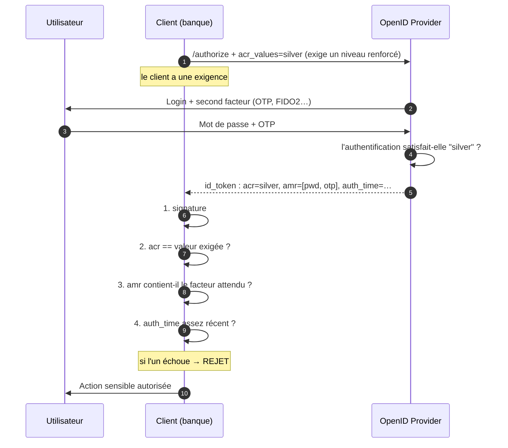

# Authentification renforcée (acr_values, amr, auth_time)

> [!abstract] Ancre
> `acr_values` permet au client d'**exiger** un niveau d'authentification ; `acr` et `amr` permettent à l'OP de dire **ce qui a réellement été fait**. La demande n'a de valeur que si le client **vérifie** la réponse.

---

## 🧒 Avant de commencer : de quoi on parle

> [!tip] En clair
> Toutes les actions ne méritent pas le même niveau de preuve. Consulter son solde bancaire, ça va. **Virer 50 000 €**, non.
>
> Alors l'application dit au guichet : *« Pour cette opération, je veux une preuve **renforcée** : plus qu'un simple mot de passe. »*
>
> C'est exactement ce que permet `acr_values`. Et dans la réponse, le guichet précise **ce qui a réellement été fait** — parce que sinon, n'importe qui pourrait prétendre avoir exigé le MFA sans le vérifier.

**Les mots à connaître pour cette note :**

| Mot technique | En clair |
|---|---|
| **`acr_values`** | la **demande** : « exige ce niveau d'authentification » |
| **`acr`** | la **réponse** : « voici le niveau réellement atteint » |
| **`amr`** | le **détail** : « voici avec quoi il s'est authentifié » (mot de passe ? OTP ? clé ?) |
| **`auth_time`** | **quand** il s'est authentifié pour de vrai |
| **step-up** | « monter le niveau » pour une action sensible |
| **MFA** | plusieurs preuves combinées (mot de passe **+** code, par exemple) |
| **LoA** | *Level of Assurance* : une échelle de confiance (bronze, argent, or…) |

Voir aussi : [[Session SSO et consentement]] (le niveau est **monotone**) et [[Prompts et contrôle de l'interaction]] (`max_age`).

---

## Définition

> [!tip] En clair
> Trois noms qui se ressemblent, à ne pas mélanger :
>
> - **`acr_values`** est un **paramètre de la requête** : ce que le client **demande**.
> - **`acr`** est un **claim de la réponse** : ce que l'OP a **effectivement satisfait**.
> - **`amr`** est un **claim de la réponse** : la **liste des méthodes** utilisées.
>
> 🔧 **Les mots techniques :** définis par **OpenID Connect Core 1.0** — `acr_values` et `acr` en §2 et §3.1.2.1, la sémantique de demande en §5.5.1.1, les valeurs de `amr` par **RFC 8176**.

**`acr_values`** (OpenID Connect Core §3.1.2.1) est une liste, séparée par des espaces, de *Authentication Context Class Reference* que le serveur d'autorisation est invité à utiliser, **par ordre de préférence**. Le `acr` correspondant est **volontaire** (*Voluntary Claim*) lorsqu'il est demandé par ce paramètre.

**`acr`** (OIDC Core §2) est un claim de l'[[ID Token]] : la valeur de contexte d'authentification que l'authentification effectuée a **satisfaite**.

**`amr`** (OIDC Core §2, RFC 8176) est un tableau de chaînes **sensibles à la casse** identifiant les méthodes réellement utilisées.

**`auth_time`** est l'instant (timestamp UNIX) où l'utilisateur s'est authentifié **réellement** — distinct de `iat`, qui est l'instant d'**émission** du jeton.

---

## Enjeux

> [!tip] En clair
> **Pourquoi c'est important ?** Parce qu'une session unique ouvre beaucoup de portes — **sauf** que certaines portes devraient exiger une preuve plus forte.
>
> Le modèle s'appelle **step-up authentication** : on ne demande pas le MFA à la connexion (friction), on le demande **au moment de l'action sensible** (pertinence).

- **Proportionnalité** : le niveau de preuve doit correspondre à la sensibilité de l'action (paiement, changement de mot de passe, suppression de compte, accès aux données médicales).
- **Friction maîtrisée** : on n'impose pas le MFA à chaque connexion ; on l'exige **au bon moment**.
- **Vérifiabilité** : `acr` et `amr` sont **signés** par l'OP — le client peut donc s'y fier, contrairement à une simple déclaration.
- **Distinction demande/réponse** : `acr_values` est **volontaire** ; l'OP peut satisfaire **une autre** valeur ou refuser. C'est **pourquoi le client doit vérifier**.
- **Conformité** : eIDAS, DSP2/PSD2, FAPI, secteurs santé et bancaire s'appuient sur des niveaux d'authentification normalisés ([[Sécurité OIDC et OAuth 2.1]], `FAPI`).

---

## Fonctionnement détaillé

### Les trois claims, et ce qu'ils ne sont pas

> [!tip] En clair
> Un point de vocabulaire qui évite 90 % des confusions :
>
> - `acr` dit **le niveau** (« argent »).
> - `amr` dit **les moyens** (« mot de passe + code à usage unique »).
> - `auth_time` dit **le moment**.
>
> **Aucun des trois n'est une permission.** Ils parlent de **comment tu t'es connecté**, jamais de **ce que tu as le droit de faire**.

| Claim | Nature | Sens | Exemple |
|---|---|---|---|
| **`acr`** | string | La classe de contexte **satisfaite** | `urn:mace:incommon:iap:silver` |
| **`amr`** | array de strings | Les **méthodes** effectivement utilisées | `["pwd", "otp"]` |
| **`auth_time`** | number | L'instant **réel** d'authentification | `1759316000` |

> [!warning] `acr` n'est pas une autorisation
> C'est **l'erreur classique**. `acr: silver` ne veut **pas** dire « cet utilisateur a le droit d'accéder aux virements ». Il dit seulement « il s'est authentifié à ce niveau ». La permission, elle, relève du `scope` ([[Scopes et claims]]) et de la logique métier de l'API.

### `acr_values` : comment on demande un niveau

> [!tip] En clair
> On envoie une **liste**, par **ordre de préférence**. Comme pour tout dans OIDC : c'est une **demande**, pas un ordre. L'OP peut satisfaire une autre valeur — ou refuser.

```http
GET /authorize?response_type=code
  &client_id=banque-app
  &redirect_uri=https%3A%2F%2Fbanque.example.fr%2Fcallback
  &scope=openid
  &state=a1b2c3
  &nonce=x9y8z7
  &acr_values=urn%3Amace%3Aincommon%3Aiap%3Asilver%20urn%3Amace%3Aincommon%3Aiap%3Abronze
  &prompt=login
  &code_challenge=E9Melhoa2OwvFrEMTJguCHaoeK1t8URWbuGJSstw-cM
  &code_challenge_method=S256
HTTP/1.1
Host: auth.example.com
```

Trois comportements possibles de l'OP :

1. **Il satisfait la première valeur** demandée (le cas idéal).
2. **Il satisfait une autre valeur** de la liste — l'OP peut avoir son propre jeu de valeurs ; il renvoie alors **son** vocabulaire dans `acr`.
3. **Il ne peut pas** satisfaire la demande → il réauthentifie pour tenter d'y parvenir, ou **échoue**.

**Le point qui en fait un outil de sécurité** : si l'OP ne satisfait **pas** la valeur exigée, le client **doit rejeter** le jeton — sinon la demande n'était qu'un vœu pieux. C'est exactement le même schéma que pour `max_age` / `auth_time` ([[Prompts et contrôle de l'interaction]]).

### Le vocabulaire `acr` : des URI, pas des mots

> [!tip] En clair
> Les valeurs `acr` ne sont **pas** des mots universels comme « fort » ou « moyen ». Ce sont des **identifiants** (des URI) définis par un **référentiel métier**.
>
> Conséquence : **deux OP différents peuvent utiliser des vocabulaires différents**. Le client doit connaître celui de son OP.

| Famille | Exemples | En clair |
|---|---|---|
| **InCommon / MACE** (classique) | `urn:mace:incommon:iap:bronze`<br>`urn:mace:incommon:iap:silver`<br>`urn:mace:incommon:iap:gold` | échelle historique : simple, renforcé, élevé |
| **PAPE** (OpenID) | `http://schemas.openid.net/pape/policies/2007/06/multi-factor` | exigence de MFA explicite |
| **EAP ACR Values** (OIDC) | `phr` (résistant au phishing)<br>`phrh` (idem, protégé matériellement) | le niveau moderne : **résistance au phishing** |
| **Fournisseurs** | `urn:okta:loa:2fa:any`, valeurs Entra/Keycloak… | vocabulaires propriétaires |

La valeur `phr` mérite une mention : elle désigne une authentification **résistante au phishing** — le niveau que les recommandations modernes (dont FAPI) privilégient, bien au-dessus du simple « mot de passe + code par SMS ».

Le document de découverte peut publier les valeurs supportées ([[OIDC Discovery et JWKS]]) — **à vérifier avant de fonder une logique dessus**.

### La liste `amr` : les méthodes réellement utilisées

> [!tip] En clair
> `amr` est le **journal de bord** : il liste les moyens employés. C'est une **liste**, et l'ordre n'a pas de signification normative.
>
> C'est le claim **le plus honnête** de tout OIDC : il ne dit pas « le niveau attendu », il dit « voilà ce qui a été fait ».

Valeurs normalisées par la **RFC 8176** (registre IANA *Authentication Method Reference Values*) :

| `amr` | En clair |
|---|---|
| `pwd` | mot de passe |
| `otp` | code à usage unique (TOTP / HOTP) |
| `sms` | code reçu par SMS |
| `hwk` | clé matérielle (**FIDO2**, YubiKey) |
| `swk` | clé logicielle |
| `mfa` | plusieurs facteurs (générique) |
| `face` | reconnaissance faciale |
| `fpt` | empreinte digitale |
| `pin` | code PIN |
| `pop` | preuve de possession d'une clé (*proof of possession*) |
| `user` | présence de l'utilisateur |
| `wia` | authentification par opérateur (héritage télécom) |

**Sensible à la casse** : `otp` ≠ `OTP`. Une comparaison naïve échoue.

**Subtilité** : `amr: ["pwd"]` seul **ne prouve pas** qu'il n'y a pas eu de MFA — certains OP omettent `mfa`. À l'inverse, la présence de `hwk` est un signal **fort**. D'où la prudence : `amr` est **descriptif**, pas toujours exhaustif. Le champ le plus fiable pour une politique reste **`acr`** (quand l'OP le gère).

### Le motif complet : demande → vérification

> [!tip] En clair
> **Voilà tout le mécanisme en une image.** Retiens surtout l'étape 5 : **la vérification côté client**. Sans elle, tout le reste ne sert à rien.



**Les 4 contrôles, dans l'ordre :**

| # | Contrôle | En clair | Sans lui… |
|---|---|---|---|
| 1 | **Signature** de l'ID Token | le jeton vient bien de l'OP | tout le reste est faux |
| 2 | **`acr`** conforme | le niveau atteint correspond à l'exigence | on accepte un simple mot de passe |
| 3 | **`amr`** attendu | le bon facteur a été utilisé | on accepte un facteur faible |
| 4 | **`auth_time`** assez récent | l'authentification n'est pas ancienne | on accepte une session de la veille |

Le contrôle 3 est **optionnel** mais recommandé : `acr` peut être mal configuré chez l'OP, tandis que `amr` montre la réalité.

### Le cas d'usage central : le *step-up* au moment de l'action

> [!tip] En clair
> **Le scénario qui justifie tout ce mécanisme.** Alice est connectée avec un simple mot de passe. Elle veut faire un virement important.
>
> L'application **ne lui redemande pas de se reconnecter depuis le début** : elle renvoie Alice vers l'OP en exigeant un niveau renforcé. L'OP voit qu'Alice est déjà connectée mais à un niveau insuffisant → il lui demande **seulement** le second facteur, puis renvoie un nouveau jeton avec `acr` élevé.

```
1. Alice est en session, acr = "bronze" (mot de passe seul)
2. Elle clique « Virement »
3. L'app exige un niveau supérieur :
   → redirection /authorize?...&acr_values=...silver&prompt=login
4. L'OP : la session actuelle (bronze) ne suffit PAS
   → il demande le SECOND facteur (OTP, FIDO2)
5. Alice fournit son OTP
6. L'OP : la session est ÉLEVÉE à "silver"
   → nouvel id_token avec acr=silver, amr=[pwd, otp]
7. L'app VÉRIFIE acr → conforme → virement autorisé
```

**Et le lien avec la session** : conformément à la règle de [[Session SSO et consentement|monotonie du niveau]], cette élévation **bénéficie à toutes les applications**. Alice ne refera pas son OTP pour la prochaine action sensible — elle **reste** au niveau « silver » jusqu'à l'expiration de la session.

### Exiger `acr` via le paramètre `claims`

> [!tip] En clair
> Il existe une **deuxième façon** de demander : non pas « je préfère tel niveau », mais **« j'exige, sinon échoue »**. C'est le paramètre `claims` ([[Scopes et claims]]), avec `essential: true`.

```json
{
  "id_token": {
    "acr": {
      "essential": true,
      "values": ["urn:mace:incommon:iap:silver", "urn:mace:incommon:iap:bronze"]
    }
  }
}
```

**La différence est importante** (OIDC Core §5.5.1.1) :

| Méthode | Nature | Comportement si non satisfait |
|---|---|---|
| **`acr_values`** (paramètre dédié) | **Volontaire** | l'OP peut satisfaire une autre valeur |
| **`claims` + `essential: true`** | **Essentiel** | l'OP **doit** satisfaire, ou **échouer** |

`acr_values` est donc une **préférence** ; `claims.essential` est une **exigence contractuelle**. Pour une action réellement critique, c'est la seconde qu'il faut utiliser.

---

## Exemple concret

> [!tip] En clair
> **Un virement bancaire, de bout en bout.** Suis bien les deux temps : la demande (`acr_values`), puis la vérification (`acr` + `amr` + `auth_time`).

**1. L'application exige un niveau renforcé :**

```http
GET /authorize?response_type=code
  &client_id=banque-app
  &redirect_uri=https%3A%2F%2Fbanque.example.fr%2Fcallback
  &scope=openid
  &state=a1b2c3
  &nonce=x9y8z7
  &acr_values=urn%3Amace%3Aincommon%3Aiap%3Asilver
  &prompt=login
  &max_age=300
  &code_challenge=E9Melhoa2OwvFrEMTJguCHaoeK1t8URWbuGJSstw-cM
  &code_challenge_method=S256
HTTP/1.1
Host: auth.example.com
```

**2. L'utilisateur s'authentifie avec mot de passe + OTP.**

**3. L'ID Token reçu :**

```json
{
  "iss": "https://auth.example.com",
  "sub": "f3a9c1e2-88b4-4d77-9e01-5c2ab7d19f40",
  "aud": "banque-app",
  "exp": 1759316420,
  "iat": 1759316120,
  "auth_time": 1759316105,                      // authentification il y a 15 s
  "acr": "urn:mace:incommon:iap:silver",        // LE NIVEAU ATTEINT
  "amr": ["pwd", "otp"],                        // LES MÉTHODES UTILISÉES
  "nonce": "n-0S6_WzA2Mj"
}
```

**4. Les vérifications côté application :**

```
① Signature       : vérifiée via JWKS de l'issuer épinglé        → OK
② acr             : "…iap:silver" == valeur exigée ?             → OK
③ amr             : contient "otp" (facteur attendu) ?           → OK
④ auth_time       : 1759316120 - 1759316105 = 15 s ≤ max_age 300 → OK
```

**Résultat : virement autorisé.**

**5. Et si un contrôle échoue :**

```
② acr = "urn:mace:incommon:iap:bronze" (simple mot de passe)
   → niveau INSUFFISANT → REJET de la demande, pas d'exécution de l'action

③ amr = ["pwd"] (aucun second facteur)
   → facteur attendu ABSENT → REJET (ou reformulation d'un step-up)

④ auth_time = 1759310000 (il y a 1 h 42) alors que max_age = 300
   → authentification TROP ANCIENNE → REJET
```

**Le principe :** un jeton qui échoue à **un seul** de ces contrôles est **rejeté**, jamais « accepté avec un avertissement ».

---

## Pièges fréquents

> [!tip] En clair
> **Les 5 erreurs à retenir :**
> 1. **Demander `acr_values` sans jamais vérifier `acr`** → la demande ne sert à rien.
> 2. **Croire que `acr` est une autorisation** → il décrit l'authentification, pas les droits.
> 3. **Comparer `amr` sans tenir compte de la casse** → `otp` ≠ `OTP`, la comparaison échoue.
> 4. **Supposer un vocabulaire `acr` universel** → chaque OP (et référentiel) a le sien.
> 5. **Confondre `auth_time` et `iat`** → en SSO, le jeton est neuf mais la connexion peut dater.

- **`acr_values` envoyé, `acr` jamais vérifié** — l'application *croit* exiger le MFA, mais accepte n'importe quel jeton. C'est l'erreur la plus fréquente et la plus grave. Réflexe : **toujours** comparer `acr` à l'exigence, et **rejeter** en cas de divergence.
- **`acr` traité comme une permission** — concevoir des autorisations sur le niveau d'authentification plutôt que sur le `scope` et les rôles. Réflexe : `acr`/`amr` = **contexte d'authentification** ; l'autorisation se joue ailleurs.
- **Vocabulaire `acr` supposé universel** — comparer `acr` à une valeur d'un autre référentiel, ou à une valeur non supportée par l'OP. Réflexe : vérifier les valeurs supportées (document de découverte) et **accepter le vocabulaire de l'OP**.
- **`amr` comparé de façon insensible à la casse ou « floue »** — les valeurs RFC 8176 sont **sensibles à la casse**. Réflexe : comparaison exacte, sur des valeurs connues.
- **`amr` considéré comme exhaustif** — `amr: ["pwd"]` n'exclut pas formellement un second facteur non déclaré ; et inversement `mfa` est générique. Réflexe : traiter `amr` comme **descriptif**, fonder la politique sur `acr` quand c'est possible.
- **`auth_time` absent alors qu'on exige une fraîcheur** — impossible de vérifier `max_age`. Réflexe : exiger `auth_time` (`claims` + `essential`), ou refuser.
- **Confusion `auth_time` / `iat`** — en SSO silencieux, `iat` est récent alors que l'authentification date. Réflexe : toute exigence de fraîcheur se contrôle sur **`auth_time`**.
- **`acr_values` avec `prompt=none`** — demander une élévation de niveau sans interaction possible → l'OP ne peut pas satisfaire : erreur `interaction_required` ou niveau insuffisant. Réflexe : un step-up **exige** une interaction ; ne pas le combiner à `prompt=none` ([[Prompts et contrôle de l'interaction]]).
- **Prendre `acr_values` pour une garantie** — le paramètre est **volontaire** ; l'OP peut satisfaire autre chose. Réflexe : utiliser `claims` + `essential: true` pour une exigence **contractuelle**.
- **Niveau supposé rétrogradable** — attendre qu'une authentification plus faible « fasse baisser » la session. Réflexe : le niveau est **monotone** (voir [[Session SSO et consentement]]) ; seules l'expiration ou la révocation le font disparaître.
- **`acr_values` sans `max_age`** — le niveau est atteint, mais peut dater. Réflexe : combiner les deux pour une action sensible.
- **SMS considéré comme résistant au phishing** — `sms` est un facteur **faible** (SIM swap, interception). Réflexe : privilégier `hwk` / `phr` pour les opérations critiques.

---

## Rappel

> [!question] Question de rappel
> Une application bancaire envoie `acr_values=urn:mace:incommon:iap:silver` pour autoriser un virement. Le jeton revient avec `acr=urn:mace:incommon:iap:bronze` et `amr=["pwd"]`. Que doit faire l'application, et comment ce mécanisme se distingue-t-il d'`acr_values` demandé via `claims` avec `essential: true` ?

> [!success]- Réponse
> L'application doit **rejeter** la demande d'action : le niveau **réellement atteint** (`bronze` — mot de passe seul) est **inférieur** à celui exigé (`silver`), et `amr` confirme qu'aucun second facteur n'a été employé. `acr_values` étant un claim **volontaire** (OIDC Core §3.1.2.1), l'OP **pouvait** satisfaire une autre valeur : c'est précisément pourquoi **la vérification côté client est obligatoire** — sans elle, la demande d'élévation n'est qu'un souhait sans effet. Pour rendre l'exigence **contractuelle**, il faut utiliser le paramètre `claims` avec `acr: {"essential": true, "values": [...]}` : l'OP doit alors satisfaire l'une des valeurs exigées **ou faire échouer** la requête, au lieu de renvoyer silencieusement un niveau inférieur. Dans les deux cas, le client doit **en plus** contrôler la signature, `amr` et `auth_time`.

### 🎯 Le résumé à retenir

> [!tip] Si tu ne retiens qu'une chose
> **Tu demandes avec `acr_values`, tu vérifies avec `acr` et `amr`.**
>
> - **`acr_values`** = « exige ce niveau » → une **demande volontaire**, pas une garantie.
> - **`acr`** = le niveau **atteint**.
> - **`amr`** = les **méthodes** employées (`pwd`, `otp`, `hwk`…).
> - **`auth_time`** = quand, **pour de vrai** (≠ `iat`).
>
> **Et surtout :** demander ne suffit pas — **il faut vérifier**. Un `acr` non contrôlé, c'est un MFA exigé sur le papier et absent dans les faits.
>
> **Bonus :** l'élévation (**step-up**) est **monotone** — une fois obtenue, elle profite à toute la session ([[Session SSO et consentement]]).

---

## Voir aussi

- [[Session SSO et consentement]] — le niveau d'authentification est **monotone** (il monte, ne descend jamais).
- [[Prompts et contrôle de l'interaction]] — `max_age`, `prompt`, et le contrôle de `auth_time`.
- [[ID Token]] — où vivent `acr`, `amr` et `auth_time`, et la validation complète.
- [[Scopes et claims]] — le paramètre `claims` et `essential: true`, utilisés pour exiger `acr`.
- [[OIDC Discovery et JWKS]] — les valeurs supportées et la vérification de signature.
- [[Sécurité OIDC et OAuth 2.1]] — FAPI, eIDAS et les exigences sectorielles.
- [[OpenID Connect]] — la couche qui définit ces claims.
- [[OIDC (MOC)]] — carte d'entrée du dossier.

## Références

- OpenID Connect Core 1.0 — §2 (`acr`, `amr`, `auth_time`), §3.1.2.1 (`acr_values`, claim volontaire), §5.5.1.1 (sémantique de la demande `acr`), §3.1.3.7 (validation).
- RFC 8176 — *Authentication Method Reference Values* (`pwd`, `otp`, `sms`, `hwk`, `mfa`, `pop`…), registre IANA *Authentication Method Reference Values*.
- RFC 6711 — *An IANA Registry for Level of Assurance (LoA) Profiles*.
- OpenID Connect EAP ACR Values 1.0 — valeurs `phr` (phishing-resistant) et `phrh` (hardware-protected), valeur `amr` `pop`.
- OpenID Provider Authentication Policy Extension (PAPE) 1.0 — vocabulaire historique (`multi-factor`).
- RFC 9700 — *Best Current Practice for OAuth 2.0 Security* — exigences d'authentification et résistance au phishing.
