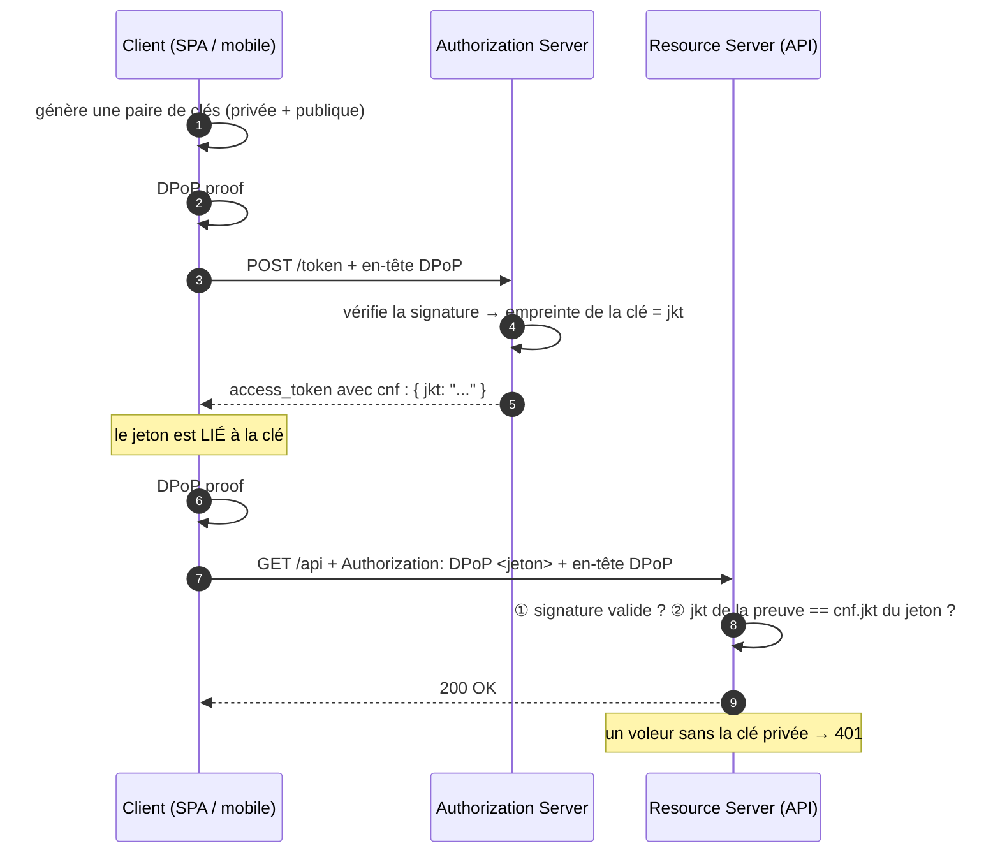

# DPoP

> [!abstract] Ancre
> DPoP (*Demonstrating Proof of Possession*, RFC 9449) lie un access token à une **paire de clés** détenue par le client : à chaque requête, le client signe une preuve avec sa clé privée. Un jeton volé devient inutilisable sans cette clé.

---

## 🧒 Avant de commencer : de quoi on parle

> [!tip] En clair
> Aujourd'hui, la plupart des jetons sont des **laissez-passer au porteur** : *celui qui le montre passe*. Si quelqu'un le vole, il l'utilise **comme si c'était lui**. C'est le gros point faible du [[Access Token|Bearer token]].
>
> **DPoP change ça.** L'idée, en une image :
>
> **Au lieu d'un laissez-passer que n'importe qui peut présenter**, tu as un **badge + une signature**. À chaque fois que tu montres ton badge, tu dois **le signer de ta main**. Un voleur qui a le badge ne peut pas imiter ta signature — il n'a pas ta main.
>
> 🖊️ **Techniquement, la « main », c'est une paire de clés.** La clé privée ne quitte jamais ton appareil. Elle sert à signer, à chaque requête, une petite preuve. Le serveur vérifie la signature avec la clé publique.

**Les mots à connaître pour cette note :**

| Mot technique | En clair |
|---|---|
| **DPoP** | *Demonstrating Proof of Possession* : « prouver qu'on possède la clé » |
| **preuve de possession** | prouver qu'on **détient** la clé, pas seulement un jeton |
| **paire de clés** | une clé privée (secrète, signe) + une clé publique (vérifie) |
| **`jkt`** | l'**empreinte** de la clé publique — ce qui lie le jeton |
| **`DPoP`** (en-tête) | la **preuve signée** envoyée à chaque requête |
| **`cnf`** | la case « lié à » dans le jeton (contient le `jkt`) |
| **sender-constrained** | « lié à l'expéditeur » : le jeton ne marche que pour **son** porteur légitime |

Voir aussi : [[mTLS]] (l'autre mécanisme de preuve de possession) et [[Access Token]] (le jeton à protéger).

---

## Définition

> [!tip] En clair
> À la demande du jeton, le client fabrique une **paire de clés**. Il envoie la **clé publique**, garde la **clé privée**. Le serveur inscrit l'**empreinte de la clé publique** dans le jeton (case `cnf`).
>
> Ensuite, à **chaque appel d'API**, le client **signe** un petit message avec sa clé privée, et l'envoie dans un en-tête `DPoP`. L'API vérifie : la signature est-elle bonne ? l'empreinte correspond-elle à celle du jeton ? Si oui → ça passe.

**DPoP** (RFC 9449, *OAuth 2.0 Demonstrating Proof of Possession*) est un mécanisme qui rend un access token **lié à une clé** (*sender-constrained*, « à preuve de possession ») : le client génère une paire de clés asymétriques, prouve la possession de la clé privée à l'émission du jeton, et **signe chaque requête** d'API avec cette clé.

Le jeton porte alors, dans son claim **`cnf`** (RFC 7800), l'empreinte de la clé publique — notée **`jkt`** (*JWK thumbprint*).

---

## Enjeux

> [!tip] En clair
> **Le problème :** le modèle « au porteur » fait de tout jeton volé une **clé universelle** jusqu'à son expiration. Un jeton qui traîne dans un log, un proxy, une sauvegarde, un outil d'observabilité… est un accès offert.
>
> **Ce que DPoP apporte :** le jeton seul ne suffit plus. Il faut **aussi** la clé privée. Et cette clé, elle, **ne voyage pas** — elle signe.
>
> **Et pourquoi c'est élégant :** contrairement à [[mTLS]], il n'y a **rien à déployer** — pas d'autorité de certification, pas de certificats à distribuer, pas d'infrastructure. C'est un simple en-tête HTTP.

- **Fin du jeton universel** : un jeton volé ne vaut rien sans la clé.
- **Zéro infrastructure** : pas de PKI, pas de certificats — juste une paire de clés dans l'application.
- **Protection à chaque requête** : là où mTLS protège à la **poignée de main**, DPoP protège **chaque appel** — plus granulaire.
- **Adapté aux clients modernes** : SPA, mobile, applications grand public — là où mTLS n'est pas praticable.
- **Coût** : la clé vit dans l'application (ou dans un stockage sécurisé de l'OS). Moins protégée physiquement qu'un certificat sur carte à puce.
- **Complémentaire** : [[FAPI]] recommande DPoP **et** [[mTLS]] selon le profil. Les deux peuvent même être combinés.

---

## Fonctionnement détaillé

### Les deux moments où DPoP intervient

> [!tip] En clair
> DPoP agit **deux fois** :
> 1. **À la demande du jeton** : le client prouve qu'il possède la clé, et le serveur **lie** le jeton à cette clé.
> 2. **À chaque appel d'API** : le client **re-signe** pour prouver que c'est toujours lui.



**Les deux différences avec le Bearer classique :**
1. Le schéma n'est plus `Bearer` mais **`DPoP`** dans l'en-tête `Authorization`.
2. **Un second en-tête** `DPoP` transporte la preuve signée.

### La preuve DPoP : ce qu'elle contient

> [!tip] En clair
> La preuve est un **petit JWT** que le client fabrique et signe **à chaque requête**. Elle ne contient pas ton jeton — elle contient de quoi **prouver que c'est bien toi** qui fais cette requête précise, maintenant.

En-tête du JWT de preuve :

```json
{
  "typ": "dpop+jwt",              // obligatoire : marqueur DPoP
  "alg": "ES256",                  // un algorithme ASYMÉTRIQUE (jamais HS256)
  "jwk": {                         // la clé PUBLIQUE, en ligne
    "kty": "EC",
    "crv": "P-256",
    "x": "l8tFrhx-34tV3hRICRDY9zCkDlpBhF42UQUfWVAWBFs",
    "y": "9VE4jf_Ok_o64zbTTlcuNJajHmt6v9TDVrU0CdvGRDA"
  }
}
```

Contenu (*payload*) de la preuve :

| Claim | Sens | En clair |
|---|---|---|
| `htm` | *HTTP method* | la méthode : `GET`, `POST`… |
| `htu` | *HTTP URI* | l'adresse visée, sans query ni fragment |
| `iat` | *issued at* | l'instant d'émission (preuve **courte**) |
| `jti` | identifiant unique | anti-rejeu |
| `ath` | *access token hash* | l'empreinte du jeton utilisé (requis pour un appel d'API) |
| `nonce` | nonce serveur | quand le serveur l'exige (anti-rejeu renforcé) |

**Le `jti`** empêche de rejouer la même preuve. **Le `ath`** certifie que la preuve accompagne bien **ce** jeton-là. **Le `htm`/`htu`** empêchent d'utiliser la preuve sur une autre requête.

### Le claim `cnf` et le `jkt`

> [!tip] En clair
> Le jeton délivré contient **l'empreinte de la clé publique**. C'est le lien : « ce jeton appartient à qui détient cette clé ».
>
> L'API recalcule l'empreinte de la clé qui a signé la preuve, et **compare**.

```json
// L'access token délivré
{
  "iss": "https://auth.example.com",
  "aud": "https://api.example.com",
  "sub": "user_9921",
  "scope": "read:data",
  "exp": 1759316420,
  "cnf": {
    "jkt": "0ZcOCORZNYy-DWpqq30jZyJGHTN0d2HglBV3uiguA4I"
  }
}
```

| Notation | Ce que c'est |
|---|---|
| **`jkt`** | *JWK SHA-256 Thumbprint* — l'empreinte de la clé publique, méthode **RFC 7638** |
| **`cnf.jkt`** | la liaison : « ce jeton est lié à cette clé » |

**La vérification côté API, en trois temps :**

```
① La preuve DPoP est-elle bien signée ? (par la clé publique qu'elle annonce)
② L'empreinte de cette clé == cnf.jkt du jeton ?        → sinon : 401
③ La preuve correspond-elle à CETTE requête ? (htm, htu, ath, iat récent, jti non rejoué)
```

Si l'un des trois échoue → **refus**. Le jeton volé, présenté sans la clé privée, échoue à l'étape ①.

### Le `nonce` serveur : durcissement supplémentaire

> [!tip] En clair
> Un serveur peut exiger que chaque preuve contienne un **nonce** qu'il fournit lui-même, renouvelé régulièrement. Ça complique sérieusement le rejeu : même une preuve interceptée ne sert qu'**une fois**, sur **un** nonce.

- Le serveur répond `401` avec `WWW-Authenticate: DPoP error="use_dpop_nonce"` et fournit un `DPoP-Nonce`.
- Le client **refait** sa preuve en incluant ce nonce, et réessaie.
- Le nonce est **courte durée** et renouvelé.
- **Coût** : un aller-retour supplémentaire de temps en temps.

### DPoP vs mTLS : même but, deux chemins

> [!tip] En clair
> Les deux empêchent qu'un jeton volé serve. La différence : **où vit la clé**, et **ce qu'il faut déployer**.

| | **[[mTLS]]** | **DPoP** |
|---|---|---|
| Où vit la clé privée | dans un **certificat** (PKI, HSM, carte) | dans l'**application** cliente |
| Infrastructure | **lourde** : autorité de certification, révocation | **aucune** : une paire de clés |
| Où se fait la vérification | **TLS**, à la poignée de main | **HTTP**, à chaque requête |
| Granularité | la connexion | **chaque requête** |
| Cadre naturel | **B2B**, service à service, entreprise | **applications modernes** (SPA, mobile) |
| Standard | RFC 8705 | RFC 9449 |
| Empreinte dans `cnf` | `x5t#S256` (certificat) | `jkt` (clé publique) |

**En résumé :** mTLS a une clé mieux protégée (matériel certifié) mais coûte une PKI. DPoP est **immédiatement déployable** mais la clé vit dans l'application. Ils peuvent être **combinés** — un jeton peut être lié au **certificat** *et* à une **clé DPoP**.

---

## Exemple concret

> [!tip] En clair
> **Le scénario complet** : le client obtient un jeton lié à sa clé, l'utilise normalement, puis on voit l'attaque échouer.

### Temps 1 — Demander le jeton, avec preuve

**La preuve DPoP (JWT signé) :**

```json
// header
{ "typ": "dpop+jwt", "alg": "ES256",
  "jwk": { "kty": "EC", "crv": "P-256", "x": "l8tFrhx-...", "y": "9VE4jf_..." } }

// payload
{ "htm": "POST",
  "htu": "https://auth.example.com/token",
  "iat": 1759316100,
  "jti": "a4f1c9e2" }
```

**La requête :**

```http
POST /token HTTP/1.1
Host: auth.example.com
DPoP: eyJ0eXAiOiJkcG9wK2p3dCIsImFsZyI6IkVTMjU2IiwiandrIjp7...
Content-Type: application/x-www-form-urlencoded

grant_type=authorization_code
&code=SplxlOBeZQQYbYS6WxSbIA
&redirect_uri=https%3A%2F%2Fapp.example.com%2Fcallback
&code_verifier=dBjftJeZ4CVP-mB92K27uhbUJU1p1r_wW1gFWFOEjXk
&client_id=app-spa
```

**La réponse — le jeton est lié :**

```json
{
  "access_token": "eyJhbGci...",
  "token_type": "DPoP",          // ← plus "Bearer" !
  "expires_in": 3600,
  "scope": "read:data"
}
```

```json
// le jeton décodé contient le lien
{
  "iss": "https://auth.example.com",
  "aud": "https://api.example.com",
  "sub": "user_9921",
  "exp": 1759316420,
  "cnf": { "jkt": "0ZcOCORZNYy-DWpqq30jZyJGHTN0d2HglBV3uiguA4I" }
}
```

### Temps 2 — Appeler l'API (usage normal)

**La preuve pour CETTE requête** (`ath` = empreinte du jeton, `htu` = adresse visée) :

```json
{ "htm": "GET",
  "htu": "https://api.example.com/data",
  "iat": 1759316200,
  "jti": "b7d2e4f8",
  "ath": "fUHyO2r2Z3DZ53EsNrWBb0xWXoaNy59IiKCAqksmQEo" }
```

**La requête :**

```http
GET /data HTTP/1.1
Host: api.example.com
Authorization: DPoP eyJhbGci...
DPoP: eyJ0eXAiOiJkcG9wK2p3dCIsImFsZyI6IkVTMjU2IiwiandrIjp7...
```

```
API vérifie :
  ① signature de la preuve (avec la clé publique annoncée)        → OK
  ② empreinte de cette clé == cnf.jkt du jeton ?                  → OK
  ③ htm=GET ✓  htu=/data ✓  ath == hash du jeton ✓  iat récent ✓  jti inédit ✓
Résultat : 200 OK
```

### Temps 3 — Le jeton volé échoue

```
1. Un attaquant extrait le jeton d'un log
2. Il l'envoie à l'API en Bearer classique :
   Authorization: Bearer eyJhbGci...
   → 401 : le jeton exige le schéma DPoP

3. Il essaie en DPoP, en fabriquant SA propre preuve avec SA clé :
   → 401 : cnf.jkt du jeton ≠ empreinte de SA clé
   → l'API refuse : "invalid_dpop_proof" / "invalid_token"

4. Il rejoue une preuve interceptée :
   → 401 : jti déjà utilisé (anti-rejeu), ou htu/ath ne correspondent pas
```

> [!tip] Ce que ça change
> **Sans DPoP**, le jeton volé aurait suffi (étape 2 → `200 OK`).
> **Avec DPoP**, le jeton volé est **inutilisable** : la clé privée est indispensable, et elle n'a jamais quitté le client légitime.

### Les codes d'erreur typiques

| Erreur | Signification |
|---|---|
| `invalid_dpop_proof` | la preuve DPoP est malformée, mal signée, expirée ou rejouée |
| `invalid_token` | la liaison `cnf.jkt` ne correspond pas |
| `use_dpop_nonce` | le serveur exige un nonce dans la preuve |

---

## Pièges fréquents

> [!tip] En clair
> **Les 5 erreurs à retenir :**
> 1. **Émettre un jeton normal sans `cnf.jkt`** → aucun bénéfice, le jeton reste un porteur.
> 2. **L'API ne vérifie pas la preuve** → elle valide la signature du jeton et s'arrête là : le vol passe.
> 3. **Utiliser un algorithme symétrique dans la preuve** → `HS256` n'a aucun sens ici (pas de clé publique).
> 4. **Ne pas contrôler `htm` / `htu` / `ath`** → une preuve pour une autre requête est acceptée.
> 5. **Stocker la clé privée n'importe où** → un `localStorage` lisible annule presque tout l'intérêt.

- **Jeton émis sans `cnf.jkt`** — le serveur délivre un jeton classique alors que le client a envoyé une preuve. Réflexe : vérifier la preuve **et** inscrire le `jkt` dans le jeton ; refuser si le client annonce DPoP sans que le serveur puisse lier.
- **L'API ignore la preuve** — elle valide `exp`/`aud`/`signature` du jeton mais jamais l'en-tête `DPoP`. Le jeton volé passe. Réflexe : **imposer** le schéma `DPoP` et le contrôle `cnf.jkt` sur toute l'API protégée.
- **`alg` symétrique (`HS256`) dans la preuve** — impossible à vérifier sans le secret ; pire, ouvre la confusion d'algorithme ([[JWT]]). Réflexe : n'accepter que des algorithmes **asymétriques** (`ES256`, `RS256`…), refuser `none` et les algorithmes symétriques.
- **Pas de contrôle de `htm`/`htu`** — une preuve émise pour `GET /data` pourrait servir pour `POST /admin`. Réflexe : comparer **exactement** méthode et URI (sans query ni fragment pour `htu`).
- **`ath` absent à l'appel d'API** — rien ne lie la preuve au jeton utilisé ; une preuve valide pourrait accompagner un **autre** jeton du même client. Réflexe : exiger `ath` (empreinte du jeton) sur les requêtes vers l'API.
- **`jti` non contrôlé** — la même preuve peut être **rejouée** pendant sa fenêtre de validité. Réflexe : mémoriser les `jti` (cache court) et refuser les doublons.
- **Fenêtre `iat` trop large** — une preuve valable une heure peut être rejouée longtemps. Réflexe : exiger une fraîcheur **courte** (quelques minutes) — les implémentations utilisent souvent de l'ordre de la dizaine de secondes.
- **`htu` comparé approximativement** — ignorer la casse ou des segments ouvre des contournements. Réflexe : comparaison **normalisée** et stricte.
- **Clé privée stockée en clair** — `localStorage`, fichier non chiffré, variable d'environnement partagée. Réflexe : stockage sécurisé de l'OS (Keychain, Keystore), ou clé non extractible.
- **Clé DPoP réutilisée entre appareils ou sessions** — réduit la portée du mécanisme et complique la rotation. Réflexe : une paire de clés **par instance** de client, renouvelée périodiquement.
- **Nonce serveur ignoré** — le client ne retente pas avec le `DPoP-Nonce` fourni, et reste bloqué. Réflexe : implémenter la boucle `use_dpop_nonce` (un aller-retour).
- **`Bearer` au lieu de `DPoP` dans l'`Authorization`** — l'API refuse (ou pire, accepte en mode dégradé). Réflexe : le schéma `Authorization` doit être `DPoP` pour un jeton lié.
- **Croire que DPoP protège aussi l'`id_token`** — DPoP lie l'**access token** ; l'[[ID Token]] relève d'autres protections (signature, `nonce`). Réflexe : ne pas confondre les deux mécanismes.
- **Réutiliser le même `jti` pour des requêtes différentes** — collisions et faux positifs d'anti-rejeu. Réflexe : `jti` **unique** par preuve.

---

## Rappel

> [!question] Question de rappel
> Un access token DPoP (`cnf.jkt`) est volé. Pourquoi est-il inutilisable ? Et que doit vérifier l'API pour que la protection soit effective ?

> [!success]- Réponse
> Parce que le jeton est **lié à une clé** : le `cnf.jkt` contient l'empreinte de la **clé publique** dont le client détient la **clé privée**. Pour utiliser le jeton, il faut **signer une preuve DPoP** avec cette clé privée — que l'attaquant n'a pas, puisqu'elle n'a jamais quitté le client (elle sert à signer, elle n'est jamais transmise). L'attaquant peut tenter de fabriquer sa **propre** preuve avec sa **propre** clé, mais l'empreinte obtenue ne correspondra pas au `cnf.jkt` du jeton : l'API refuse. Pour que la protection soit **effective**, l'API doit, **pour chaque requête** : ① vérifier la signature de la preuve avec la clé publique qu'elle annonce ; ② comparer l'empreinte de cette clé au `cnf.jkt` du jeton ; ③ vérifier que la preuve correspond bien à **cette** requête (`htm`, `htu`), à **ce** jeton (`ath`), qu'elle est fraîche (`iat`) et non rejouée (`jti`). Si l'API se contente de valider la signature du jeton sans contrôler la preuve, le jeton volé redevient utilisable : **la liaison n'existe que si elle est vérifiée**.

### 🎯 Le résumé à retenir

> [!tip] Si tu ne retiens qu'une chose
> **DPoP = un badge que tu dois signer à chaque fois.**
>
> Le jeton est lié à une **clé** (`cnf.jkt`) ; à chaque appel, le client **signe une preuve** (`DPoP`) — un jeton volé ne sert à rien sans la clé privée.
>
> **Le réflexe vital :** l'API doit **vérifier la preuve** et la liaison `cnf.jkt`. Un jeton lié mais non contrôlé ne protège rien.
>
> **Et la bonne nouvelle :** contrairement à [[mTLS]], **rien à déployer** — pas de PKI, juste un en-tête HTTP. C'est ce qui rend DPoP adoptable partout.

---

## Voir aussi

- [[mTLS]] — l'autre preuve de possession : la clé dans un certificat, vérifiée à la poignée de main.
- [[FAPI]] — le profil qui impose DPoP et mTLS pour la finance.
- [[Access Token]] — le jeton dont DPoP fait un jeton *sender-constrained*.
- [[JWT]] — le format de la preuve DPoP et les pièges d'algorithmes.
- [[Authorization Code Flow]] — le flow où le jeton DPoP est obtenu.
- [[Sécurité OIDC et OAuth 2.1]] — la RFC 9700 et la fin du Bearer nu.
- [[Client Credentials Flow]] — un grant qui peut aussi émettre des jetons DPoP.
- [[OIDC (MOC)]] — carte d'entrée du dossier.

## Références

- RFC 9449 — *OAuth 2.0 Demonstrating Proof of Possession (DPoP)* : preuve `dpop+jwt`, `htm`, `htu`, `ath`, `jti`, `nonce`, erreurs.
- RFC 7800 — *Proof-of-Possession Key Semantics for JSON Web Tokens* — le claim `cnf`.
- RFC 7638 — *JSON Web Key (JWK) Thumbprint* — le calcul du `jkt`.
- RFC 7515 — *JSON Web Signature (JWS)*.
- RFC 9700 — *Best Current Practice for OAuth 2.0 Security* — jetons à preuve de possession.
- RFC 8705 — *Mutual-TLS Client Authentication and Certificate-Bound Access Tokens* (approche complémentaire).
- draft-ietf-oauth-v2-1 — *The OAuth 2.1 Authorization Framework*.
