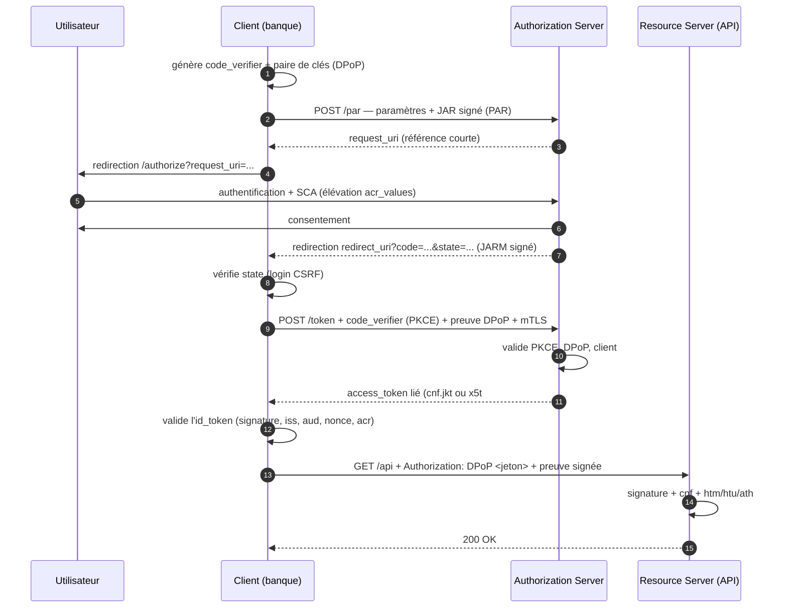

# FAPI

> [!abstract] Ancre
> FAPI (*Financial-grade API*) est un **profil sectoriel** de l'OpenID Foundation : il n'invente presque rien, il **durcit** OAuth 2.0 et OIDC en rendant obligatoires les protections les plus fortes, et en supprimant celles qui sont trop laxistes.

---

## 🧒 Avant de commencer : de quoi on parle

> [!tip] En clair
> **FAPI, ce n'est pas un nouveau protocole.** C'est une **liste de règles** pour un secteur exigeant : la finance.
>
> 🍽️ **L'analogie :** imagine OAuth comme une **recette de cuisine** de base. FAPI, c'est la version qu'un **cuisinier étoilé** doit suivre dans un restaurant où une erreur peut empoisonner quelqu'un : mêmes ingrédients, mais **procédure stricte** et **aucune approximation tolérée**.
>
> Concrètement, FAPI dit : *« Vous utilisez OAuth et OIDC — très bien. Mais comme vous manipulez de l'argent, voici ce qui devient **obligatoire**, et voici ce qui devient **interdit**. »*
>
> Et le plus important : FAPI **ne définit pas** les mécanismes ([[PKCE]], [[mTLS]], [[DPoP]]…) — il les **sélectionne** et les **impose**.

**Les mots à connaître pour cette note :**

| Mot technique | En clair |
|---|---|
| **FAPI** | *Financial-grade API* : le profil durci pour la finance |
| **profil** | une **liste de règles** ajoutées à un protocole existant |
| **OpenID Foundation** | l'organisation qui publie les spécifications OIDC |
| **FAPI 1.0** | la première version (lourde, très flexible) |
| **FAPI 2.0** | la version modernisée (plus simple, plus sûre) |
| **certification** | le **label** délivré après tests de conformité |
| **baseline / advanced** | les deux niveaux de FAPI 1.0 (de plus en plus strict) |

Voir aussi : [[mTLS]] et [[DPoP]] (les mécanismes que FAPI impose) et [[Sécurité OIDC et OAuth 2.1]] (la RFC 9700 qui a intégré ses leçons).

---

## Définition

> [!tip] En clair
> FAPI est une **surcouche de règles**. Il ne remplace ni OAuth ni OIDC : il dit **comment les utiliser**, avec quelles protections obligatoires et quelles simplifications interdites.
>
> Il existe en **deux générations** : FAPI 1.0 (2020, avec deux niveaux) et FAPI 2.0 (finalisé en 2024, plus simple et plus sûr). **FAPI 2.0 est désormais la référence** pour tout nouveau projet.

**FAPI** (*Financial-grade API*) est un **profil** publié par l'**OpenID Foundation** qui spécifie quelles options d'[[OAuth 2.0]] et d'[[OpenID Connect]] doivent être **utilisées obligatoirement** (ou **proscrites**) pour les écosystèmes nécessitant un haut niveau de sécurité : banque, paiement, assurance, santé, administration.

Il existe deux générations :

| Version | Publication | Philosophie |
|---|---|---|
| **FAPI 1.0** (baseline / advanced) | 2020 | liste d'exigences sur OAuth 2.0 / OIDC ; deux niveaux de sévérité ; plusieurs mécanismes alternatifs admis |
| **FAPI 2.0** | finalisé 2024 | **modernisation** : parcours unique, PKCE obligatoire, **jetons à preuve de possession** systématiques, plus simple à implémenter **et** plus sûr |

FAPI ne définit aucun mécanisme nouveau : il **assemble** [[PKCE]], [[mTLS]], [[DPoP]], JAR/JARM, PAR, la validation stricte d'[[ID Token]], et interdit ce qui est trop faible. Aujourd'hui, FAPI 2.0 est au **niveau « Security Profile »** ; un **« Message Signing »** complète l'ensemble.

---

## Enjeux

> [!tip] En clair
> **Pourquoi la finance a-t-elle besoin d'un profil à part ?**
>
> Parce que **l'enjeu change**. Si un attaquant vole un jeton sur un réseau social, il lit des messages. S'il vole un jeton bancaire, il **vide un compte**. La conséquence n'est pas la même, donc **le niveau d'exigence non plus**.
>
> La logique de FAPI : **réduire la liberté de configuration au minimum**. Chaque « option ouverte » est une occasion d'erreur. FAPI ferme les options.

- **Enjeu proportionné** : les exigences augmentent avec les conséquences — virements, PSD2/Open Banking, données de santé.
- **Réduire la surface d'erreur** : en imposant un parcours unique, FAPI supprime les choix dangereux (« mauvaise configuration » impossible, ou détectée).
- **Fin du jeton porteur nu** : FAPI 2.0 impose des **jetons à preuve de possession** ([[DPoP]] ou [[mTLS]]) — un jeton volé est inutilisable.
- **Réponse aux régulations** : PSD2, eIDAS, DSP2, Open Banking — FAPI est souvent la brique technique désignée pour satisfaire l'exigence (SCA, SCA dynamique, etc.).
- **Interopérabilité vérifiable** : la **certification** par l'OpenID Foundation garantit qu'une implémentation respecte réellement le profil (on ne se contente pas d'une déclaration).
- **Effet d'entraînement** : les leçons de FAPI (et de ses déploiements) ont largement nourri la **RFC 9700** et **OAuth 2.1** — ce qui explique que tes notes du dossier les recroisent sans cesse.

---

## Fonctionnement détaillé

### Ce que FAPI impose, vue par vue

> [!tip] En clair
> Voilà **la liste des courses** de FAPI 2.0. Chaque ligne renvoie à une note existante du dossier : FAPI **n'ajoute presque rien de neuf**, il **combine** et **rend obligatoire**.

| Domaine | Exigence FAPI 2.0 | Note liée |
|---|---|---|
| **Flow** | Authorization Code **uniquement** | [[Authorization Code Flow]] |
| **PKCE** | **obligatoire**, `S256` | [[PKCE]] |
| **Redirection** | correspondance **exacte** de `redirect_uri` | [[Sécurité OIDC et OAuth 2.1]] |
| **Jeton** | **preuve de possession** obligatoire : [[DPoP]] ou [[mTLS]] | [[DPoP]], [[mTLS]] |
| **ID Token** | validation **complète** (signature, `iss`, `aud`, `exp`, `nonce`) | [[ID Token]] |
| **Algorithme** | **asymétriques** uniquement (`PS256`/`ES256`…), `none` interdit | [[JWT]] |
| **Authentification du client** | forte ([[mTLS]], `private_key_jwt`), jamais de secret partagé en clair | [[mTLS]] |
| **Requête d'autorisation** | signée et/ou passée par référence (**JAR/JARM**, **PAR**) | — |
| **Délégation entre acteurs** | [[Token Exchange]] (`act`, audience restreinte) | [[Token Exchange]] |
| **`state`, `nonce`** | obligatoires | [[State (login CSRF)]], [[Prompts et contrôle de l'interaction]] |
| **Session** | pas de laissé-passer implicite, contrôle strict | [[Session SSO et consentement]] |
| **Flows interdits** | Implicit, Password (déjà dépréciés ailleurs) | [[Comparatif des flows OIDC]] |

**Le point à comprendre :** aucune de ces lignes n'est *inventée* par FAPI. Toutes existent déjà dans OAuth 2.0, OIDC ou la RFC 9700. FAPI est le **catalogue qui les rend obligatoires simultanément** — c'est là toute sa valeur.

### FAPI 1.0 vs FAPI 2.0

> [!tip] En clair
> **L'évolution, en une phrase :** FAPI 1.0 était **très strict mais compliqué** (beaucoup d'options, deux niveaux, plusieurs façons d'atteindre le même but). FAPI 2.0 **simplifie en renforçant** — un seul chemin, et il est le bon.

| | **FAPI 1.0** | **FAPI 2.0** |
|---|---|---|
| **Structure** | deux niveaux : *baseline* et *advanced* | un seul profil principal |
| **Preuve de possession** | *advanced* : mTLS principalement | **systématique** : DPoP **ou** mTLS |
| **Complexité** | élevée (options multiples) | réduite (parcours unique) |
| **PKCE** | exigé | exigé (**`S256`**) |
| **Signature de requête** | JAR/JARM, PAR | JAR/JARM, PAR |
| **Algorithme** | `PS256` etc. ; `RS256` toléré | asymétriques, avec préférence pour `PS256`/`ES256` |
| **Statut** | largement déployé (Open Banking historique) | **référence actuelle**, à privilégier |
| **Message Signing** | — | profil complémentaire (signature de message) |

**Ce qu'il faut retenir pour un projet neuf :** viser **FAPI 2.0**. FAPI 1.0 reste à connaître parce que des déploiements existants (Open Banking, DSP2 en Europe) s'y conforment — mais il est en voie de remplacement.

### Les briques qui complètent FAPI

> [!tip] En clair
> FAPI ajoute **trois briques techniques** dont certaines n'ont pas encore de note dans le dossier. Voilà l'essentiel pour ne pas être perdu quand tu les croiseras.

**1. PAR (*Pushed Authorization Requests*, RFC 9126)**
> Au lieu d'envoyer les paramètres d'autorisation dans l'URL du navigateur, le client les **pousse d'abord** au serveur d'autorisation par un **appel POST direct**, et ne met plus dans l'URL qu'une **référence courte** (`request_uri`).
>
> **Pourquoi :** les paramètres (scopes, `acr_values`, données riches) ne traînent plus dans l'URL — donc moins de fuite par historique, logs ou `Referer`. C'est aussi ce qui permet des requêtes longues sans dépasser les limites d'URL.

**2. JAR / JARM (*JWT Secured Authorization Request / Response*)**
> - **JAR** : la requête d'autorisation est **transportée dans un JWT signé** (paramètre `request`) — elle ne peut donc pas être **modifiée** en route.
> - **JARM** : la **réponse** d'autorisation est elle aussi **signée** — le client peut vérifier qu'elle vient bien de l'OP et n'a pas été altérée.
>
> **Pourquoi :** sans signature, un attaquant qui intercepte ou modifie les paramètres peut changer la cible (`redirect_uri`), les scopes ou l'audience. JAR/JARM ferment ça cryptographiquement.

**3. `private_key_jwt` (RFC 7523) — authentification du client sans secret partagé**
> Le client signe une **assertion JWT** avec sa clé privée, à la place du `client_secret`. Le serveur la vérifie avec la clé publique enregistrée.
>
> **Pourquoi :** aucun secret partagé ne circule — la clé privée signe, elle n'est jamais transmise (même logique que [[mTLS]]).

### Le parcours FAPI 2.0, de bout en bout

> [!tip] En clair
> Tout se rejoint ici. **Suis les étapes — chaque protection vue dans le dossier y apparaît.**



**Repère chaque protection :** PAR (étape 2), JAR (2), JARM (7), `state` (8), [[PKCE]] (9), [[mTLS]] + [[DPoP]] (9), jeton lié (11), [[ID Token]] validé (12), [[Authentification renforcée (acr_values, amr, auth_time)|`acr`]] (4). **C'est exactement le dossier entier en une image.**

### La certification : ce qui distingue FAPI

> [!tip] En clair
> Point unique dans l'écosystème : FAPI n'est pas seulement un document — c'est un **label**. L'OpenID Foundation fait passer des **tests de conformité** et délivre une **certification**.
>
> Autrement dit : on ne **prétend** pas être conforme, on **prouve** qu'on l'est.

- **Certifications FAPI** : *FAPI 1.0 Baseline*, *FAPI 1.0 Advanced*, *FAPI 2.0 Security Profile*, *FAPI 2.0 Message Signing*.
- Un écosystème (banque centrale, groupement) **exige** souvent la certification de l'OP et des clients.
- La certification couvre l'interopérabilité **et** la sécurité : deux implémentations certifiées doivent se comprendre et se faire mutuellement confiance.

---

## Exemple concret

> [!tip] En clair
> **Ce qui change, concrètement**, entre un OAuth classique correct et un échange FAPI 2.0. Même code flow — mais tout est **durci**.

**❌ OAuth 2.0 correct mais pas FAPI :**

```http
GET /authorize?response_type=code
  &client_id=banque-app
  &redirect_uri=https%3A%2F%2Fbanque.example.fr%2Fcallback
  &scope=openid%20accounts
  &state=a1b2c3
  &code_challenge=E9Melhoa2OwvFrEMTJguCHaoeK1t8URWbuGJSstw-cM
  &code_challenge_method=S256

# puis
POST /token
grant_type=authorization_code
&code=SplxlOBeZQQYbYS6WxSbIA
&code_verifier=dBjftJeZ4CVP-mB92K27uhbUJU1p1r_wW1gFWFOEjXk
→ jeton Bearer, utilisable par quiconque le détient
```

**✅ FAPI 2.0 — la même intention, durcie :**

```http
# 1. Les paramètres sont POUSSÉS (PAR), plus mis dans l'URL
POST /par HTTP/1.1
Host: as.banque.example
Content-Type: application/x-www-form-urlencoded

response_type=code
&client_id=banque-app
&redirect_uri=https%3A%2F%2Fbanque.example.fr%2Fcallback
&scope=openid%20accounts
&state=a1b2c3
&nonce=n-0S6_WzA2Mj
&code_challenge=E9Melhoa2OwvFrEMTJguCHaoeK1t8URWbuGJSstw-cM
&code_challenge_method=S256
&acr_values=urn:banque:loa:sca
&request=<JAR : JWT signé contenant les mêmes paramètres>

# → réponse : { "request_uri": "urn:ietf:params:oauth:request_uri:6esc_11AC...", "expires_in": 90 }

# 2. L'URL ne contient plus qu'une référence
GET /authorize?client_id=banque-app&request_uri=urn%3Aietf%3Aparams%3Aoauth%3Arequest_uri%3A6esc_11AC...
```

```http
# 3. Échange avec PKCE + DPoP + mTLS
POST /token HTTP/1.1
Host: as.banque.example
DPoP: <preuve DPoP signée>
# + certificat client au niveau TLS
Content-Type: application/x-www-form-urlencoded

grant_type=authorization_code
&code=SplxlOBeZQQYbYS6WxSbIA
&code_verifier=dBjftJeZ4CVP-mB92K27uhbUJU1p1r_wW1gFWFOEjXk
&client_id=banque-app
```

```json
// 4. Le jeton est LIÉ (dp sûr) et signé en PS256
{
  "access_token": "eyJhbGci...",
  "token_type": "DPoP",
  "expires_in": 300,
  "scope": "openid accounts"
}
```

```json
// 5. Contenu : lié au porteur
{
  "iss": "https://as.banque.example",
  "aud": "https://api.banque.example",
  "sub": "client_4512",
  "scope": "accounts",
  "exp": 1759316420,
  "cnf": { "jkt": "0ZcOCORZNYy-DWpqq30jZyJGHTN0d2HglBV3uiguA4I" }
}
```

**Les différences qui sautent aux yeux :**

| | OAuth correct | FAPI 2.0 |
|---|---|---|
| Paramètres d'autorisation | dans l'URL | **poussés** (PAR) + **signés** (JAR) |
| Réponse d'autorisation | non signée | **signée** (JARM) |
| Authentification du client | `client_secret` | `private_key_jwt` ou [[mTLS]] |
| Jeton | Bearer **porteur** | **lié au porteur** ([[DPoP]]/[[mTLS]]) |
| Durée du jeton | 1 h | **5 min** (exemple) |
| Algorithme | `RS256` toléré | `PS256`/`ES256` |

**Et l'usage final** — un jeton volé ne sert à rien :

```http
GET /accounts HTTP/1.1
Host: api.banque.example
Authorization: DPoP eyJhbGci...
DPoP: <preuve signée par la clé légitime>
```

Sans la clé privée, l'attaquant échoue à la **première** vérification de l'API.

---

## Pièges fréquents

> [!tip] En clair
> **Les 5 erreurs à retenir :**
> 1. **Croire que FAPI est un protocole** → c'est un **profil** (une liste de règles).
> 2. **Implémenter FAPI 1.0 sur un projet neuf** → FAPI **2.0** est la référence actuelle.
> 3. **Prendre FAPI pour un « OAuth plus fort » sans lire les règles** → il impose des choix très précis (PAR, JAR, DPoP…).
> 4. **Se déclarer conforme sans certification** → la conformité se **prouve** par les tests.
> 5. **Croire que FAPI suffit** → il durcit le protocole, mais la sécurité applicative reste à ta charge.

- **Confondre profil et protocole** — FAPI ne redéfinit rien ; il impose des options d'OAuth/OIDC. Réflexe : lire FAPI comme une **grille d'exigences**, pas comme une spécification de départ.
- **Choisir FAPI 1.0 pour un nouveau projet** — la version 1.0 est plus complexe et moins stricte sur certains points (preuve de possession optionnelle en *baseline*). Réflexe : **FAPI 2.0** par défaut ; 1.0 uniquement pour compatibilité avec un écosystème existant.
- **Preuve de possession oubliée** — FAPI 2.0 impose un jeton **lié au porteur**. Émettre un Bearer classique **invalide la conformité** et laisse le principal risque ouvert. Réflexe : [[DPoP]] (ou [[mTLS]]) systématiquement.
- **PKCE absent ou en `plain`** — `plain` est proscrit chez FAPI comme ailleurs. Réflexe : `S256` obligatoire ([[PKCE]]).
- **`redirect_uri` non exacte** — correspondance partielle ou wildcard : rejet. Réflexe : URI **pré-enregistrée**, comparaison exacte.
- **`RS256` là où `PS256` est attendu** — certains profils/serveurs exigent RSA-PSS ou des algorithmes de courbe. Réflexe : vérifier les algorithmes supportés dans la découverte ([[OIDC Discovery et JWKS]]), ne jamais accepter `none` ni un algorithme symétrique.
- **PAR non implémenté** — paramètres laissés dans l'URL : surface d'exposition et refus de conformité. Réflexe : **pousser** les paramètres, n'exposer qu'un `request_uri` court et éphémère.
- **JAR/JARM ignorés** — requêtes et réponses non signées : modification possible en transit. Réflexe : signer (et vérifier) les deux.
- **Secret partagé conservé** — un `client_secret` en clair dans un écosystème FAPI est un défaut. Réflexe : `private_key_jwt` ou [[mTLS]] ; à défaut, secret **fort** et **rotatif**.
- **Durées de vie trop longues** — un jeton lié reste une cible. Réflexe : access token **court** (quelques minutes), refresh **rotatif** ([[Refresh Token]]).
- **Message Signing confondu avec JARM** — le profil *Message Signing* concerne la signature des **messages métier** (paiements), pas de la réponse d'autorisation. Réflexe : ne pas mélanger les deux périmètres.
- **Certification supposée acquise** — « conforme d'après la doc » ≠ « certifié ». Réflexe : vérifier la liste de certification de l'OpenID Foundation, ou faire tester l'implémentation.
- **Session utilisateur négligée** — FAPI durcit les jetons, mais une session OP mal fermée reste une faille. Réflexe : [[Déconnexion OIDC]] (front + back-channel), `max_age` pour les actions sensibles.
- **Copier un exemple d'un autre écosystème** — les banques centrales et groupements ajoutent leurs propres règles par-dessus FAPI. Réflexe : lire **le profil de l'écosystème cible**, pas seulement FAPI.

---

## Rappel

> [!question] Question de rappel
> FAPI apporte-t-il de nouveaux mécanismes de sécurité ? Citez trois exigences qu'il impose, et expliquez en quoi FAPI 2.0 diffère de FAPI 1.0.

> [!success]- Réponse
> **Non** : FAPI n'invente aucun mécanisme — il **sélectionne, combine et rend obligatoires** des briques qui existent déjà dans OAuth 2.0, OIDC et leurs extensions. Trois exigences (parmi d'autres) : ① **PKCE obligatoire en `S256`** pour le Authorization Code Flow, qui est le **seul flow admis** ; ② **jetons à preuve de possession** obligatoires ([[DPoP]] ou [[mTLS]]), un Bearer porteur n'étant pas acceptable ; ③ **authentification forte du client** sans secret partagé en clair (`private_key_jwt`, [[mTLS]]), plus **PAR** (paramètres poussés) et **JAR/JARM** (requêtes et réponses signées). Quant à la différence entre générations : **FAPI 1.0** (2020) proposait **deux niveaux** (*baseline*, *advanced*) avec de multiples options — très strict mais complexe, et la preuve de possession n'était requise qu'en *advanced*. **FAPI 2.0** (finalisé en 2024) **simplifie en renforçant** : un **parcours unique**, PKCE systématique, **preuve de possession obligatoire partout**, et un choix restreint d'algorithmes — plus facile à implémenter **et** plus sûr. Pour un projet neuf, FAPI 2.0 est la référence ; FAPI 1.0 reste à connaître pour les écosystèmes existants (Open Banking/DSP2), et il est en voie de remplacement.

### 🎯 Le résumé à retenir

> [!tip] Si tu ne retiens qu'une chose
> **FAPI n'invente rien : il rend obligatoire ce que le reste recommande.**
>
> Un projet neuf vise **FAPI 2.0** : Authorization Code + [[PKCE]] `S256`, jeton **lié au porteur** ([[DPoP]]/[[mTLS]]), client authentifié **sans secret partagé**, **PAR** et **JAR/JARM**, validation stricte de l'[[ID Token]].
>
> **Ce qui le distingue vraiment :** la **certification**. On ne prétend pas être conforme — on le **prouve**.
>
> **Et il ne faut pas l'oublier :** FAPI durcit les **jetons**, pas toute l'application. La sécurité du reste (session, logs, stockage) reste entièrement à ta charge.

---

## Voir aussi

- [[mTLS]] — une des deux preuves de possession que FAPI impose.
- [[DPoP]] — l'autre, et le choix par défaut de FAPI 2.0.
- [[PKCE]] — obligatoire chez FAPI, en `S256`.
- [[Sécurité OIDC et OAuth 2.1]] — la RFC 9700, largement nourrie par les leçons de FAPI.
- [[ID Token]] — la validation complète exigée, avec algorithme asymétrique.
- [[Authorization Code Flow]] — le seul flow admis par FAPI 2.0.
- [[Authentification renforcée (acr_values, amr, auth_time)]] — l'élévation de niveau (SCA) exigée par la finance.
- [[Refresh Token]] — la rotation, indispensable avec des jetons courts.
- [[Déconnexion OIDC]] — la session, que FAPI ne couvre pas mais qui reste critique.
- [[Token Exchange]] — la délégation d'identité entre acteurs financiers.
- [[JWT]] — les algorithmes asymétriques et la signature des requêtes (JAR/JARM).
- [[OIDC (MOC)]] — carte d'entrée du dossier.

## Références

- FAPI 1.0 — *Financial-grade API Security Profile 1.0* (baseline et advanced), OpenID Foundation.
- FAPI 2.0 — *FAPI 2.0 Security Profile* et *FAPI 2.0 Message Signing*, OpenID Foundation.
- RFC 9126 — *OAuth 2.0 Pushed Authorization Requests* (PAR).
- RFC 9101 — *The OAuth 2.0 Authorization Framework: JWT-Secured Authorization Request* (JAR).
- JARM — *JWT Secured Authorization Response Mode for OAuth 2.0*, OpenID Foundation.
- RFC 7523 — *JSON Web Token (JWT) Profile for OAuth 2.0 Client Authentication and Authorization Grants* (`private_key_jwt`).
- RFC 9449 — *OAuth 2.0 Demonstrating Proof of Possession (DPoP)*.
- RFC 8705 — *OAuth 2.0 Mutual-TLS Client Authentication and Certificate-Bound Access Tokens*.
- RFC 7636 — *Proof Key for Code Exchange by OAuth Public Clients* (PKCE).
- RFC 9700 — *Best Current Practice for OAuth 2.0 Security*.
