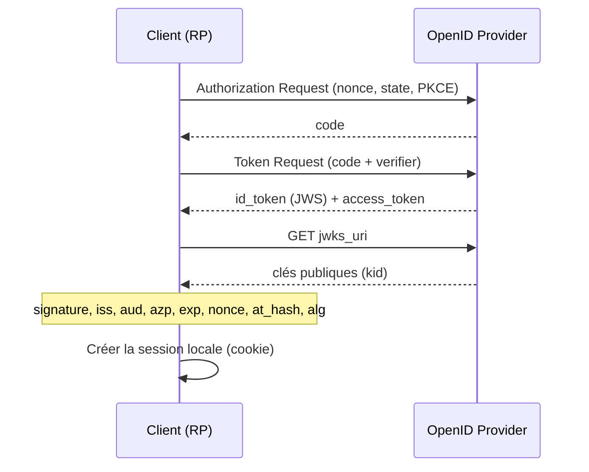

# ID Token

> [!abstract] Ancre
> L'ID Token prouve *qui* est l'utilisateur au client ; il ne donne accès à aucune API.

---

## 🧒 Avant de commencer : de quoi on parle

> [!tip] En clair
> On a deux papiers qui se ressemblent mais qui n'ont **pas du tout** le même usage :
>
> - **L'access token** = le **badge**. Tu le montres à une porte pour **faire** quelque chose.
> - **L'ID Token** = la **carte d'identité**. Tu la montres à l'application pour qu'elle sache **qui tu es**.
>
> Tu ne montres **jamais** ta carte d'identité pour ouvrir une porte, et tu ne montres **jamais** ton badge pour prouver ton nom. Confondre les deux est l'erreur la plus fréquente d'OIDC.

**Les mots à connaître pour cette note :**

| Mot technique | En clair |
|---|---|
| **ID Token** | la carte d'identité signée par le guichet |
| **claim** | une ligne de la carte (`sub` = identifiant, `email` = adresse…) |
| **`sub`** | ton identifiant stable chez le guichet (ne change jamais) |
| **`aud`** | « à qui cette carte est destinée » — doit être l'application |
| **`iss`** | « qui a émis cette carte » — le guichet |
| **`exp`** | « jusqu'à quand la carte est valable » |
| **signature** | le cachet du guichet : ce qui rend la carte infalsifiable |

Voir aussi : [[OpenID Connect]] (le protocole) et [[JWT]] (le format de la carte).

---

## Définition

> [!tip] En clair
> L'ID Token est un **petit document signé** que le guichet remet à l'application, à la fin de la connexion. Il dit : « cet utilisateur, c'est celui-là, et il s'est bien connecté à telle heure ».
>
> Le **cachet** (la signature) est essentiel : sans lui, n'importe qui pourrait fabriquer un faux document. Le contenu seul ne vaut rien.
>
> 🔧 **Le mot technique :** ce document s'appelle l'**ID Token**. Il est au format [[JWT]].

L'ID Token est un [[JWT]] signé (JWS) émis par l'OpenID Provider à l'issue de l'authentification — [[OAuth 2.0]] fournit le transport, [[OpenID Connect]] ajoute l'identité. Il atteste, pour le client (RP), l'identité de l'utilisateur et l'instant de son authentification. Ce n'est **pas** un [[Access Token]] : il ne s'utilise jamais contre une API.

---

## Enjeux

> [!tip] En clair
> L'ID Token est **la pièce la plus importante d'OIDC** : c'est en la lisant que l'application décide « ok, je te connais, j'ouvre ta session ».
>
> **Mais attention** : une carte d'identité que personne ne vérifie ne vaut **rien**. Si l'application se contente de lire le contenu sans contrôler le cachet, un escroc peut lui présenter une carte fabriquée à la maison. C'est tout l'enjeu : **la vérification**.

L'ID Token est le cœur d'[[OpenID Connect]] : c'est la pièce que le RP inspecte pour ouvrir une session locale. Sa valeur tient entièrement à la **vérification** faite par le client — un jeton non validé vaut zéro.

- **Preuve d'authentification, pas d'autorisation** : « cet utilisateur s'est authentifié à telle heure », jamais « il a le droit d'appeler `/factures` ».
- **Destinataire unique** : `aud` désigne le client, pas le resource server — frontière stricte avec le [[Access Token]].
- **Durée très courte** : quelques minutes, consommé une fois pour ouvrir la session ([[Authorization Code Flow]], [[PKCE]]) ; la continuité passe par un [[Refresh Token]] ou un cookie côté serveur, jamais par l'ID Token.
- **Surface d'attaque** : signature non vérifiée, `alg` manipulé, `aud` ignoré, `nonce` absent — les erreurs qui transforment une brique d'identité en usurpation ([[Sécurité OIDC et OAuth 2.1]]).

---

## Fonctionnement détaillé

### ID Token vs Access Token : ne jamais les confondre

> [!tip] En clair
> Le tableau ci-dessous est **le plus important de la note**. Si tu ne retiens qu'une ligne : **le badge s'adresse à l'API, la carte s'adresse à l'application.**

| Critère | ID Token | [[Access Token]] |
|---|---|---|
| Destinataire (`aud`) | Le **client** (`client_id`) | Le **resource server** (API) |
| Rôle | Prouver l'identité | Autoriser l'accès à une ressource |
| Format | Toujours un [[JWT]] signé | Opaque ou JWT (RFC 9068, `typ: at+jwt`) |
| Qui le lit / vérifie | Le client | L'API |
| Usage | Une fois, pour créer la session | À chaque appel, jusqu'à expiration |
| Transmis à une API ? | **Jamais** | Oui, en `Authorization: Bearer *** |

L'ID Token est un **acte de naissance** présenté au guichet ; l'access token est le **badge** qui ouvre les portes. Présenter l'un à la place de l'autre est une erreur de modèle, pas un détail d'implémentation.

### Claims : obligatoires et additionnels

> [!tip] En clair
> Chaque ligne de la carte s'appelle un **claim**. Il y en a qu'on est **obligé** de mettre (les 6 ci-dessous), et d'autres qu'on ajoute si besoin.
>
> Retiens surtout les trois noms à surveiller : **`iss`** (qui a émis), **`sub`** (qui tu es), **`aud`** (à qui c'est destiné).

Catalogue complet des claims, de leur fiabilité et de la façon de les demander : [[Scopes et claims]].

Claims **obligatoires** ([[JWT|RFC 7519]] + OIDC Core §2) :

| Claim | Sens | Requis | Piège |
|---|---|---|---|
| `iss` | Émetteur (URL de l'OP) | Oui | Comparer **exactement** : casse et slash final compris |
| `sub` | Identifiant local de l'utilisateur | Oui | Stable, contrairement à `email` |
| `aud` | Audience = `client_id` du RP | Oui | Souvent un tableau : vérifier la **présence** du bon `client_id` |
| `exp` | Expiration | Oui | Quelques minutes ; tolérance d'horloge |
| `iat` | Émis à | Oui | Sert à juger la fraîcheur |
| `nonce` | Anti-rejeu | Oui si jeton rendu par l'authorization endpoint | Doit être **identique** à celui envoyé |

Claims **OIDC additionnels** (OIDC Core §2, §5.1) :

| Claim | Sens | Requis quand | Piège |
|---|---|---|---|
| `auth_time` | Instant d'authentification réelle | `max_age` demandé | Distinct de `iat` (SSO silencieux) |
| `acr` | Contexte d'authentification (niveau MFA) | Politique de sécurité | Déclaré par l'OP, pas par le client — voir [[Authentification renforcée (acr_values, amr, auth_time)]] |
| `amr` | Méthodes utilisées (`pwd`, `mfa`, `otp`) | Souhaité | Tableau de chaînes sensibles à la casse |
| `azp` | Partie autorisée à qui le jeton a été émis | Multi-audience | `aud` multiple sans `azp` → **rejeter** |
| `at_hash` | Empreinte du [[Access Token]] associé | Jeton rendu par l'authorization endpoint | Bloque la substitution de jeton |
| `c_hash` | Empreinte du `code` | Flow hybride | Uniquement en `code id_token` |
| `sid` | Identifiant de session | Déconnexion globale | Utile à `end_session` |
| `sub_jwk` | Clé publique du sujet | Self-issued OP | `iss` = `sub` dans ce cas |
| `email` / `email_verified` | Adresse électronique | Scope `email` | Ne jamais croire `email` sans `email_verified` |

### Validation côté RP : les étapes obligatoires (OIDC Core §3.1.3.7)

> [!tip] En clair
> C'est la **checklist de sécurité** : tout ce que l'application DOIT faire avant de faire confiance à la carte. Les trois contrôles les plus importants en premier :
> 1. **Le cachet est-il authentique ?** (la signature)
> 2. **La carte est-elle pour moi ?** (`aud`)
> 3. **Est-ce bien la carte de MA session ?** (`nonce`)
>
> Sans ces trois-là, tout le reste ne sert à rien.

À la réception, le client **MUST** :

1. **Vérifier la signature** avec la clé publique de l'OP récupérée via [[OIDC Discovery et JWKS]] (`jwks_uri`), sélectionnée par `kid`. Sans cette étape, tout le reste est décoratif : un jeton forgé passe.
2. **Vérifier `alg`** contre une **liste blanche** (`RS256`, `ES256`…). Refuser `none` et un `HS256` inattendu : c'est la **confusion d'algorithme** (HMAC signé avec la clé publique RSA).
3. **`iss` strictement égal** à l'émetteur attendu.
4. **`aud` contient le `client_id`** du RP ; si plusieurs audiences, exiger **`azp` égal** au `client_id` et rejeter les audiences non fiables.
5. **Fenêtre temporelle** : `exp` non dépassé, `nbf` non futur, `iat` cohérent, avec **tolérance d'horloge** explicite (≈ 60 s) pour éviter les faux rejets.
6. **`nonce` identique** à celui envoyé (obligatoire quand le jeton vient du authorization endpoint) : défense anti-rejeu.
7. **`at_hash`** si présent : recalculer l'empreinte de l'access token reçu et comparer.
8. **`c_hash`** si présent : même contrôle sur le `code`.
9. **`auth_time`** comparé à `max_age` si une durée maximale de session a été demandée.
10. **`kid` absent ou introuvable** : recharger le JWKS (rotation), puis échouer — jamais de confiance par défaut.



## Exemple concret

> [!tip] En clair
> Voici une vraie carte d'identité, décodée. Repère surtout **`iss`** (c'est bien mon guichet ?), **`aud`** (c'est bien ma carte ?), **`sub`** (c'est bien moi ?) et **`exp`** (elle est encore valable ?).
>
> Le `header` (partie 1) dit **comment** vérifier le cachet ; le `payload` (partie 2) contient les **informations**.

ID Token typique d'un SSO d'entreprise (RP `app-portail`, OP `auth.exemple.com`), décodé :

```json
// Header
{
  "alg": "RS256",              // asymétrique : le RP vérifie avec la clé publique
  "kid": "2026-09-01-a1b2",    // identifie la clé dans le JWKS → rotation
  "typ": "JWT"                 // un access token OIDC porterait "at+jwt" (RFC 9068)
}
```

```json
// Payload
{
  "iss": "https://auth.exemple.com",   // doit correspondre EXACTEMENT à l'issuer de discovery
  "sub": "f3a9c1e2-88b4-4d77-9e01-5c2ab7d19f40",  // identité stable côté OP (jamais l'email)
  "aud": "app-portail",                 // le CLIENT, pas l'API
  "azp": "app-portail",                 // partie autorisée (explicite si multi-audience)
  "exp": 1759316420,                    // valide 5 minutes seulement
  "iat": 1759316120,
  "auth_time": 1759316000,              // authentification réelle 2 min avant l'émission
  "nonce": "n-0S6_WzA2Mj",             // identique à celui envoyé par le RP
  "acr": "urn:mace:incommon:iap:silver",
  "amr": ["pwd", "otp"],                // mot de passe + OTP : le MFA est visible
  "at_hash": "77QmUPtjPfzWtF2AnpK9RQ",  // empreinte de l'access token (anti-substitution)
  "sid": "08a5019c-17e1-4977-8f42-65a12843ea02",
  "email": "alice@exemple.com",
  "email_verified": true                // à contrôler AVANT d'utiliser email
}
```

Avec `alg` et `kid`, le RP sait quelle clé demander à `jwks_uri` ; avec `aud`, que le jeton lui est destiné ; avec `nonce` et `at_hash`, qu'il n'est ni rejoué ni substitué. Les trois vérifications les plus souvent sautées sont justement signature, `aud` et `nonce`.

## Pièges fréquents

> [!tip] En clair
> **Les 4 erreurs à retenir avant tout :**
> 1. Lire la carte **sans vérifier le cachet** → n'importe qui peut en fabriquer une.
> 2. Oublier de vérifier **à qui** elle est destinée (`aud`) → une carte émise pour une autre appli ouvre ta session.
> 3. Oublier le `nonce` → une carte capturée peut être rejouée.
> 4. Envoyer la carte d'identité à une **API** en pensant que c'est un badge → faille majeure.

- **Décoder sans vérifier la signature** → n'importe qui forge une identité. Réflexe : signature d'abord, champs ensuite ([[JWT]]).
- **Oublier `aud`** → un jeton émis pour une application voisine ouvre votre session (*token substitution*). Réflexe : exiger son `client_id`, et `azp` si multi-audience.
- **Accepter `alg: none`** ou faire confiance au `alg` du header → jeton non signé accepté, ou confusion RS256/HS256. Réflexe : liste blanche côté serveur (RFC 8725 §3.1).
- **Ignorer `nonce`** → rejeu d'un ID Token capturé. Réflexe : nonce imprévisible par requête, comparé à l'identique ([[Sécurité OIDC et OAuth 2.1]]).
- **Confondre `id_token` et `access_token`** → ID Token envoyé en `Bearer` à une API : une application cliente peut usurper n'importe quel utilisateur. Réflexe : l'API n'accepte que des access tokens (RFC 9068).
- **Utiliser `email` sans `email_verified`** → prise de compte via un email non vérifié. Réflexe : clé d'identité = `sub`.
- **Aucune tolérance d'horloge** → sessions refusées en apparence au hasard. Réflexe : ± 60 s documentée.
- **Stocker l'ID Token longtemps** → un JWT est lisible et non révocable. Réflexe : usage unique, cookie de session serveur, rien de persistant.

## Rappel

> [!question] Question de rappel
> Pourquoi ne pas passer l'ID Token en `Authorization: Bearer` à une API interne, pour économiser un appel ?

> [!success]- Réponse
> L'ID Token est destiné au **client** (`aud = client_id`), pas au resource server : l'API n'est pas l'audience légitime et ne devrait pas l'accepter. L'accepter permet à n'importe quelle application cliente de forger un jeton pour n'importe quel utilisateur — l'authentification devient autorisation. Il ne porte d'ailleurs aucune permission. Solution : un [[Access Token]] dédié ([[Client Credentials Flow]] ou échange de jeton), validé par l'API sur son propre `aud`/`iss`.

### 🎯 Le résumé à retenir

> [!tip] Si tu ne retiens qu'une chose
> **L'ID Token est une carte d'identité ; l'access token est un badge.**
> On montre la carte **à l'application** (pour qu'elle sache qui tu es), le badge **à l'API** (pour agir). Jamais l'inverse.
>
> **Et le réflexe vital :** une carte ne vaut **que si on vérifie le cachet** (la signature). Contenu sans vérification = zéro.

## Voir aussi
- [[OpenID Connect]] — le protocole qui définit et transporte l'ID Token.
- [[JWT]] — format, signature JWS et claims sous-jacents.
- [[Scopes et claims]] — comment demander les claims (scopes, paramètre `claims`) et le rôle de `/userinfo`.
- [[Prompts et contrôle de l'interaction]] — `max_age`, `prompt` et le contrôle de `auth_time`.
- [[Session SSO et consentement]] — la session stateful de l'OP, source de `auth_time`, `acr` et `sid`.
- [[Authentification renforcée (acr_values, amr, auth_time)]] — exiger un niveau (MFA) et le vérifier.
- [[Déconnexion OIDC]] — le `sid` utilisé pour propager la déconnexion.
- [[Access Token]] — la frontière à ne jamais franchir.
- [[OIDC Discovery et JWKS]] — clés de vérification et rotation.
- [[Authorization Code Flow]] — flow principal de délivrance.
- [[PKCE]] — protège le `code`, donc l'ID Token qui en découle.
- [[Sécurité OIDC et OAuth 2.1]] — bonnes pratiques de validation.
- [[OIDC (MOC)]] — carte d'ensemble du domaine.

## Références
- OpenID Connect Core 1.0 — §2 (ID Token), §3.1.3.6, §3.1.3.7 (ID Token Validation), §5.1 (Standard Claims).
- RFC 7519 — JSON Web Token (JWT).
- RFC 8725 — JWT Best Current Practices (algorithmes, validation).
- RFC 9068 — JWT Profile for OAuth 2.0 Access Tokens (`typ: at+jwt`).
