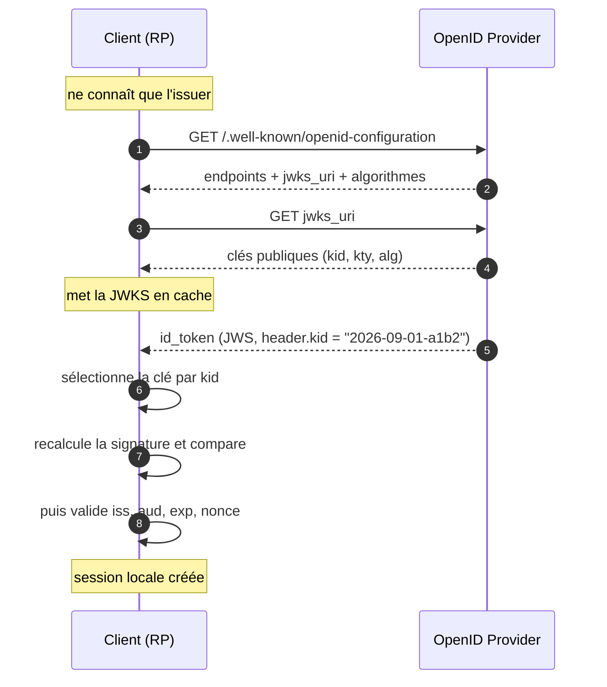

# OIDC Discovery et JWKS

> [!abstract] Ancre
> Discovery publie les points d'entrée du serveur d'identité ; JWKS publie ses clés publiques. Ensemble, ils permettent à un client de vérifier un jeton sans configuration manuelle.

---

## 🧒 Avant de commencer : de quoi on parle

> [!tip] En clair
> Ton application reçoit une **carte d'identité signée** (l'[[ID Token]]). Pour savoir si le cachet est authentique, il lui faut la **clé publique du guichet**. Deux questions se posent :
>
> 1. **Où est le guichet, et à quelles adresses parle-t-on ?** → c'est **Discovery**.
> 2. **Quelle est sa clé publique, et comment la récupérer ?** → c'est **JWKS**.
>
> Et le plus beau : **personne n'a besoin de configurer ça à la main**. L'application pose *une seule question* et le reste suit tout seul.

**Les mots à connaître pour cette note :**

| Mot technique | En clair |
|---|---|
| **Discovery** | la fiche technique publique du guichet (où sont ses guichets, quels algorithmes…) |
| **`.well-known`** | l'adresse standard où cette fiche est toujours rangée |
| **JWKS** | le porte-clés public du guichet : ses clés publiques |
| **JWK** | une clé publique, prise individuellement |
| **`jwks_uri`** | l'adresse où récupérer le porte-clés |
| **`kid`** | l'étiquette d'une clé, pour choisir la bonne |

Voir aussi : [[ID Token]] (qui doit être vérifié) et [[JWT]] (le format vérifié).

---

## Définition

> [!tip] En clair
> **Discovery**, c'est la **carte de visite** du guichet : un document public, à une adresse toujours identique, qui liste tout ce dont une application a besoin pour lui parler.
>
> **JWKS**, c'est son **porte-clés public** : les clés avec lesquelles on peut vérifier ses cachets — mais avec lesquelles on **ne peut pas** en fabriquer.
>
> 🔧 **Les mots techniques :** ces deux services viennent des spécifications **OpenID Connect Discovery 1.0** et **RFC 8414** (métadonnées) et **RFC 7517** (JWK).

**Discovery** (OpenID Connect Discovery 1.0, RFC 8414) est un document JSON publié à une URL conventionnelle qui décrit un serveur d'autorisation : ses endpoints, les scopes et claims supportés, les algorithmes de signature acceptés et l'URI de ses clés publiques.

**JWKS** (*JSON Web Key Set*, RFC 7517) est l'ensemble des clés publiques du serveur, publié à l'URI `jwks_uri` indiquée par Discovery. Le client l'utilise pour vérifier la signature des jetons ([[JWT]], [[ID Token]]).

---

## Enjeux

> [!tip] En clair
> **Le problème sans Discovery :** il faudrait configurer à la main, pour chaque fournisseur, l'adresse de son guichet, celle de ses jetons, celle de ses clés… Un vrai casse-tête, et une source d'erreurs.
>
> **Le problème sans JWKS :** il faudrait échanger les clés publiques manuellement par e-mail, et les mettre à jour à chaque changement. Ingérable.
>
> **Ce que ça apporte :** l'application ne connaît **qu'une seule adresse** ; tout le reste est découvert automatiquement, y compris le renouvellement des clés.

- **Zéro configuration** : un seul point d'entrée (*issuer*) suffit à un client pour découvrir tout le reste.
- **Rotation des clés** : le serveur change de clé sans rien casser — le client la retrouve par son `kid`.
- **Vérification hors-ligne** : avec la clé publique en cache, le client vérifie une signature sans appeler le serveur à chaque requête.
- **Point de vigilance** : une JWKS mal validée ou un `issuer` non épinglé ouvre la porte à des attaques de substitution ([[Sécurité OIDC et OAuth 2.1]]).

---

## Fonctionnement détaillé

### Le document de découverte

> [!tip] En clair
> Une **seule adresse** à connaître, toujours construite de la même façon :
>
> `https://le-guichet/` **+** `.well-known/openid-configuration`
>
> L'application va la lire, et y trouve tout : où demander l'autorisation, où échanger les jetons, où récupérer les clés…

L'URL est l'*issuer* concaténé à `/.well-known/openid-configuration` (OpenID Connect Discovery 1.0 §4). Exemple :

```
https://auth.example.com/.well-known/openid-configuration
```

Champs principaux retournés :

| Champ | Rôle |
|---|---|
| `issuer` | L'identifiant du serveur ; **doit correspondre exactement** à celui attendu |
| `authorization_endpoint` | Où envoyer la demande d'autorisation (`/authorize`) |
| `token_endpoint` | Où échanger le code (`/token`) |
| `userinfo_endpoint` | Où lire les claims de profil (`/userinfo`) |
| `jwks_uri` | **Où récupérer les clés publiques** |
| `scopes_supported` | Scopes acceptés (`openid`, `profile`, `email`…) |
| `response_types_supported` | Flux supportés (`code`, `code id_token`…) |
| `id_token_signing_alg_values_supported` | Algorithmes de signature (`RS256`, `ES256`…) |
| `code_challenge_methods_supported` | Méthodes [[PKCE]] (`S256` attendu — `plain` à refuser) |
| `end_session_endpoint` | Déconnexion (logout) |

OAuth 2.0 utilise aussi `/.well-known/oauth-authorization-server` (RFC 8414) pour un serveur d'autorisation pur, et `/.well-known/oauth-protected-resource` (RFC 9728) pour décrire une API protégée.

### La JWKS : le porte-clés public

> [!tip] En clair
> Le porte-clés contient une ou plusieurs **clés publiques**. Chaque clé a une **étiquette** (`kid`).
>
> Pourquoi plusieurs ? Parce que le guichet **renouvelle** ses clés régulièrement : pendant la transition, l'ancienne et la nouvelle coexistent. Le `kid` écrit dans le jeton dit laquelle utiliser.

Une JWK (RFC 7517 §4) décrit une clé : `kty` (type — `RSA`, `EC`, `oct`), `use` (`sig` pour la signature), `alg` (`RS256`…), `kid` (identifiant), puis les paramètres publics (`n`/`e` pour RSA, `crv`/`x`/`y` pour EC). Une clé privée ne doit **jamais** y figurer.

```json
{
  "keys": [
    {
      "kty": "RSA",
      "use": "sig",
      "alg": "RS256",
      "kid": "2026-09-01-a1b2",
      "n": "0vx7agoebGcQ...",
      "e": "AQAB"
    }
  ]
}
```

Le `kid` du header du jeton ([[JWT]] §Header) sélectionne la clé correspondante : le client cherche ce `kid` dans la JWKS, récupère la clé publique, et vérifie la signature.

### La chaîne de vérification, de bout en bout

> [!tip] En clair
> Le trajet complet, en une image :
>
> 1. L'application **connaît l'adresse du guichet** (`issuer`).
> 2. Elle lit sa **carte de visite** (Discovery) → elle y trouve l'adresse des clés.
> 3. Elle récupère le **porte-clés** (JWKS) → elle y trouve les clés publiques.
> 4. Elle reçoit un jeton, lit son étiquette (`kid`) → elle prend **la bonne clé**.
> 5. Elle **recalcule le cachet** et compare → identique = authentique.



Le client peut mettre le document de découverte et la JWKS en cache : la signature se vérifie alors **hors-ligne**, sans appeler l'OP à chaque requête.

### Rotation des clés et `kid` inconnu

> [!tip] En clair
> Quand le guichet change de clé, un jeton peut arriver avec une étiquette que l'application ne connaît pas encore.
>
> Le bon réflexe : **ne pas paniquer, ne pas faire confiance** — recharger le porte-clés **une fois**, puis réessayer. Si l'étiquette reste introuvable, **rejeter le jeton**.

1. Un jeton arrive avec un `kid` absent du cache.
2. Le client **recharge** la JWKS depuis `jwks_uri` (§4.2 de Discovery).
3. Si le `kid` est trouvé → vérification normale.
4. S'il reste introuvable → **échec**, jamais de confiance par défaut.

Le cache doit avoir un TTL raisonnable et un rafraîchissement forcé sur `kid` inconnu : ni re-téléchargement à chaque requête (latence, dépendance), ni cache éternel (rotation ratée).

---

## Exemple concret

> [!tip] En clair
> Deux appels HTTP, et c'est tout. Le premier pour la carte de visite, le second pour le porte-clés.

**1. Le document de découverte (extrait) :**

```json
{
  "issuer": "https://auth.example.com",
  "authorization_endpoint": "https://auth.example.com/authorize",
  "token_endpoint": "https://auth.example.com/token",
  "userinfo_endpoint": "https://auth.example.com/userinfo",
  "jwks_uri": "https://auth.example.com/.well-known/jwks.json",
  "scopes_supported": ["openid", "profile", "email"],
  "response_types_supported": ["code"],
  "id_token_signing_alg_values_supported": ["RS256", "ES256"],
  "code_challenge_methods_supported": ["S256"]
}
```

**2. Le porte-clés (JWKS) :**

```json
{
  "keys": [
    {
      "kty": "RSA",
      "use": "sig",
      "alg": "RS256",
      "kid": "2026-09-01-a1b2",
      "n": "0vx7agoebGcQSuuPiLJXZptN9nndrQmbXEps2aiAFbWhM78LhWx4cbbfAAtVT86zwu1RK7aPFFxuhDR1L6tSoc_BJECPebWKRXjBZCiFV4n3oknjhMstn64tZ_2W-5JsGY4Hc5n9yBXArwl93lqt7_RN5w6Cf0h4QyQ5v-65YGjQR0_FDW2QvzqY368QQMicAtaSqzs8KJZgnYb9c7d0zgdAZHzu6qMQvRL5hajrn1n91CbOpbISD08qNLyrdkt-bFTWhAI4vMQFh6WeZu0fM4lFd2NcRwr3XPksINHaQ-G_xBniIqbw0Ls1jF44-csFCur-kEgU8awapJzKnqDKgw",
      "e": "AQAB"
    }
  ]
}
```

Le client cherche `kid: "2026-09-01-a1b2"` dans ce tableau, reconstruit la clé publique, et vérifie la signature de l'[[ID Token]].

---

## Pièges fréquents

> [!tip] En clair
> **Les 5 erreurs à retenir :**
> 1. Faire confiance à l'`issuer` annoncé sans vérifier qu'il **est bien celui attendu** → on peut te rediriger vers un faux guichet.
> 2. Ne pas valider la JWKS reçue → clé falsifiée = vérification inutile.
> 3. Télécharger la JWKS **à chaque requête** → lenteur, dépendance, saturation.
> 4. Garder la JWKS en cache **pour toujours** → après rotation, tous les jetons sont rejetés.
> 5. Rejeter un `kid` inconnu sans recharger, ou pire, le **tolérer** → on rate la rotation ou on accepte un faux jeton.

- **`issuer` non épinglé** — la Discovery annonce un `issuer` ; s'il ne correspond pas **exactement** (casse, slash final) à celui configuré, les jetons d'un autre serveur peuvent être acceptés. Réflexe : comparaison stricte, et refus de tout `iss` divergent.
- **Pas de validation de la source JWKS** — une JWKS récupérée au-dessus d'un canal non authentifié, ou redirigée, peut être substituée. Réflexe : HTTPS obligatoire, URI issue de la Discovery **de l'issuer épinglé**.
- **Clé privée publiée** — une JWKS ne contient **que** des clés publiques ; toute fuite de clé privée casse tout l'écosystème. Réflexe : ne publier que `kty`, `use`, `alg`, `kid` et les paramètres publics.
- **Pas de gestion du `kid`** — ignorer le `kid` et tester toutes les clés, ou n'accepter qu'une clé fixe, casse la rotation. Réflexe : sélection par `kid`, rechargement forcé si inconnu.
- **Cache sans TTL** — ni rechargement à chaque requête, ni cache permanent. Réflexe : TTL (heures) + rafraîchissement à la demande sur `kid` inconnu.
- **`alg` non contraint** — accepter l'algorithme annoncé dans le jeton plutôt qu'une liste blanche issue de la Discovery ([[JWT]]). Réflexe : liste blanche (`RS256`, `ES256`), refus de `none` et de tout symétrique.
- **`code_challenge_methods_supported` ignoré** — si le serveur n'annonce pas `S256`, [[PKCE]] est affaibli. Réflexe : vérifier que `S256` est annoncé, refuser `plain`.
- **Confondre Discovery et JWKS** — l'une décrit le **serveur**, l'autre publie ses **clés**. Deux documents, deux rôles. Réflexe : ne pas chercher les clés dans le document de découverte.

---

## Rappel

> [!question] Question de rappel
> Le client ne connaît qu'une seule adresse : l'`issuer`. Comment récupère-t-il, sans configuration supplémentaire, la clé qui lui permet de vérifier la signature d'un ID Token ?

> [!success]- Réponse
> Il concatène l'`issuer` et `/.well-known/openid-configuration` pour lire le document de découverte, qui lui donne notamment `jwks_uri`. Il télécharge cette JWKS, qui contient les clés publiques. À la réception du jeton, le `kid` de son header sélectionne la bonne clé, et la signature est recalculée puis comparée. Aucune configuration manuelle n'est nécessaire ; la clé se renouvelle via la rotation et le `kid`.

### 🎯 Le résumé à retenir

> [!tip] Si tu ne retiens qu'une chose
> **Discovery = la carte de visite du guichet. JWKS = son porte-clés public.**
>
> L'application connaît **une seule adresse** et découvre tout le reste. Puis elle prend la clé publique étiquetée par le `kid` du jeton, recalcule le cachet et compare.
>
> **Pourquoi c'est vital :** sans cette vérification, la « carte d'identité » n'est qu'un bout de papier — n'importe qui peut en fabriquer un faux.

---

## Voir aussi

- [[ID Token]] — le jeton dont ce document permet de vérifier la signature.
- [[JWT]] — le format vérifié (`kid`, `alg`, signature).
- [[OpenID Connect]] — le protocole qui définit Discovery et le rôle des clés.
- [[PKCE]] — `code_challenge_methods_supported` annonce `S256`.
- [[Authorization Code Flow]] — où s'insèrent ces vérifications.
- [[Sécurité OIDC et OAuth 2.1]] — substitutions d'issuer, algorithmes, durcissements.
- [[OIDC (MOC)]] — carte d'entrée du dossier.

## Références

- OpenID Connect Discovery 1.0 — §4 (document de découverte), §4.2 (obtention des clés).
- RFC 8414 — *OAuth 2.0 Authorization Server Metadata*.
- RFC 7517 — *JSON Web Key (JWK)* — structure d'une clé, `kid`, JWK Set.
- RFC 7515 — *JSON Web Signature (JWS)* — vérification d'une signature.
- RFC 8725 — *JWT Best Current Practices* — validation des algorithmes.
- RFC 9700 — *Best Current Practice for OAuth 2.0 Security*.
- RFC 9728 — *OAuth 2.0 Protected Resource Metadata*.
