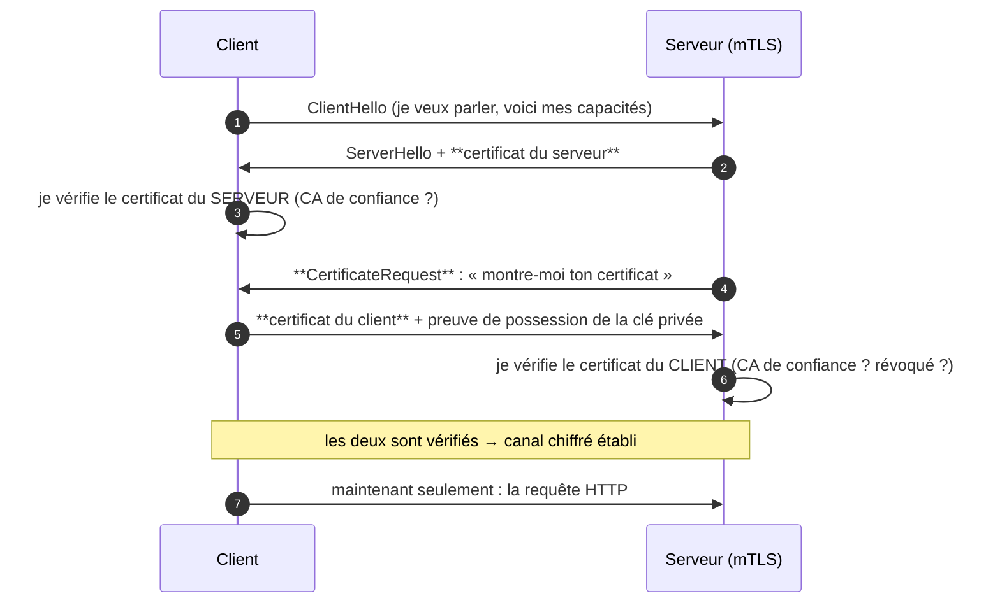

# mTLS

> [!abstract] Ancre
> Le mTLS est un TLS **bidirectionnel** : le serveur présente son certificat (comme d'habitude), mais le client présente le sien **aussi**. En OAuth 2.0 (RFC 8705), il sert à deux choses : authentifier fortement le client, et **lier un jeton à ce certificat** pour qu'un jeton volé soit inutilisable.

---

## 🧒 Avant de commencer : de quoi on parle

> [!tip] En clair
> Quand tu visites un site en HTTPS, il y a un **contrôle d'identité à sens unique** : **le site prouve qui il est** à ton navigateur (le petit cadenas). Toi, tu ne prouves rien — tu es un visiteur, n'importe qui peut venir.
>
> Le **mTLS** (mutual TLS, « TLS mutuel ») ajoute **le contrôle dans l'autre sens** : le **client aussi** doit prouver qui il est, avec un **certificat**.
>
> 🏢 **L'analogie :** c'est un **immeuble hautement sécurisé**.
> - **HTTPS normal** : tu regardes la plaque de l'immeuble pour vérifier que c'est bien la bonne banque. Puis tu entres librement.
> - **mTLS** : en plus, **le portier** te demande ton badge nominatif à l'entrée. Pas de badge → pas de porte. Et le badge est **vérifié cryptographiquement**, impossible à falsifier.

**Les mots à connaître pour cette note :**

| Mot technique | En clair |
|---|---|
| **TLS** | le protocole qui chiffre les échanges web (le « S » de HTTPS) |
| **mTLS** | TLS **mutuel** : les deux côtés présentent un certificat |
| **certificat client** | le **badge** du client, délivré par une autorité |
| **CA** (autorité de certification) | le **fabricant de badges** de confiance |
| **empreinte** (*thumbprint*) | l'**identifiant unique** du certificat |
| **sender-constrained** | « lié à l'expéditeur » : le jeton ne marche que pour **son** porteur légitime |
| **`cnf`** | la case « lié à » dans le jeton (contient l'empreinte) |

Voir aussi : [[DPoP]] (l'autre mécanisme de preuve de possession) et [[Access Token]] (le jeton qu'on cherche à protéger).

---

## Définition

> [!tip] En clair
> **TLS classique** : ton navigateur vérifie le certificat du serveur. Fin de l'histoire.
>
> **mTLS** : pendant la **poignée de main** (le début de la conversation), le serveur demande aussi **ton** certificat. Les deux se vérifient mutuellement. Si l'un des deux n'est pas valide, la connexion **n'a même pas lieu**.

Le **mTLS** désigne l'usage de TLS (RFC 8446) où **les deux parties** s'authentifient mutuellement par certificat : le serveur présente le sien, et **exige** celui du client.

En OAuth 2.0, la **RFC 8705** (*Mutual-TLS Client Authentication and Certificate-Bound Access Tokens*) normalise deux usages :

1. **`tls_client_auth`** — le certificat sert à **authentifier le client** auprès du serveur d'autorisation, **à la place** (ou en plus) d'un `client_secret`.
2. **Les jetons liés au certificat** (*certificate-bound*) — le jeton délivré est attaché à l'empreinte du certificat, via le claim **`cnf`** (RFC 7800). Il n'est alors utilisable que sur une connexion mTLS **avec ce certificat**.

---

## Enjeux

> [!tip] En clair
> **Le problème que mTLS résout en OAuth : le jeton porteur.**
>
> Aujourd'hui, la plupart des jetons sont « au porteur » (*Bearer*) : **celui qui le montre passe**. Si quelqu'un vole le jeton (dans un log, un proxy, une sauvegarde), il l'utilise **comme si c'était lui**.
>
> Avec un jeton lié au certificat : le voleur a le jeton, mais **pas le certificat**. Le jeton devient **inutilisable**. C'est ça, un jeton *sender-constrained*.

- **Fin du « porteur passe »** : un jeton volé ne suffit plus — il faut **aussi** la clé privée du certificat, qui ne quitte jamais son propriétaire.
- **Authentification client forte** : plus de secret partagé à stocker, à faire tourner, à fuiter — un certificat, et une clé privée qui ne circule pas.
- **Standard du monde professionnel** : banques, santé, B2B, API partenaires — partout où la confiance doit être **cryptographique** et pas seulement déclarative.
- **Coût réel** : il faut gérer une **PKI** (autorité de certification, délivrance, renouvellement, révocation). C'est la raison pour laquelle mTLS est courant en entreprise et rare en grand public.
- **Complémentaire, pas concurrent** : mTLS et [[DPoP]] résolvent le même problème par des moyens différents ; [[FAPI]] impose les deux.

---

## Fonctionnement détaillé

### La poignée de main : ce qui change

> [!tip] En clair
> **Avant même d'échanger la moindre donnée**, le serveur et le client se présentent leurs certificats et se vérifient. C'est une **double vérification** qui se passe avant tout.



**Le point clé :** si le certificat client est absent, expiré, révoqué, ou émis par une CA non reconnue, **la connexion est refusée avant toute application**. Ce n'est pas l'application qui refuse — c'est **TLS**, au niveau du transport.

### Ce qu'est un certificat client

> [!tip] En clair
> Un certificat, c'est un **badge nominatif** : « ce client s'appelle X, et voici sa clé publique ». Il est **signé par une autorité de certification** (CA) — le fabricant de badges — ce qui permet de vérifier qu'il n'est pas falsifié.
>
> Et surtout : le certificat contient une **clé publique**. La **clé privée**, elle, reste chez le client et **ne circule jamais**.

| Élément | Rôle |
|---|---|
| **Sujet** (`CN`, `O`…) | qui est ce client |
| **Clé publique** | permet de vérifier les preuves de possession |
| **Émetteur (CA)** | qui a signé le certificat — la racine de confiance |
| **Dates de validité** | `notBefore` / `notAfter` |
| **Empreinte** (*thumbprint*) | identifiant unique — utilisé pour lier le jeton |
| **Étendue d'usage** | `clientAuth` doit être autorisé |

**L'authentification par certificat ne repose pas sur un secret partagé** : le client prouve qu'il **possède la clé privée** associée au certificat, sans jamais la transmettre. C'est un modèle **asymétrique**, bien plus fort qu'un `client_secret`.

### Usage 1 — Authentifier le client (`tls_client_auth`)

> [!tip] En clair
> **Première utilisation :** le client **n'a plus de mot de passe**. Il prouve son identité par son certificat, à chaque connexion.
>
> Finis les secrets à stocker, à faire tourner, et à fuiter. Le serveur d'autorisation associe simplement **un certificat** à un `client_id`.

```http
POST /token HTTP/1.1
Host: auth.example.com
Content-Type: application/x-www-form-urlencoded
# Pas d'en-tête Authorization: Basic — le client s'est authentifié via TLS

grant_type=client_credentials
&client_id=billing-worker
&scope=read:invoices
```

L'authentification se fait **au niveau TLS** (RFC 8705 §2), pas dans la requête HTTP. Variantes normalisées :

| Méthode | Principe |
|---|---|
| **`tls_client_auth`** | le certificat identifie le client par son sujet / son empreinte |
| **`self_signed_tls_client_auth`** | certificat auto-signé, dont la clé publique est **enregistrée** pour ce client |

Le document de découverte annonce le support : `tls_client_certificate_bound_access_tokens`, et les méthodes dans `token_endpoint_auth_methods_supported` ([[OIDC Discovery et JWKS]]).

C'est le mode **préféré** de la RFC 9700 pour les clients confidentiels : un secret partagé finit toujours par fuiter quelque part ; une clé privée qui ne circule jamais, non.

### Usage 2 — Lier le jeton au certificat (le cœur)

> [!tip] En clair
> **Deuxième utilisation, la plus importante :** le jeton délivré est **marqué** avec l'empreinte du certificat. Du coup, il ne fonctionne que sur une connexion mTLS utilisant **ce certificat précis**.
>
> 🎯 **Le scénario :** un attaquant vole ton badge (le jeton) dans un log. Il le présente à l'API… et se fait refuser, parce qu'il n'a pas **la clé** qui va avec.

**1. Le client obtient un jeton, sur une connexion mTLS :**

```json
{
  "access_token": "eyJhbGci...",
  "token_type": "Bearer",
  "expires_in": 3600,
  "scope": "read:invoices"
}
```

**2. Le jeton contient le claim `cnf` (confirmation), avec l'empreinte du certificat :**

```json
{
  "iss": "https://auth.example.com",
  "aud": "https://api.finance.example.com",
  "sub": "billing-worker",
  "scope": "read:invoices",
  "exp": 1759316420,
  "cnf": {
    "x5t#S256": "bwcK0esc3ACC3DB2Y5_lESsXE8o9ltc05O89jdN-dg2"
  }
}
```

**3. L'API vérifie les DEUX choses :**

```
① Le jeton est-il valide ? (signature, exp, aud, scope)      → OK
② La connexion mTLS présente-t-elle le certificat attendu ?
   empreinte calculée  ==  cnf.x5t#S256 du jeton ?           → OK
   → sinon : 401, le jeton est inutilisable
```

**Le point central :** le jeton n'est plus un « laissez-passer » — c'est un laissez-passer **nominatif, lié à un badge physique**. Le vol du jeton seul ne suffit plus.

### Les différents types de `cnf`

> [!tip] En clair
> Le claim `cnf` indique **à quoi** le jeton est lié. Il existe plusieurs façons de désigner un certificat — plus ou moins robustes.

| Champ `cnf` | Ce qu'il compare | Robustesse |
|---|---|---|
| **`x5t#S256`** | l'**empreinte SHA-256** du certificat | ⭐ **recommandé** (RFC 8705) |
| `x5t` | l'empreinte SHA-1 | déprécié (SHA-1 cassé) |
| `jkt` | l'empreinte d'une **clé publique JWK** | utilisé par [[DPoP]] |
| `jwk` | la clé publique complète | volumineux |

**`x5t#S256` est le choix de référence** pour mTLS : une empreinte SHA-256, courte et non ambiguë.

### mTLS vs DPoP : même objectif, moyens différents

> [!tip] En clair
> Les deux transforment un jeton « au porteur » en jeton **lié à son porteur**. La différence : **où vit la clé** et **qui gère l'infrastructure**.

| | **mTLS** | **[[DPoP]]** |
|---|---|---|
| La clé vit… | dans un **certificat** (PKI, cartes à puce, HSM) | dans l'**application cliente** (paire de clés) |
| Infrastructure | **lourde** : autorité de certification, révocation | **légère** : rien à déployer |
| Vérification | au niveau **TLS** | au niveau **HTTP** (en-tête `DPoP`) |
| Écosystème | entreprise, B2B, banque | applications modernes, grand public |
| Standard | RFC 8705 | RFC 9449 |
| Preuve de possession | à la **poignée de main** | **à chaque requête** |

**Résumé :** mTLS est **plus fort** (la clé est dans du matériel certifié) mais **plus coûteux** à déployer. DPoP est **plus simple** mais la clé vit dans l'application, donc moins protégée physiquement. [[FAPI]] conseille et impose les deux selon le profil.

---

## Exemple concret

> [!tip] En clair
> **Le scénario complet, en trois temps** : le client s'authentifie, reçoit un jeton **marqué**, puis utilise ce jeton — et on voit l'attaque échouer.

### Temps 1 — Authentification et jeton lié

```http
POST /token HTTP/1.1
Host: auth.example.com
Content-Type: application/x-www-form-urlencoded
# Authentification par certificat client au niveau TLS

grant_type=client_credentials
&scope=read:invoices
```

**Réponse — le jeton porte le `cnf` :**

```json
{
  "access_token": "eyJhbGciOiJSUzI1NiIsImtpZCI6IjIwMjYtMDktMDEifQ...",
  "token_type": "Bearer",
  "expires_in": 3600,
  "scope": "read:invoices"
}
```

```json
// Décodé — le jeton est LIÉ au certificat
{
  "iss": "https://auth.example.com",
  "aud": "https://api.finance.example.com",
  "sub": "billing-worker",
  "scope": "read:invoices",
  "exp": 1759316420,
  "cnf": { "x5t#S256": "bwcK0esc3ACC3DB2Y5_lESsXE8o9ltc05O89jdN-dg2" }
}
```

### Temps 2 — Usage normal

```http
GET /invoices HTTP/1.1
Host: api.finance.example.com
Authorization: Bearer eyJhbGci...
# + la connexion TLS présente le certificat habituel
```

```
API vérifie :
  ① signature, exp, aud, scope            → OK
  ② empreinte du certificat de la connexion == cnf.x5t#S256 ?  → OK
Résultat : 200 OK + les factures
```

### Temps 3 — Le jeton volé — l'attaque échoue

```
1. Un attaquant extrait le jeton d'un log applicatif mal protégé
2. Il le présente à l'API, avec SON propre certificat (ou sans certificat)
3. L'API vérifie :
   ① signature, exp, aud, scope            → OK (le jeton est authentique)
   ② empreinte de SON certificat == cnf.x5t#S256 du jeton ?
      → NON : ce n'est pas le bon certificat
4. Résultat : 401 Unauthorized
```

> [!tip] Ce que ça change
> **Sans mTLS**, l'étape 4 aurait été `200 OK` — le jeton volé aurait suffi.
> **Avec mTLS**, le jeton volé est **un bout de papier inutile** : il faut aussi la clé privée, qui n'a jamais quitté le client légitime.

### Le cas `tls_client_auth` (sans secret du tout)

```
Avant :  client_secret = "s3cr3t..."   → stocké, à faire tourner, fuite possible
Après :  certificat client + clé privée → la clé ne circule JAMAIS
```

Concrètement, côté serveur, l'association se fait sur le sujet ou l'empreinte :

```yaml
# Exemple de configuration de client (Keycloak-like)
client_id: billing-worker
client_authenticator: tls_client_auth          # au lieu de client-secret
tls_client_auth_subject_dn: "CN=billing-worker,OU=services,O=Exemple,C=FR"
# ou, équivalent, l'empreinte du certificat :
tls_client_auth_certificate_sha256: "bwcK0esc3ACC3DB2Y5_lESsXE8o9ltc05O89jdN-dg2"
```

---

## Pièges fréquents

> [!tip] En clair
> **Les 5 erreurs à retenir :**
> 1. **Croire que mTLS chiffre plus fort** → il **authentifie** les deux côtés ; le chiffrement est le même qu'en HTTPS.
> 2. **Émettre un jeton normal sans `cnf`** → aucun bénéfice : le jeton reste un porteur.
> 3. **Vérifier le `cnf` de façon approximative** → la comparaison doit être **stricte** sur l'empreinte.
> 4. **Oublier la révocation** → un certificat volé reste valide jusqu'à son expiration.
> 5. **Se reposer sur mTLS pour tout** → il ne remplace ni [[PKCE]], ni le `state`, ni la validation du [[ID Token]].

- **Confusion mTLS / chiffrement renforcé** — mTLS ne rend pas le chiffrement « plus fort » ; il ajoute une **authentification mutuelle**. Réflexe : présenter mTLS comme un mécanisme d'**identité**, pas de confidentialité.
- **Jeton sans `cnf`** — la connexion est mTLS mais le jeton reste un simple porteur : tout le bénéfice est perdu. Réflexe : exiger `tls_client_certificate_bound_access_tokens` et **vérifier la présence de `cnf`**.
- **`cnf` non vérifié par l'API** — l'API valide la signature mais jamais la liaison au certificat : le jeton volé passe. Réflexe : **toujours** comparer l'empreinte de la connexion au `cnf.x5t#S256`.
- **Comparaison d'empreinte approximative** — comparer des chaînes partielles, ignorer la casse ou la normalisation base64url. Réflexe : comparaison **stricte**, sur les octets.
- **`x5t` (SHA-1) au lieu de `x5t#S256`** — SHA-1 est **cassé**. Réflexe : `x5t#S256` uniquement (RFC 8705 §3).
- **Absence de révocation** — un certificat client volé ou compromis reste accepté jusqu'à `notAfter`. Réflexe : CRL / **OCSP**, et durée de vie **courte** des certificats.
- **Certificat client de longue durée** — des certificats valables des années rendent la compromission durable. Réflexe : rotation périodique, automatisation du renouvellement.
- **CA trop large ou mal restreinte** — accepter n'importe quel certificat d'une CA généraliste ouvre la porte à des certificats non prévus pour l'API. Réflexe : CA **dédiée**, ou vérification du sujet / des extensions attendues.
- **Erreur de chaîne ignorée** — accepter les certificats auto-signés sans validation de la chaîne. Réflexe : valider la chaîne complète jusqu'à une racine de confiance.
- **Passerelle TLS qui « termine » la connexion** — un proxy/load-balancer termine le TLS et perd l'information du certificat client, ou la transmet **sans authentification** (en-tête HTTP fiable par erreur). Réflexe : transmettre l'empreinte **via un canal de confiance** (en-tête signé, réseau interne), ou conserver le mTLS de bout en bout.
- **Certificat client sur un poste grand public** — le grand public ne gère pas de certificats ; mTLS n'est pas adapté à un site de e-commerce B2C. Réflexe : réserver mTLS au **B2B / service à service / environnements maîtrisés**.
- **Croire que mTLS remplace OAuth** — mTLS authentifie un **client** ; il ne dit rien de l'**utilisateur** ni de ses **permissions**. Réflexe : mTLS **et** jetons : l'un authentifie le canal, les autres portent l'autorisation ([[Scopes et claims]]).

---

## Rappel

> [!question] Question de rappel
> Un access token lié à un certificat (`cnf.x5t#S256`) est volé dans un log applicatif. Pourquoi l'attaquant ne peut-il pas l'utiliser, et que doit vérifier l'API pour que cette protection soit effective ?

> [!success]- Réponse
> Parce que le jeton n'est **pas un jeton porteur** : le `cnf` l'attache à l'**empreinte du certificat** du client légitime. Pour s'en servir, il faudrait présenter le **certificat correspondant** sur une connexion mTLS — or le certificat va de pair avec une **clé privée qui n'a jamais quitté** le client (elle n'est jamais transmise, seulement utilisée pour prouver la possession). L'attaquant a donc le jeton mais pas la clé : il ne peut pas satisfaire le contrôle. Pour que la protection soit **effective**, l'API doit : vérifier la **signature** du jeton et ses claims habituels (`exp`, `aud`, `scope`), **puis** comparer **strictement** l'empreinte du certificat présenté sur la connexion TLS avec le `cnf.x5t#S256` du jeton — et refuser en cas de divergence. Si l'API se contente de valider la signature sans contrôler le `cnf`, le jeton volé redevient utilisable : la protection n'existe que si **les deux** vérifications sont faites. Le RSA doit aussi gérer la **révocation** des certificats, sinon un certificat compromis reste accepté.

### 🎯 Le résumé à retenir

> [!tip] Si tu ne retiens qu'une chose
> **mTLS = TLS avec un badge à l'entrée, dans les deux sens.**
>
> Deux usages en OAuth :
> 1. **Authentifier le client** (`tls_client_auth`) — un certificat à la place du `client_secret`.
> 2. **Lier le jeton au certificat** (`cnf.x5t#S256`) — un jeton volé devient **inutilisable**.
>
> **La question à laquelle il répond :** *« comment empêcher qu'un jeton volé serve ? »* → en prouvant que celui qui le présente possède **aussi** la clé.
>
> **Et le réflexe vital :** un `cnf` émis mais **non vérifié** par l'API ne protège rien.

---

## Voir aussi

- [[DPoP]] — l'autre mécanisme de preuve de possession (sans PKI, à chaque requête).
- [[FAPI]] — le profil sectoriel qui impose mTLS et DPoP pour la finance.
- [[Access Token]] — le jeton dont mTLS fait un jeton *sender-constrained*.
- [[Client Credentials Flow]] — le grant où mTLS remplace avantageusement le `client_secret`.
- [[Sécurité OIDC et OAuth 2.1]] — la RFC 9700 et la fin du Bearer nu.
- [[OIDC Discovery et JWKS]] — où sont annoncées les méthodes d'authentification client et le support du `cnf`.
- [[JWT]] — le format qui porte le claim `cnf`.
- [[OpenID Connect]] — le cadre des échanges client↔OP.
- [[OIDC (MOC)]] — carte d'entrée du dossier.

## Références

- RFC 8705 — *OAuth 2.0 Mutual-TLS Client Authentication and Certificate-Bound Access Tokens* (§2 authentification client, §3 jetons liés au certificat, `x5t#S256`).
- RFC 8446 — *The Transport Layer Security (TLS) Protocol Version 1.3*.
- RFC 5280 — *Internet X.509 Public Key Infrastructure Certificate and CRL Profile*.
- RFC 7800 — *Proof-of-Possession Key Semantics for JWT* (le claim `cnf`).
- RFC 9700 — *Best Current Practice for OAuth 2.0 Security* — authentification forte du client, jetons à preuve de possession.
- draft-ietf-oauth-v2-1 — *The OAuth 2.1 Authorization Framework*.
- OpenID Connect Core 1.0 — authentification du client et `token_endpoint_auth_methods_supported`.
